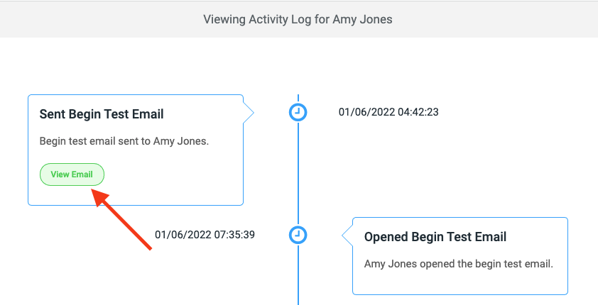
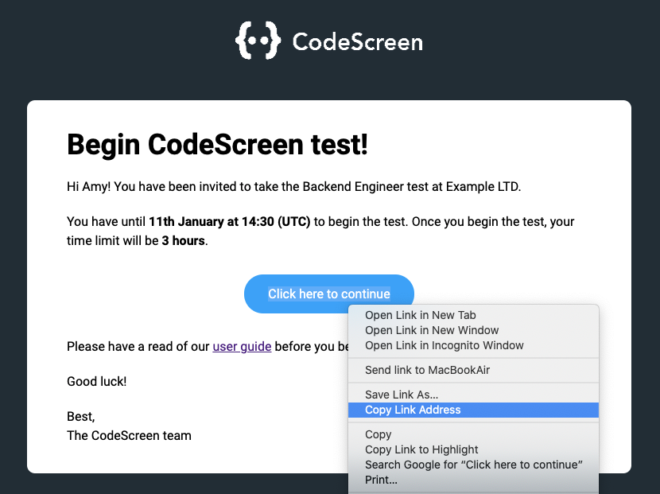

# Accessing Test Link Directly

On very rare occasions, a candidate may not receive the email that was sent to them containing the link to start their CodeScreen test.

To handle this scenario, you can copy the test link from the Activity Log and send it to the candidate directly.

To do this, follow the steps below:

<strong>1.</strong> Click into the [Activity Log](viewing-activity-log.md) for the candidate.

<strong>2.</strong> Click the `View Email` button in the `Sent Begin Test Email` event for the candidate:

<figure>
  <figcaption style="font-style: italic;"></figcaption>
   
  
</figure>

 

<strong>3</strong>. The email will open in a new tab in your browser. Now right-click the `Click here to continue` blue button and click `Copy link address` 
(or `Copy link` on Safari/Firefox) to copy the link to your clipboard:

<figure>
  <figcaption style="font-style: italic;"></figcaption>
   
  
</figure>

 

<strong>4.</strong> You can then copy and paste this link into an email and send it to the candidate directly.
