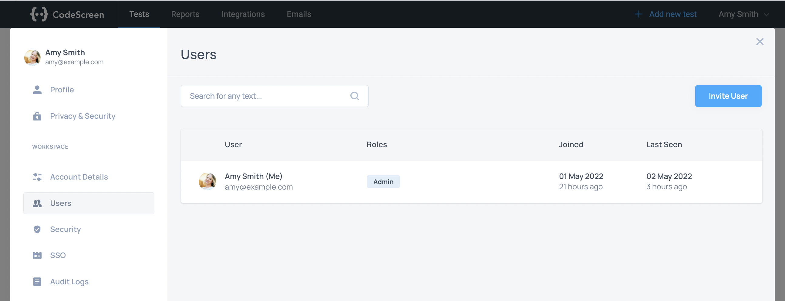
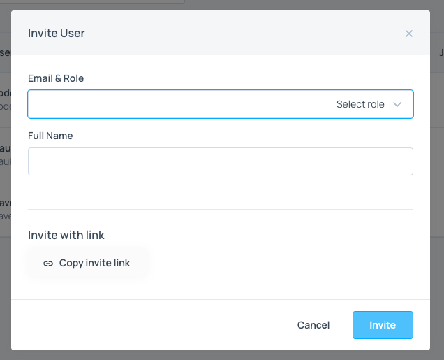

# Adding Users

CodeScreen has been built in a way that makes it easy for any of your colleagues (recruiters, hiring managers, and developers)
to use.

You can create as many users as you like as all of our pricing plans come with an unlimited number of users.

You can add new users by clicking the `Your Account` entry in the drop down list that pops after you click on your name at the top right of the toolbar, and then choosing `Users` from the sections on the left:

<figure>
  <figcaption style="font-style: italic;"></figcaption>
   
  
</figure>

 

**Note** that you will not have access to the `Users` section on CodeScreen unless you are an admin user. If you are not
an admin, please contact one of the admin users in your organization, and they will be able to make you an admin.

You can then add a new user by clicking the `Add New User` button, which will launch the following pop-up:

<figure>
  <figcaption style="font-style: italic;"></figcaption>
   
  
</figure>

 

You can enter the user's `Name`, `Email` and select one or more `Roles` depending on what access you want that user to have (see [Roles](user-roles.md) section for more details).

You can now click the `Invite` blue button to finish adding the user. The user will then be sent a welcome email containing a link to sign in for the first time.
