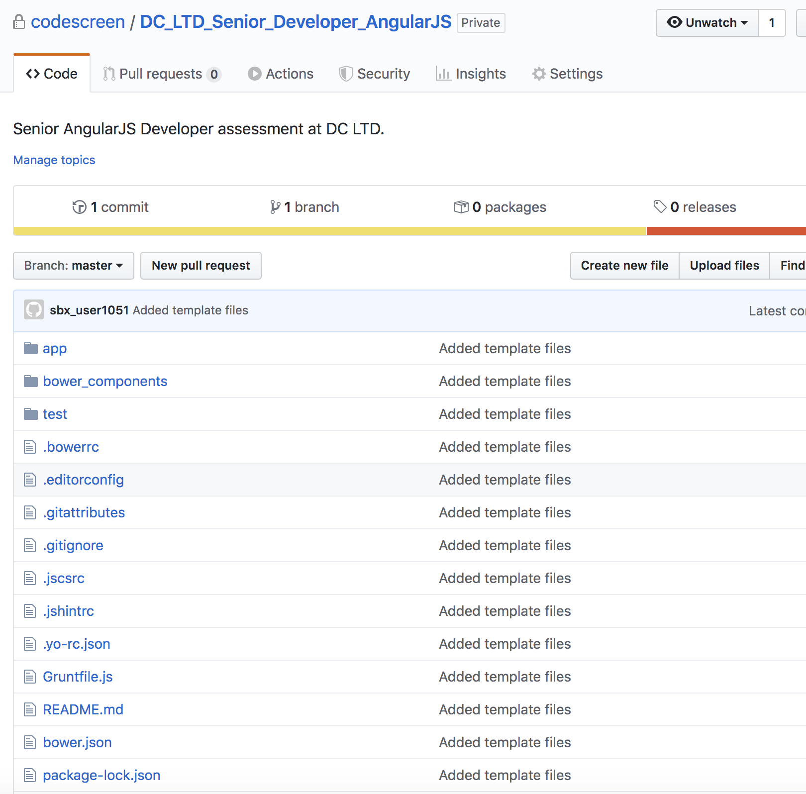

# Creating Custom AngularJS Assessments
CodeScreen allows you to add your own assessment and send it to candidates.  
To begin, log on to [CodeScreen](https://app.codescreen.dev/#/login), click <strong>Add new test</strong>, and select <strong>Custom test</strong>. 

You can then add the description of your test, choose <strong>AngularJS</strong> from the drop-down list of available frontend frameworks, and set the time limit for the test. 

Once you click <strong>Publish</strong>, a private GitHub repository will be created in the CodeScreen account, and you will be given access.
This repository will contain a skeleton <strong>AngularJS</strong> project, and the README will contain the description of the test that you added during the setup.  

<figure>
  <figcaption style="font-style: italic;">Example custom AngularJS assessment GitHub repository:</figcaption>
   
  
</figure>

  

You can then update this repository with details of your AngularJS assessment and start sending the test to candidates.

### Automated test-suite setup
Automated test-suite scoring for AngularJS is not currently supported but it will be added shortly!