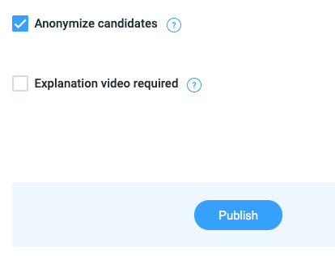
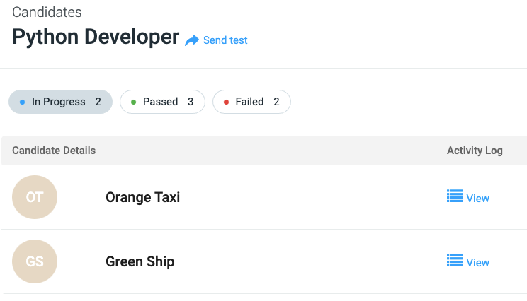
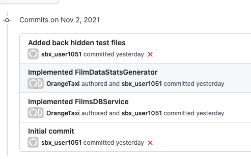
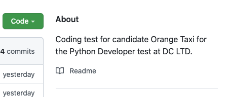

# Anonymizing Candidates

CodeScreen provides the option to anonymize any data about a candidate that would reveal the candidate's gender or ethnicity.
This removes unconscious bias when reviewing a candidate's solution to one of your CodeScreen assessments, which promotes
Diversity, Equity and Inclusion (DEI) in your organization.

---

To get started, click the `Anonymize candidates` check box when creating a new assessment:

<figure>
  <figcaption style="font-style: italic;"></figcaption>
   
  
</figure>

 

**Note** if you want to turn this feature on for one of your existing assessments, please let us know via <a href="mailto:hello@codescreen.com">email</a>
 or our live chat and we will switch it on for you.

 Once you send an assessment to a candidate when the anonymize candidates feature is enabled, we will display random names for each candidate
 and no longer show their email address:

<figure>
  <figcaption style="font-style: italic;"></figcaption>
   
  
</figure>

 

**Note** admin users are still able to search for a candidate using the candidate's email address.

Our email & in-app notifications will also use the candidate's random name when notifying you that a result is ready to view.

The image displayed for each candidate will always stay as the initials of the candidate's random name.

### Viewing GitHub Repos

We also remove any mention of the candidate's name and GitHub username from their GitHub solution repo. We do this in three
different places:

**1.** We change the author name of each candidate commit to their random name:

<figure>
  <figcaption style="font-style: italic;"></figcaption>
   
  
</figure>

 

**2.** We replace the candidate's real name in the repo description with their random name:

<figure>
  <figcaption style="font-style: italic;"></figcaption>
   
  
</figure>

 

**3.** We remove the Contributors section that is usually displayed on the right-hand side of the repo page on GitHub.

---

The result of this process is that the reviewer does not know any personal information about the candidate, which means the 
candidate's solution is assessed fairly.

**Note** that the workflow from the candidate's point of view stays exactly the same as before.
