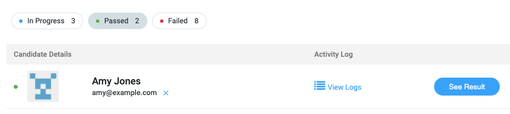
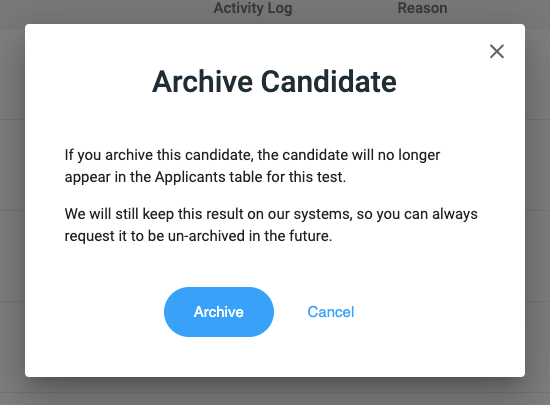

# Archiving Candidates

Once a candidate either passes or fails a CodeScreen test, you can remove them from the Applicants table
by `Archiving` the candidate.

To do this, click the blue `X`  button beside the candidate's email address.

<figure>
  <figcaption style="font-style: italic;"></figcaption>
   
  
</figure>

 

You will then see the following pop-up:

<figure>
  <figcaption style="font-style: italic;"></figcaption>
   
  
</figure>

 

As stated in the pop-up, we will keep the candidate's result on our systems, so you can retrieve it at any time by messaging us
on our live chat or via <a href="mailto:hello@codescreen.dev">email</a>.  You can also request us to delete the result permanently,
again by messaging us on our live chat or via <a href="mailto:hello@codescreen.dev">email</a>.

Once you click the blue `Archive` button, the candidate will no longer appear in the Applicant list table for that test.
