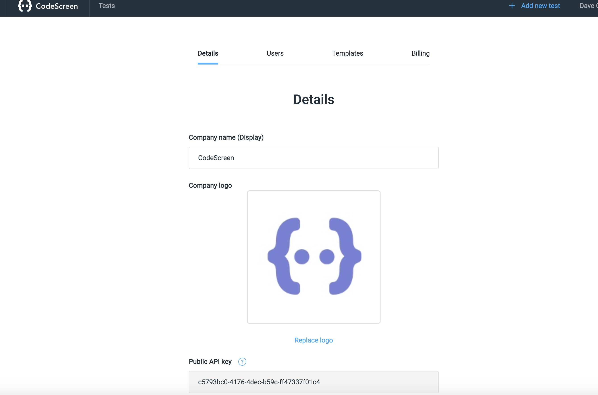

# Getting Started

### Introduction
The CodeScreen API can be used to send and retrieve CodeScreen tests programmatically.
<p> A common use-case of the API is for companies that do not use one of the Applicant Tracking Systems that we integrate with is to add CodeScreen into their interview process workflow programmatically.</p>

### Authentication

In order to use the CodeScreen API, you will first need to retrieve your API key from the CodeScreen platform.<br/><br/>
To do this, log on to [CodeScreen](https://app.codescreen.dev/#/login), head to the account section and copy your API key.



<br/>You then need to include this API key in the Authorization header of every request that you send to the CodeScreen API.
The API key needs to be prefixed by the string `apiToken`.

An example request is shown below:

```
curl -X GET https://app.codescreen.dev/api/listTests -H 'Authorization: apiToken c5793bc0-4176-4dec-b59c-ff47337f01c4' 

```