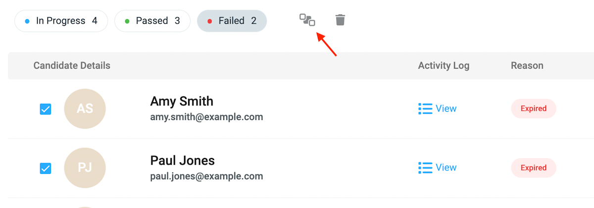
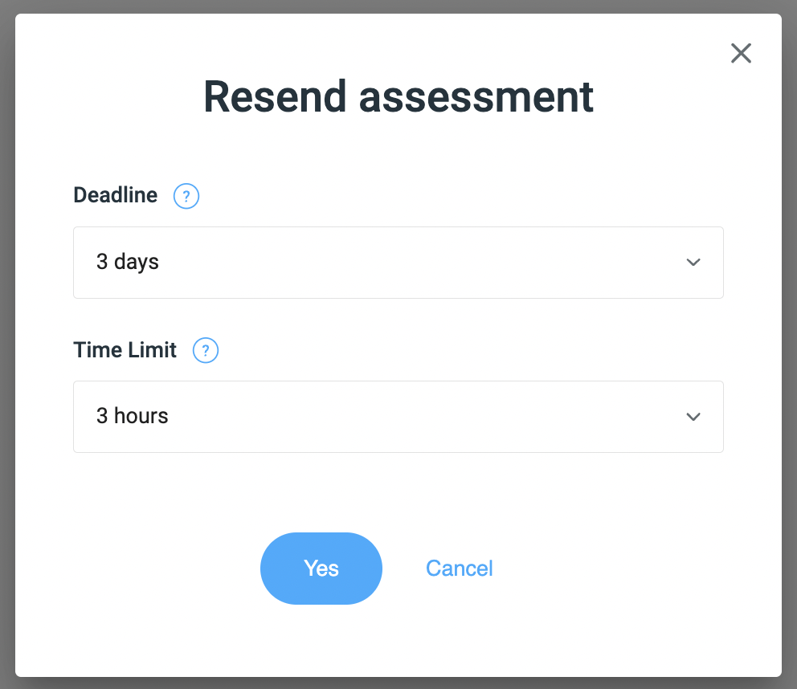

# Resending assessments

To resend an assessment to multiple candidates at once, first head to the Failed column in the candidate list for that assessment, then tick the box on the left-hand side of each candidate you want it re-sent to.

You then click the Resend icon that appears once a box is ticked:

<figure>
  <figcaption style="font-style: italic;"></figcaption>
   
  
</figure>

 

Once the Resend icon is clicked, you will then see the following pop-up:

<figure>
  <figcaption style="font-style: italic;"></figcaption>
   
  
</figure>

 

The `Deadline` and `Time Limit` will be set to the current values of these parameters for this assessment, but you can edit these for the candidates you are re-sending this assessment to.

Once you click the `Yes` button, the assessment is re-sent, the candidates are notified via email and placed back into the `In Progress` column.
