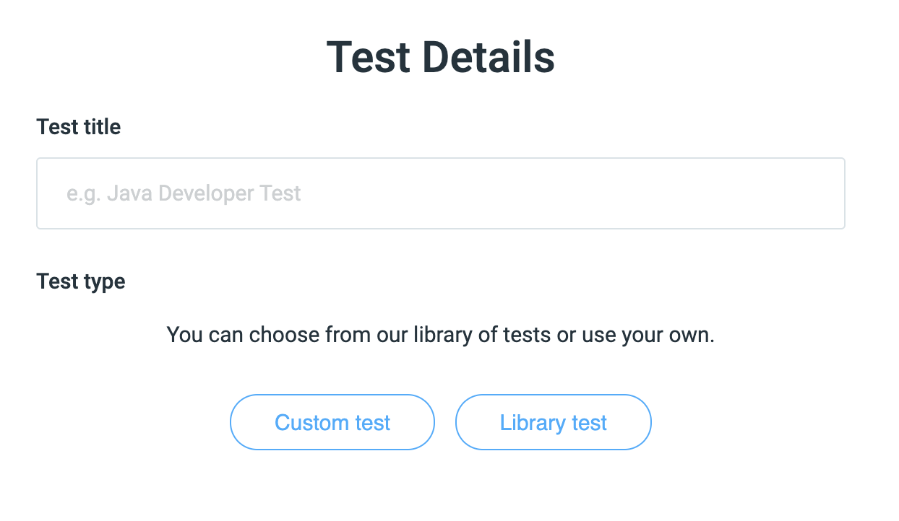
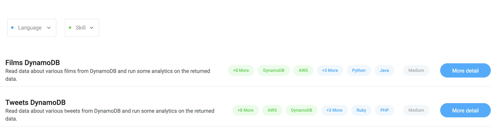
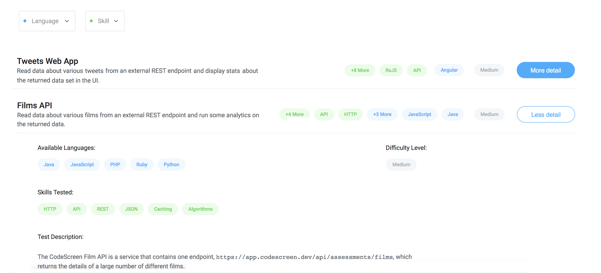

# Choosing a Library Test

When you click `Add new test` on CodeScreen, you will be given the following two choices:

<figure>
  <figcaption style="font-style: italic;"></figcaption>
   
  
</figure>

`Library Tests` are assessments that we provide off the shelf for you to use. **Note** if you want to learn more about
`Custom Tests`, click [here](concepts.md).

Once you click on Library test, you will see the following screen which contains a summary of each of our library tests:

<figure>
  <figcaption style="font-style: italic;"></figcaption>
   
  
</figure>

You can filter these tests based of which `language/framework` the test is available in, and which `skills` are assessed during the test.

Each test is available in multiple languages/frameworks and assess various different skills (e.g. Databases, APIs, REST, etc.).

There is also a `Difficulty Level` attached to each test, which can be one of the following three values:

 * **Easy** - New Grad/1 year experience.
 * **Medium** - Junior/Medium level developer. 2 - 5 years experience.
 * **Hard** - Senior developer. 5+ years experience.

To find out more information about a test, click the `More detail` blue button:

<figure>
  <figcaption style="font-style: italic;"></figcaption>
   
  
</figure>

To choose a test, just click on the row for test you want to select. Once you select a test, you will be brought to 
the [Create Library Test](creating-lib-test.md) screen.
