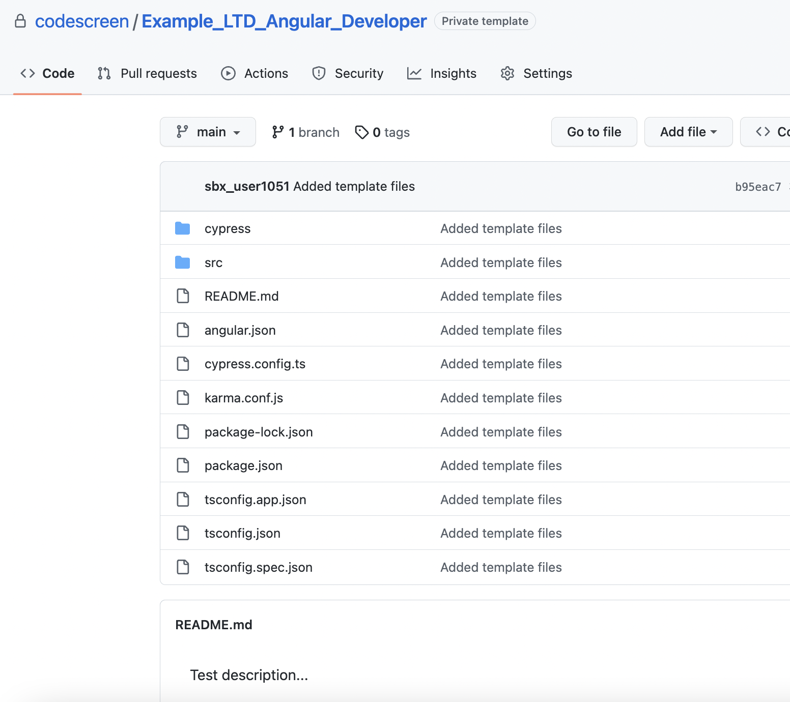

# Creating Custom Angular Assessments
To start, [log in](https://app.codescreen.com/account/login) to CodeScreen, click <strong>Add new assessment</strong>, and select <strong>Custom assessment</strong>.

You can then add the description of your assessment, select the <strong>Frontend</strong> category and then choose `Angular` from the drop-down list of available frontend frameworks.

Once you create an assessment, a private GitHub repository will be created in the CodeScreen account, and you will be given access.

This repository will contain a skeleton `Angular 13` project, and the `README.md` file will contain the description of the assessment that you added during the setup.

<br>

<figure>
  <figcaption style="font-style: italic;">Example custom Angular assessment GitHub repository:</figcaption>
  </br>
  
</figure>

</br></br>

You can then update this repository with details of your Angular assessment and start sending the assessment to candidates.

### Automated test-suite setup

If you would like to add tests that are automatically run by CodeScreen against each candidate's solution to your assessment, you can add these as unit tests or end-to-end tests.

All unit tests files must use the Angular default `Jasmine` test framework & `Karma` test runner, and all end-to-end tests must use the `Cypress` E2E test framework.

Your assessment must use `Angular 13`, and the `package.json` file may only be changed if you want to add third-party libraries to your assessment. All the current versions of the dependencies in `package.json` and `package-lock.json` must not be changed. 

The other config files in the template repo must also not be changed, including the `karma.conf.js` and `cypress.config.ts` files.

#### Naming Conventions

- Unit test filenames must end with `.spec.ts`. Files with names ending in `.hidden.spec.ts` will be hidden from the candidate.
- End-to-end test filenames must end with `-spec.cy.ts`. Files with names ending in `-hidden-spec.cy.ts` will be hidden from the candidate.
- To hide files used by hidden tests, their names must start with "hidden" (case-insensitive), for example: `hiddenFoo.csv`, `hidden-foo.ts`, etc.

#### GitHub Action

CodeScreen uses GitHub Actions to run automated unit & integration tests. We provide the following GitHub Action file for Angular assessments. 

**Note** that this file is added dynamically to the repo of each candidate taking your assessment, so please do not include it in your template repo. This file also cannot be changed.

```yaml
name: Angular CI

on: push

jobs:

  unit:
    runs-on: ubuntu-latest
    steps:
      - name: Checkout
        uses: actions/checkout@v3

      - name: Setup
        run: npm ci

      - name: Test
        run: npm test -- --no-watch --no-progress --browsers=ChromeHeadlessCI

  e2e:
    runs-on: ubuntu-latest
    steps:
      - name: Checkout
        uses: actions/checkout@v3

      - name: Install dependencies
        run: npm install

      - name: Check Cypress tests exist
        id: check_cypress_tests
        uses: andstor/file-existence-action@v1
        with:
          files: "cypress/e2e/"

      - name: Install and run Cypress tests
        uses: cypress-io/github-action@v4
        if: steps.check_cypress_tests.outputs.files_exists == 'true'
        env:
          GITHUB_TOKEN: ${{ secrets.GITHUB_TOKEN }}
        with:
          build: npm run build --if-present
          start: npm start
          wait-on: 'http://localhost:4200'
```

### Examples

Please see our Angular library assessments for more information on how our Angular automated test suites are set up.
