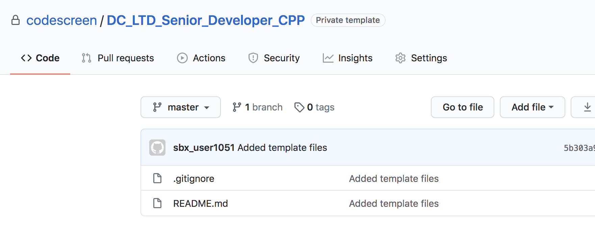

# Creating Custom C++ Assessments
CodeScreen allows you to add your own assessment and send it to candidates.</br></br>
To begin, log on to [CodeScreen](https://app.codescreen.com/account/login), click <strong>Add new assessment</strong>, and click the <strong>Custom</strong> button.</br>

You can then add the description of your assessment, choose <strong>C++</strong> from the drop-down list of available `Backend` languages, and set the time limit for the assessment.</br>

Once you create an assessment, a private GitHub repository will be created in the CodeScreen account, and you will be given access.
This repository will simply contain skeleton template `C++` project configured with the `GoogleTest` testing framework and a README containing the description of the assessment that you added during the setup.</br></br>

<figure>
  <figcaption style="font-style: italic;">Example custom C++ assessment GitHub repository:</figcaption>
  </br>
  
</figure>

</br>

You can then update this repository with details of your `C++` assessment and start sending the assessment to candidates.

### Automated test-suite setup
If you would like to add tests that are automatically run by CodeScreen against each candidate's solution to your assessment, you can add these as unit test files in the `test/` directory.

All unit test filenames must end with `_test.cpp` and must use the [GoogleTest](https://google.github.io/googletest/) testing framework.

For your unit test files to be recognised by `GoogleTest`, each unit test file must be included as an argument in the `add_executable()` command in the `test/CMakeLists.txt` file.

Note that hidden tests are not yet supported for C++ assessments.

#### GitHub Action

CodeScreen uses GitHub Actions to run automated unit tests. We provide the following GitHub Action file for C++ assessments. **Note** that this file is added dynamically to the repo of each candidate taking your assessment, so please do not include it in your template repo. This file also cannot be changed.

```yaml
name: C++ CI

on: [push]

jobs:
  test:
    runs-on: ${{ matrix.os }}
    strategy:
      matrix:
        os: [ubuntu-latest, windows-latest]
    defaults:
      run:
        shell: bash -l {0}

    steps:
    - uses: actions/checkout@v3

    - name: Configure
      run: |
        cmake -S. -Bbuild -DCMAKE_BUILD_TYPE=Debug
    - name: Build
      run: |
        cmake --build build --config Debug
    - name: Test
      run: |
        cd build
        ctest -C Debug --output-on-failure --verbose
```

### Examples

An **example** `C++` assessment that uses automated test suite scoring can be seen here:<br/>
https://github.com/Code-Screen/CPP-CodeScreen-Fibonacci