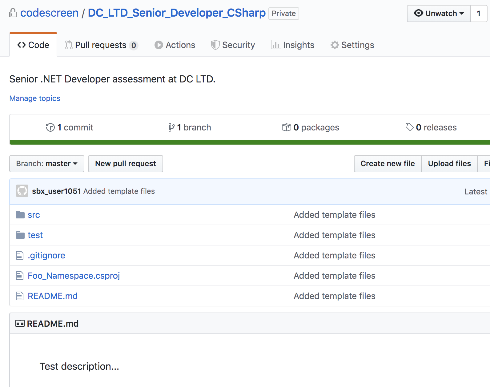

# Creating Custom .NET Assessments
CodeScreen allows you to add your own assessment and send it to candidates.</br></br>
To begin, log on to [CodeScreen](https://app.codescreen.com/account/login), click <strong>Add new assessment</strong>, and select <strong>Custom assessment</strong>.</br>

You can then add the description of your assessment, choose <strong>.NET</strong> from the drop-down list of available backend languages, and set the time limit for the assessment.</br>

Once you click <strong>Publish</strong>, a private GitHub repository will be created in the CodeScreen account, and you will be given access.
This repository will contain a skeleton <strong>.NET</strong> project, and the README will contain the description of the assessment that you added during the setup.</br></br>

<figure>
  <figcaption style="font-style: italic;">Example custom .NET assessment GitHub repository:</figcaption>
  </br>
  
</figure>

</br></br>

### Automated test-suite setup

If you would like to add tests that are automatically run by CodeScreen against each candidate's solution to your assessment, you can add these as test classes in the `test/` directory.

All unit test class names must end with `"Test"` and all unit test classes with names that end with `"HiddenTest"` will not be visible to the candidate.

If you want to add files that your hidden unit tests use and hence are also not visible to the candidate, the names of
these files must begin with `hidden` (case-insensitive), e.g., `hiddenFoo.json`, `hiddenFoo.csv`, `HiddenFoo.cs`, etc.

All unit tests must use the [`Nunit`](https://nunit.org/) test framework.

The `.csproj` file should be renamed, and the `RootNamespace` element in this file must be updated to match this
new name. The only other updates that should go in to the `.csproj` file are dependencies required for your coding assessment.

The coding assessment must use `.NET 5.0`.

#### GitHub Action

CodeScreen uses GitHub Actions to run automated unit tests. We provide the following GitHub Action file for .NET assessments. **Note** that this file is added dynamically to the repo of each candidate taking your assessment, so please do not include it in your template repo. This file also cannot be changed.

```
name: .NET

on: [push]

jobs:
  build:

    runs-on: ubuntu-latest

    steps:
    - uses: actions/checkout@v2
    - name: Setup .NET
      uses: actions/setup-dotnet@v1
      with:
        dotnet-version: 5.0.x
    - name: Restore dependencies
      run: dotnet restore
    - name: Build
      run: dotnet build --no-restore
    - name: Test
      run: dotnet test --no-build --verbosity normal
```

### Examples

An **example** `.NET` assessment that uses automated test suite scoring can be seen here:<br/>
https://github.com/Code-Screen/Csharp-CodeScreen-Fibonacci
