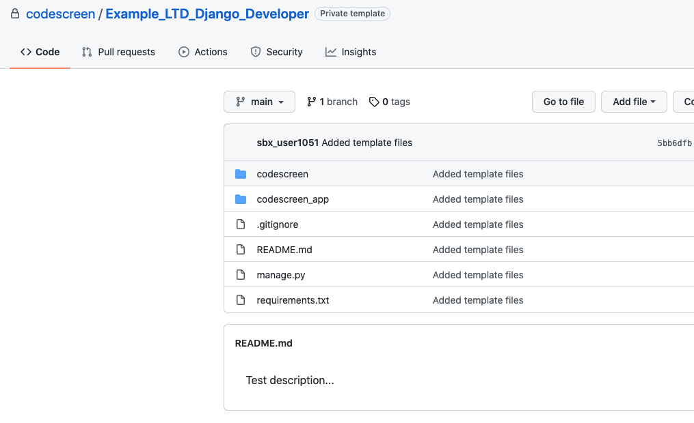

# Creating Custom Django Assessments
CodeScreen allows you to add your own assessment and send it to candidates.</br></br>
To begin, log on to [CodeScreen](https://app.codescreen.com/account/login), click <strong>Add new assessment</strong>, and select <strong>Custom assessment</strong>.</br>

You can then add the description of your assessment, choose <strong>Django</strong> from the drop-down list of available full-stack languages, and set the time limit for the assessment.</br>

Once you click <strong>Publish</strong>, a private GitHub repository will be created in the CodeScreen account, and you will be given access.
This repository will contain a skeleton <strong>Django</strong> project, and the README will contain the description of the assessment that you added during the setup.</br></br>

<figure>
  <figcaption style="font-style: italic;">Example custom Django assessment GitHub repository:</figcaption>
  </br>
  
</figure>

</br></br>

### Automated test-suite setup

If you would like to add tests that are automatically run by CodeScreen against each candidate's solution to your assessment, you can add these as unit test files.

All unit test filenames must begin with `test_` and all unit test files with names beginning with `test_hidden_` will not be visible to the candidate.

If you want to add files that your hidden unit tests use and hence are also not visible to the candidate, the names of these files must begin with `hidden`, e.g., `hiddenFoo.json`, `hiddenFoo.csv`, `hidden_foo.py`, etc.

All unit tests must use the [`pytest`](https://docs.pytest.org/en/latest/) unit test framework, version `6.0.0`.

Any dependencies required for your coding assessment need to be included in the `requirements.txt` file and must be available to download using the [`pip`](https://pip.pypa.io/en/stable/) package installer.

The Python code must be compatible with `Python` version `3.8`.

#### GitHub Action

CodeScreen uses GitHub Actions to run automated unit tests. We provide the following GitHub Action file for Django assessments. **Note** that this file is added dynamically to the repo of each candidate taking your assessment, so please do not include it in your template repo. This file also cannot be changed.

```
name: Python CI

on: [push]

jobs:
  build:

    runs-on: ubuntu-latest

    steps:
    - uses: actions/checkout@v3
    - name: Set up Python
      uses: actions/setup-python@v3
      with:
        python-version: '3.8'
    - name: Install dependencies
      run: |
        python -m pip install --upgrade pip
        pip install -r requirements.txt
    - name: Run tests
      run: pytest
```

### Examples

An **example** `Python` assessment that uses `pytest` for automated test suite scoring can be seen here:<br/>
https://github.com/Code-Screen/Python-CodeScreen-Fibonacci
