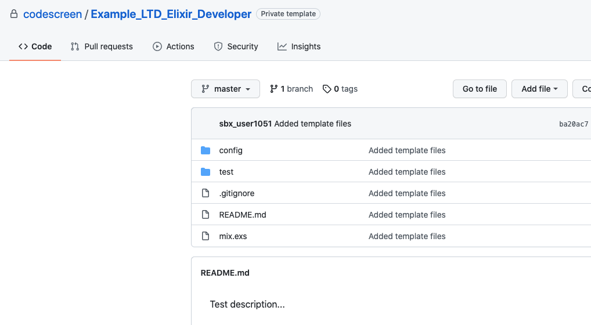

# Creating Custom Elixir Assessments
CodeScreen allows you to add your own assessment and send it to candidates.</br></br>
To begin, log on to [CodeScreen](https://app.codescreen.com/account/login), click <strong>Add new assessment</strong>, and click the <strong>Custom</strong> button.</br>

You can then add the description of your assessment, choose <strong>Elixir</strong> from the drop-down list of available backend languages, and set the time limit for the assessment.</br>

Once you create an assessment, a private GitHub template repository will be created in the CodeScreen account, and you will be given access.
This repository will contain a skeleton <strong>Elixir</strong> project (which uses [Mix](https://elixir-lang.org/getting-started/mix-otp/introduction-to-mix.html)), and the README will contain the description of the assessment that you added during the setup.</br></br>

<figure>
  <figcaption style="font-style: italic;">Example custom Elixir assessment GitHub repository:</figcaption>
  </br>
  
</figure>

</br></br>

### Automated test-suite setup

If you would like to add unit tests that are automatically run by CodeScreen against each candidate's solution to your assessment, you can add these as unit test files in the `test/` directory.

All unit tests files must be added in the `test/` directory.and use the `ExUnit` testing framework.

All test filenames must end with `_test.exs` and test files with filenames that end with `_hidden_test.exs` will not be visible to the candidate.

If you want to add files that your hidden tests use and hence are also not visible to the candidate, the names of 
these files must begin with `hidden` (case-insensitive), e.g., `hiddenFoo.json`, `hiddenFoo.csv`, `HiddenFoo.hs`, etc.

The `mix.exs` file should only be modified in order to change the name of the project and add any third-party dependencies required for your assessment.

Your coding assessment must use/be comptabible with `Elixir 1.13` and `Erlang/OTP 24`.

#### GitHub Action

CodeScreen uses GitHub Actions to run automated unit tests. We provide the following GitHub Action file for Elixir assessments. **Note** that this file is added dynamically to the repo of each candidate taking your assessment, so please do not include it in your template repo. This file also cannot be changed.

```yaml
name: Elixir CI

on: push

jobs:
  test:
    runs-on: ubuntu-latest
    steps:
    - uses: actions/checkout@v3
    - uses: erlef/setup-beam@v1
      with:
        otp-version: '24.1.6'
        elixir-version: '1.13.2'
    - run: mix deps.get
    - run: mix compile
    - run: mix test
```
