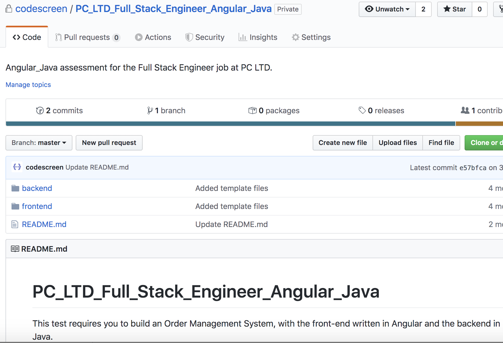
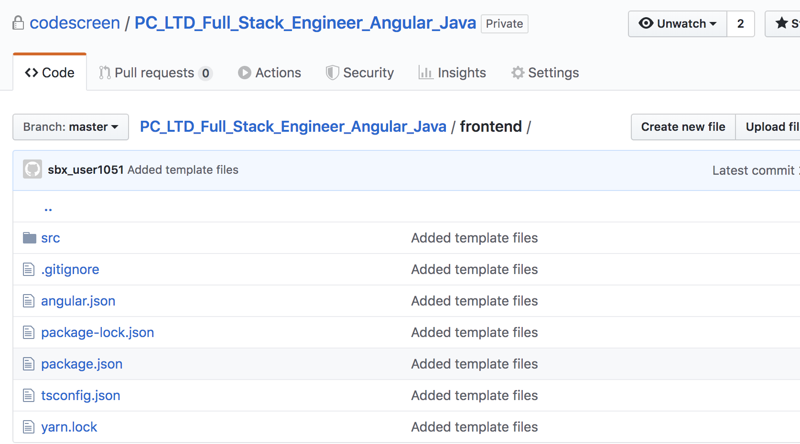
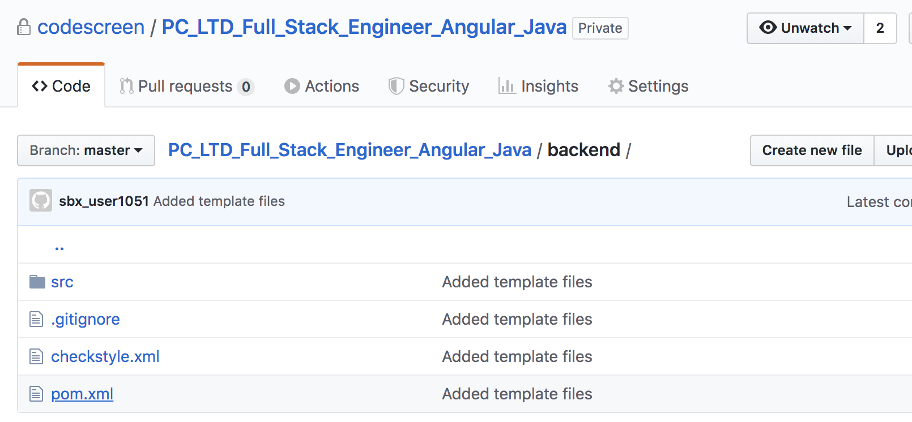

# Creating Custom Full-Stack Assessments
CodeScreen allows you to add your own full-stack assessments and send it to candidates.  
To begin, log on to [CodeScreen](https://app.codescreen.com/#/login), click <strong>Add new assessment</strong>, and select <strong>Custom assessment</strong>. 

You can then add the description of your assessment, choose which combination of frontend frameworks and backend languages you want the candidate to choose to build their solution to your assessment in, and set the time limit for the assessment. 

Once you click <strong>Publish</strong>, private GitHub repositories (one for each combination of frontend framework and backend language that you choose), will be created in the CodeScreen account, and you will be given access. 

Each repository will contain a skeleton project, with the <strong>frontend</strong> directory containing a skeleton project for the frontend framework chosen, and the <strong>backend</strong> directory containing a skeleton project for the backend language chosen. The README will contain the description of the assessment that you added during the setup. 

An example custom assessment repository, using Angular as the frontend framework and Java as the backend language, is shown below: 

<figure>
  <figcaption style="font-style: italic;">Root directory of a repository set up for an Angular & Java full-stack assessment.</figcaption>
   
  
</figure>

 

<figure>
  <figcaption style="font-style: italic;">The frontend directory of the repository, with a standard Angular project already set up.</figcaption>
   
  
</figure>

 

<figure>
  <figcaption style="font-style: italic;">The backend directory of the repository, with a standard Java Maven project already set up.</figcaption>
   
  
</figure>

  

You can then update each repository with details of your assessment and start sending the assessment to candidates.

### Further reading
Read this [blog post](https://blog.codescreen.com/introducing-template-generators/) to find out more about the theory and design principles behind custom full-stack assessments in CodeScreen.

### Automated test-suite setup
Automated test-suite scoring is not currently supported for full-stack assessments.