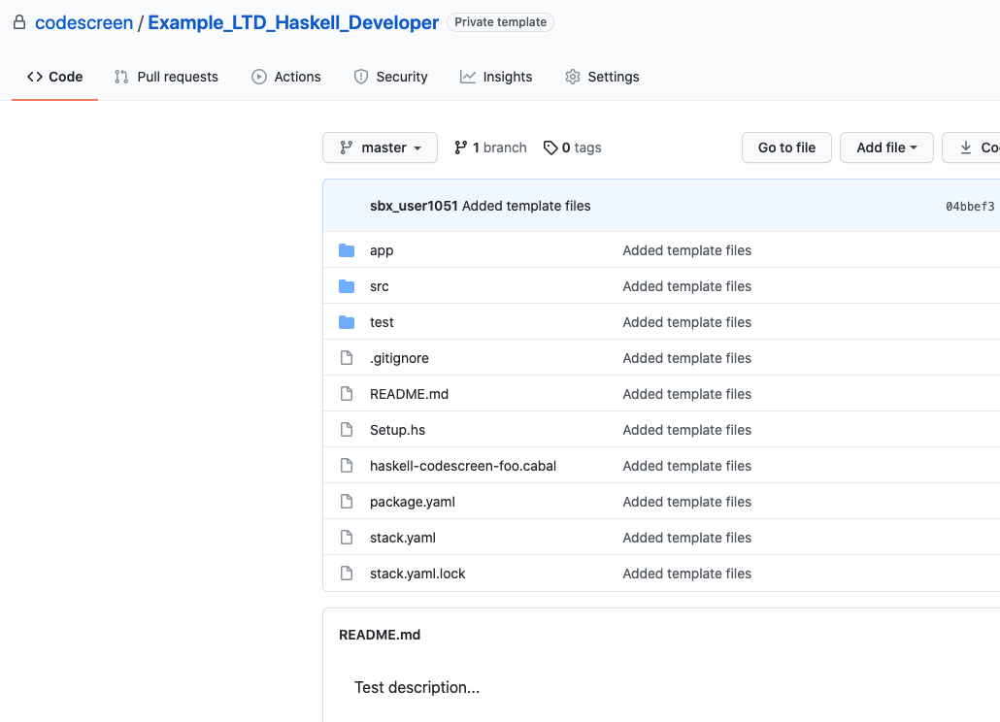

# Creating Custom Haskell Assessments
CodeScreen allows you to add your own assessment and send it to candidates.  
To begin, log on to [CodeScreen](https://app.codescreen.com/#/login), click <strong>Add new assessment</strong>, and select <strong>Custom assessment</strong>. 

You can then add the description of your assessment, choose <strong>Haskell</strong> from the drop-down list of available backend languages, and set the time limit for the assessment. 

Once you click <strong>Publish</strong>, a private GitHub repository will be created in the CodeScreen account, and you will be given access.
This repository will contain a skeleton <strong>Haskell</strong> project (which uses [Stack](https://www.haskellstack.org/)), and the README will contain the description of the assessment that you added during the setup.  

<figure>
  <figcaption style="font-style: italic;">Example custom Haskell assessment GitHub repository:</figcaption>
   
  
</figure>

  

### Automated test-suite setup

If you would like to add unit tests that are automatically run by CodeScreen against each candidate's solution to your assessment, you can add these as unit test files in the `test/` directory.

All unit tests files must be added in the `test/` directory.and use the `Hspec` testing framework.

All assessment filenames must end with `Spec.hs` and assessment files with filenames that end with `HiddenSpec.hs` will not be visible to the candidate.

If you want to add files that your hidden unit tests use and hence are also not visible to the candidate, the names of 
these files must begin with `hidden` (case-insensitive), e.g., `hiddenFoo.json`, `hiddenFoo.csv`, `HiddenFoo.hs`, etc.

The `package.yaml` file should only be modified in order to add any third-party dependencies required for your solution.

### Examples

An **example** `Haskell` assessment that uses automated test suite scoring can be seen here: 
https://github.com/Code-Screen/Haskell-CodeScreen-Fibonacci
