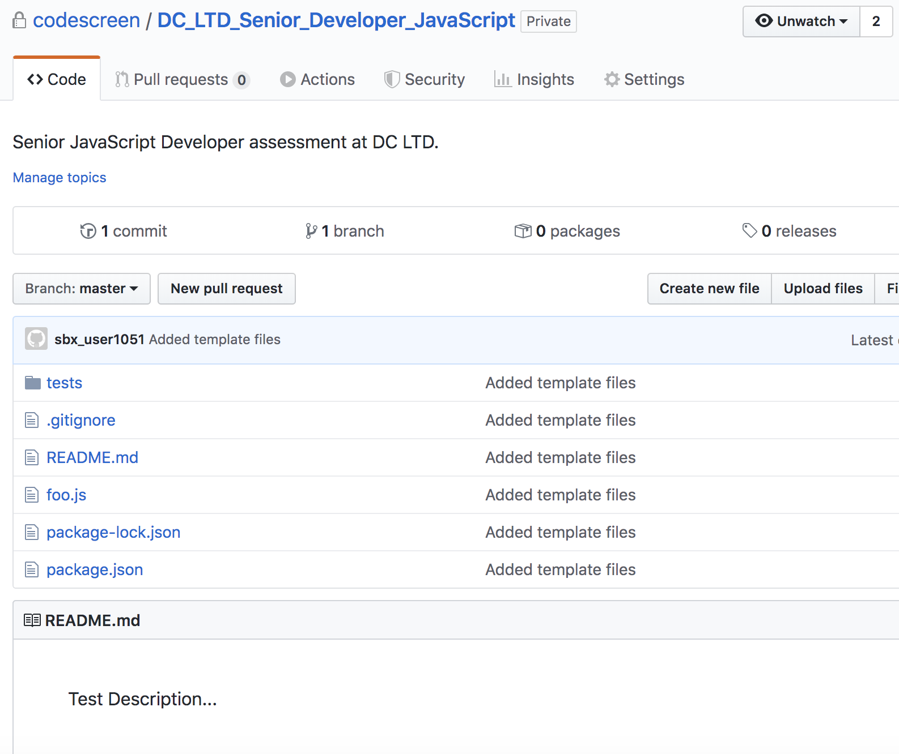

# Creating Custom JavaScript (Node.js) Assessments
CodeScreen allows you to add your own assessment and send it to candidates.  
To begin, log on to [CodeScreen](https://app.codescreen.com/#/login), click <strong>Add new assessment</strong>, and select <strong>Custom assessment</strong>. 

You can then add the description of your assessment, choose <strong>JavaScript</strong> from the drop-down list of available backend languages, and set the time limit for the assessment. 

Once you click <strong>Publish</strong>, a private GitHub repository will be created in the CodeScreen account, and you will be given access.
This repository will contain a skeleton <strong>Node.js</strong> project, and the README will contain the description of the assessment that you added during the setup.  

<figure>
  <figcaption style="font-style: italic;">Example custom JavaScript (Node.js) assessment GitHub repository:</figcaption>
   
  
</figure>

  

### Automated test-suite setup

If you would like to add assessments that are automatically run by CodeScreen against each candidate's solution to your assessment, you can add these as assessment files in the `tests/` directory.

All unit tests use the `Jest` testing framework.

All unit test file names must end with `.spec.js` and all unit test files with file names ending with `.hidden.spec.js` will not be visible to the candidate.

If you want to add files that your hidden unit tests use and hence are also not visible to the candidate, the names of these files must begin with `hidden`, e.g., `hiddenFoo.json`, `hiddenFoo.csv`, `hidden-foo.js`, etc.

The `package.json` file should only be modified in order to add any third-party dependencies required for your solution. The `jest` and `babel` versions should not be changed.

The coding assessment must be compatible with Node.js version `15.5.1`.

### Examples

An **example** `JavaScript` assessment that uses automated test suite scoring can be seen here: 
https://github.com/Code-Screen/JavaScript-CodeScreen-Fibonacci
