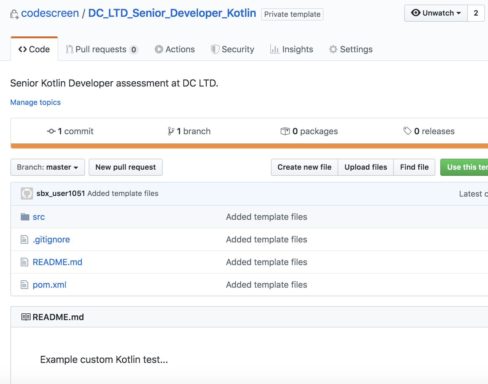

# Creating Custom Kotlin (Maven) Assessments
CodeScreen allows you to add your own assessment and send it to candidates.</br></br>
To begin, log on to [CodeScreen](https://app.codescreen.com/account/login), click <strong>Add new assessment</strong>, and select <strong>Custom assessment</strong>.</br>

You can then add the description of your assessment, choose <strong>Kotlin (Maven)</strong> from the drop-down list of available backend languages, and set the time limit for the assessment.</br>

Once you click <strong>Publish</strong>, a private GitHub repository will be created in the CodeScreen account, and you will be given access.
This repository will contain a skeleton <strong>Maven</strong> project, and the README will contain the description of the assessment that you added during the setup.</br></br>

<figure>
  <figcaption style="font-style: italic;">Example custom Kotlin (Maven) assessment GitHub repository:</figcaption>
  </br>
  
</figure>

</br></br>

### Automated test-suite setup

If you would like to add tests that are automatically run by CodeScreen against each candidate's solution to your assessment, you can add these as test classes in the `src/test/kotlin/` directory.

All unit test filenames must end with `"Test"` and all unit test filenames that end with `"HiddenTest"` will not be visible to the candidate. These hidden unit tests allow you to test candidate's solutions against edge cases etc.

If you want to add files that your hidden unit tests use and hence are also not visible to the candidate, the names of 
these files must begin with `hidden` (case-insensitive), e.g., `hiddenFoo.json`, `hiddenFoo.csv`, `HiddenFoo.kt`, etc.

All unit tests must use the [`Junit`](https://junit.org/junit5/) test framework and the `pom.xml` file may only be updated to add dependencies required for your coding assessment.

#### GitHub Action

CodeScreen uses GitHub Actions to run automated unit tests. We provide the following GitHub Action file for Kotlin (Maven) assessments. **Note** that this file is added dynamically to the repo of each candidate taking your assessment, so please do not include it in your template repo. This file also cannot be changed.

```
name: Kotlin CI

on: [push]

jobs:
  build:

    runs-on: ubuntu-latest

    steps:
    - uses: actions/checkout@v2
    - name: Set up JDK 1.11
      uses: actions/setup-java@v1
      with:
        java-version: 1.11
    - name: Build and Test
      run: mvn clean test
```

### Examples

An **example** `Kotlin (Maven)` assessment that uses automated test suite scoring can be seen here:<br/>
https://github.com/Code-Screen/Kotlin-Maven-CodeScreen-Fibonacci
