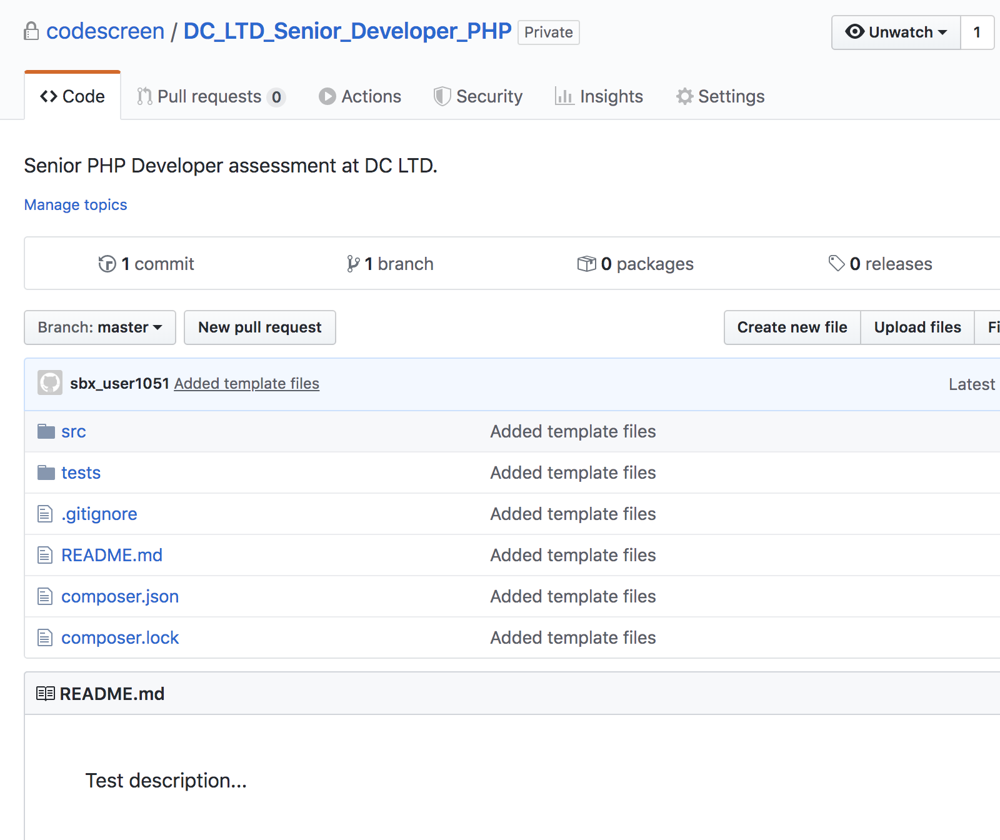

# Creating Custom PHP Assessments
CodeScreen allows you to add your own assessment and send it to candidates.  
To begin, log on to [CodeScreen](https://app.codescreen.com/account/login), click <strong>Add new assessment</strong>, and select <strong>Custom assessment</strong>. 

You can then add the description of your assessment, choose <strong>PHP</strong> from the drop-down list of available backend languages, and set the time limit for the assessment. 

Once you click <strong>Publish</strong>, a private GitHub repository will be created in the CodeScreen account, and you will be given access.
This repository will contain a skeleton <strong>PHP</strong> project, and the README will contain the description of the assessment that you added during the setup.  

<figure>
  <figcaption style="font-style: italic;">Example custom PHP assessment GitHub repository:</figcaption>
   
  
</figure>

  

### Automated test-suite setup

If you would like to add tests that are automatically run by CodeScreen against each candidate's solution to your assessment, you can add these as test classes in the `tests/` directory.

All unit test class filenames must end with `Test.php` and the test classes with filenames that end with `HiddenTest.php` will not be visible to the candidate.

If you want to add files that your hidden unit tests use and hence are also not visible to the candidate, the names of 
these files must begin with `hidden` (case-insensitive), e.g., `hiddenFoo.json`, `hiddenFoo.csv`, `HiddenFoo.php`, etc.

Your assessment must use/be compatible with `PHP` version 8.0 and all dependencies that your coding assessment requires need to be added to the `composer.json` file.

All unit tests must use be located in the `tests/` directory and use the [`PHPUnit`](https://phpunit.de)(version 9.3.0) testing framework.

### Examples

An **example** `PHP` assessment that uses automated test suite scoring can be seen here: 
https://github.com/Code-Screen/PHP-CodeScreen-Fibonacci
