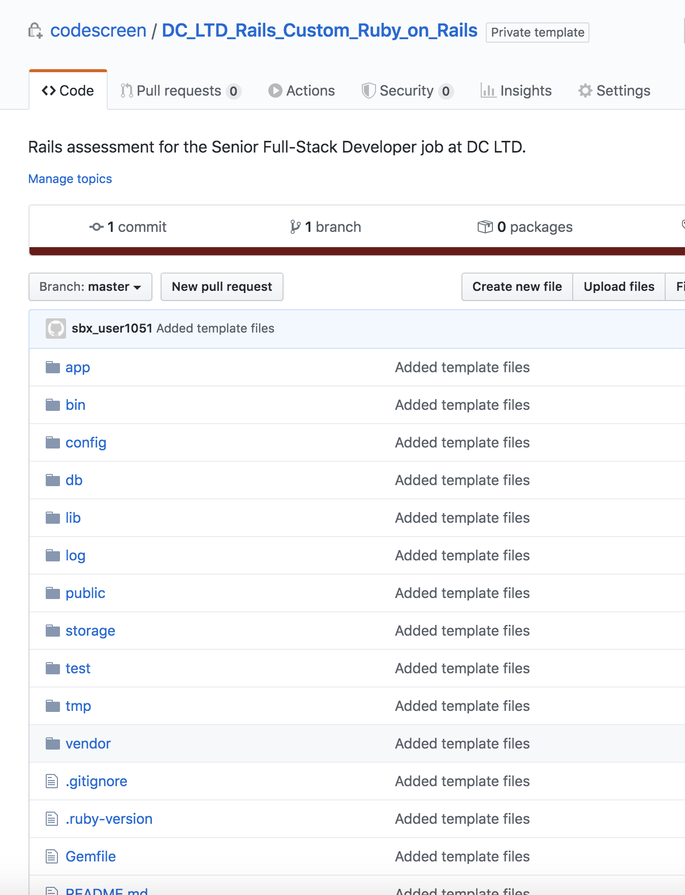

# Creating Custom Ruby on Rails Assessments
CodeScreen allows you to add your own assessment and send it to candidates.  
To begin, log on to [CodeScreen](https://app.codescreen.com/#/login), click <strong>Add new assessment</strong>, and select <strong>Custom assessment</strong>. 

You can then add the description of your assessment, choose <strong>Ruby on Rails</strong> from the drop-down list of available full-stack languages, and set the time limit for the assessment. 

Once you click <strong>Publish</strong>, a private GitHub repository will be created in the CodeScreen account, and you will be given access.
This repository will contain a skeleton <strong>Ruby on Rails</strong> template project, and the README will contain the description of the assessment that you added during the setup.  

<figure>
  <figcaption style="font-style: italic;">Example custom Ruby on Rails assessment GitHub repository:</figcaption>
   
  
</figure>

  

### Automated test-suite setup

If you would like to add tests that are automatically run by CodeScreen against each candidate's solution to your assessment, you can add these as unit test files in the `test/` directory.

All unit tests must extend [`ActiveSupport::TestCase`](https://api.rubyonrails.org/v6.0.2.2/classes/ActiveSupport/TestCase.html).

All integration tests must extend [`ActionDispatch::IntegrationTest`](https://api.rubyonrails.org/v6.0.2.2/classes/ActionDispatch/IntegrationTest.html).

All unit/integration test filenames must begin with `test_` and unit/integration test files with filenames that begin with `test_hidden` will not be visible to the candidate.

If you want to add files that your hidden unit tests use and hence are also not visible to the candidate, the names of these files must begin with `hidden`, e.g., `hiddenFoo.json`, `hiddenFoo.csv`, etc.

All dependencies required for your coding assessment must be added to the `Gemfile`.

The coding assessment must be compatible with `Ruby` version 2.5.3 and the `bundle` version required is 2.0.1.

The current content of the `Rakefile` must not be modified. You may add to the `Rakefile` as required for your coding assessment.
