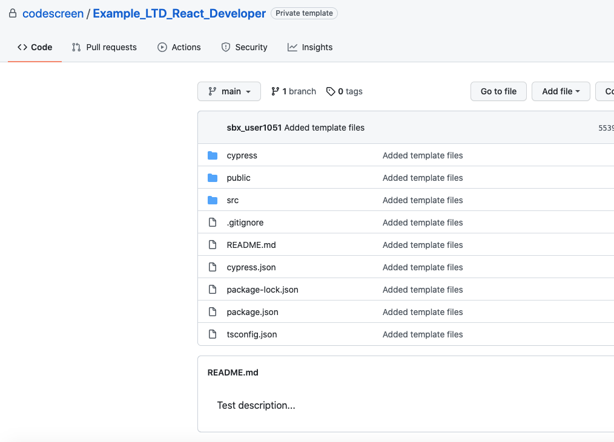

# Creating Custom React Assessments
CodeScreen allows you to add your own assessment and send it to candidates.</br></br>
To begin, log on to [CodeScreen](https://app.codescreen.com/account/login), click <strong>Add new assessment</strong>, and select <strong>Custom assessment</strong>.</br>

You can then add the description of your assessment, choose <strong>React</strong> from the drop-down list of available frontend frameworks, and set the time limit for the assessment.</br>

Once you click <strong>Publish</strong>, a private GitHub repository will be created in the CodeScreen account, and you will be given access.
This repository will contain a skeleton <strong>React</strong> project, and the README will contain the description of the assessment that you added during the setup.</br></br>

<figure>
  <figcaption style="font-style: italic;">Example custom React assessment GitHub repository:</figcaption>
  </br>
  
</figure>

</br></br>

You can then update this repository with details of your React assessment and start sending the assessment to candidates.

### Automated test-suite setup
If you would like to add tests that are automatically run by CodeScreen against each candidate's solution to your assessment, you can add these as unit tests or end-to-end tests.

All unit tests files must use the [Jest](https://jestjs.io/) or [Vitest](https://vitest.dev/) test framework, and all end-to-end tests must use the [Cypress](https://www.cypress.io/) E2E test framework.

All unit test filenames must end with `.test.js`, `.test.jsx`, `.test.ts` or `.test.tsx`, and unit test files with filenames that end with `.hidden.test.js`, `.hidden.test.jsx`, `.hidden.test.ts` or `.hidden.test.tsx` will not be visible to the candidate.

All end-to-end test filenames must end with `.cy.js` or `.cy.ts`, and end-to-end test files with filenames that end with `.hidden.cy.js` or `.hidden.cy.ts` will not be visible to the candidate.

If you want to add files that your hidden unit tests use and hence are also not visible to the candidate, the names of 
these files must begin with `hidden` (case-insensitive), e.g., `hiddenFoo.json`, `hiddenFoo.csv`, `HiddenFoo.js`, etc.

You can use either [Create React App](https://create-react-app.dev/) or [Vite](https://vitejs.dev/) as your project build tool.

#### GitHub Action

CodeScreen uses GitHub Actions to run automated unit & integration tests. We provide the following GitHub Action file for React assessments. **Note** that this file is added dynamically to the repo of each candidate taking your assessment, so please do not include it in your template repo. This file also cannot be changed.

```
name: React CI

on: push

jobs:

  unit:
    runs-on: ubuntu-latest
    steps:
    - name: Checkout
      uses: actions/checkout@v3

    - name: Install dependencies
      run: npm install

    - name: Run unit tests
      run: npm test -- --passWithNoTests
      env:
        CI: false

  e2e:
    runs-on: ubuntu-latest
    steps:
    - name: Checkout
      uses: actions/checkout@v3

    - name: Install dependencies
      run: npm install

    - name: Check Cypress tests exist
      id: check_cypress_tests
      uses: andstor/file-existence-action@v1
      with:
        files: "cypress/e2e/"

    - name: Install and run Cypress tests
      uses: cypress-io/github-action@v5
      if: steps.check_cypress_tests.outputs.files_exists == 'true'
      env:
        GITHUB_TOKEN: ${{ secrets.GITHUB_TOKEN }}
      with:
        build: npm run build --if-present
        start: npm start
        wait-on: 'http://localhost:3000'
```

### Examples

Check out our `React` library assessments to see examples of how our React assesments are structured.