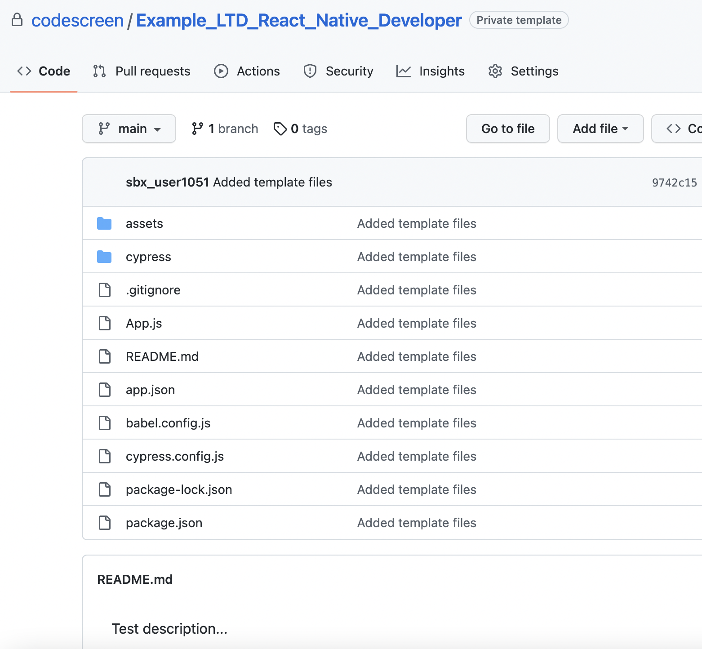

# Creating Custom React Native Assessments
CodeScreen allows you to add your own assessment and send it to candidates.  
To begin, log on to [CodeScreen](https://app.codescreen.com/#/login), click <strong>Add new assessment</strong>, and select <strong>Custom assessment</strong>. 

You can then add the description of your assessment, choose <strong>React Native</strong> from the drop-down list of available frontend frameworks, and set the time limit for the assessment. 

Once you click <strong>Publish</strong>, a private GitHub repository will be created in the CodeScreen account, and you will be given access.
This repository will contain a skeleton <strong>React Native</strong> project created with [Expo](https://expo.dev/), and the README will contain the description of the assessment that you added during the setup.  

<figure>
  <figcaption style="font-style: italic;">Example custom React Native assessment GitHub repository:</figcaption>
   
  
</figure>

  

You can then update this repository with details of your assessment and start sending the assessment to candidates.

### Automated test-suite setup

If you would like to add tests that are automatically run by CodeScreen against each candidate's solution to your assessment, you can add these as end-to-end assessments.

All end-to-end assessments must use the [Cypress](https://www.cypress.io/) E2E assessment framework.

All end-to-end assessment filenames must end with `.cy.js`, and end-to-end assessment files with filenames that end with `-hidden.cy.js` will not be visible to the candidate.

If you want to add files that your hidden end to end assessments use and hence are also not visible to the candidate, the names of these files must begin with `hidden`, e.g., `hiddenFoo.json`, `hiddenFoo.csv`, `hidden-foo.ts`, etc.

The `package.json` file may only be changed if you want to add third-party libraries to your assessment. All the current versions of the dependencies in `package.json` and `package-lock.json` must not be changed. 

The other config files in the template repo must also not be changed, including the `babel.config.js` and `cypress.config.js` files.

### Examples

Please see our React Native library assessments for more information on how our React Native automated test suites are set up.
