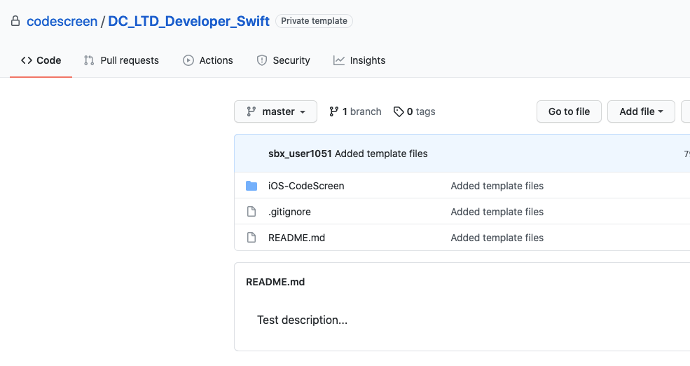
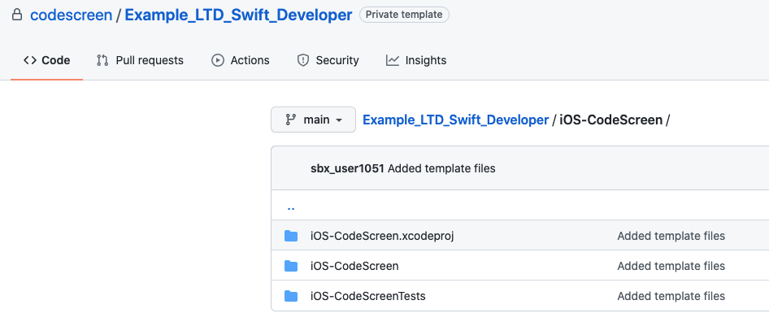

# Creating Custom Swift Assessments
CodeScreen allows you to add your own assessment and send it to candidates.  
To begin, log on to [CodeScreen](https://app.codescreen.com/#/login), click <strong>Add new assessment</strong>, and select <strong>Custom assessment</strong>. 

You can then add the description of your assessment, choose <strong>Swift</strong> from the drop-down list of available backend languages, and set the time limit for the assessment. 

Once you click <strong>Publish</strong>, a private GitHub repository will be created in the CodeScreen account, and you will be given access.
This repository will contain a skeleton `Xcode` project, and the README will contain the description of the assessment that you added during the setup.  

<figure>
  <figcaption style="font-style: italic;">Example custom Swift assessment GitHub repository:</figcaption>
   
  
</figure>

<figure>
  <figcaption style="font-style: italic;">Example custom Swift assessment GitHub repository:</figcaption>
   
  
</figure>

  

### Automated test-suite setup

If you would like to add assessments that are automatically run by CodeScreen against each candidate's solution to your assessment, you can add these as test classes in the `iOS-CodeScreen/iOS-CodeScreenTests/` directory.

All unit test class filenames must end with `Tests.swift` and the test classes with filenames that end with `HiddenTests.swift` will not be visible to the candidate. All unit tests must use the [XCTest](https://developer.apple.com/documentation/xctest) testing framework.

If you want to add files that your hidden unit tests use and hence are also not visible to the candidate, the names of 
these files must begin with `hidden` (case-insensitive), e.g., `hiddenFoo.json`, `hiddenFoo.csv`, `HiddenFoo.swift`, etc.

`Xcode` version 12.1 must be used.

### Examples

Check out our `Swift` library assessments to see examples of how our Swift assesments are structured.
