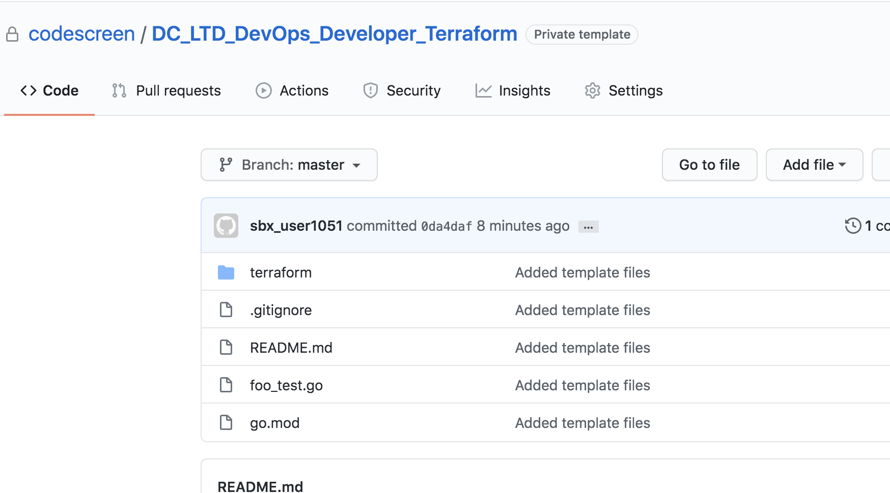
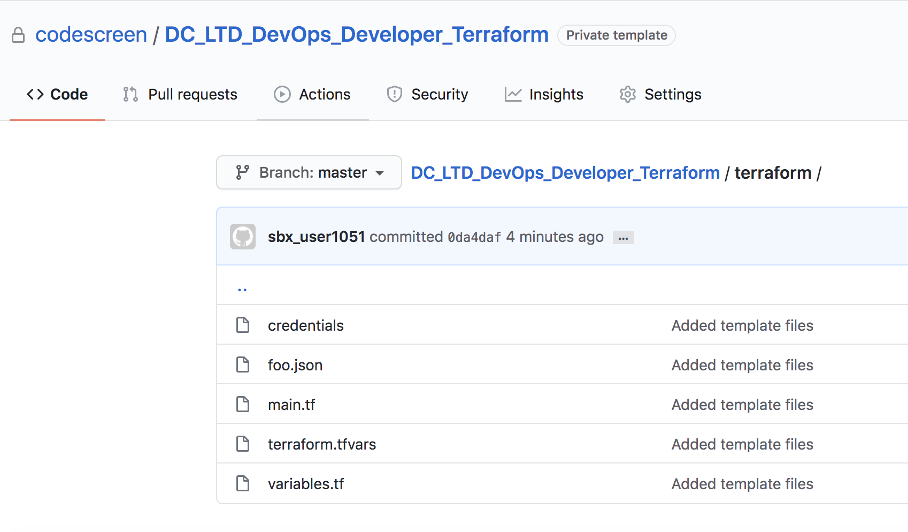

# Creating Custom Terraform Assessments
CodeScreen allows you to add your own assessment and send it to candidates.</br></br>
To begin, log on to [CodeScreen](https://app.codescreen.com/account/login), click <strong>Add new assessment</strong>, and click the <strong>Custom</strong> button.</br>

You can then add the description of your assessment, choose <strong>Terraform</strong> from the drop-down list of available `DevOps` tools, and set the time limit for the assessment.</br>

Once you create an assessment, a private GitHub repository will be created in the CodeScreen account, and you will be given access.
This repository will contain a skeleton <strong>Terraform</strong> project, and the README will contain the description of the assessment that you added during the setup.</br></br>

<figure>
  <figcaption style="font-style: italic;">Example custom Terraform assessment GitHub repository:</figcaption>
  </br>
  
</figure>

</br>

<figure>
  <figcaption style="font-style: italic;">The terraform directory in the GitHub repository:</figcaption>
  </br>
  
</figure>

</br>

### Automated test-suite setup

If you would like to add tests that are automatically run by CodeScreen against each candidate's solution to your assessment, you can add these to the existing `foo_test.go` file in the template repository. It would be best if you also renamed this `foo_test.go` file to something more relevant to your assessment.

We use the [Terratest](https://terratest.gruntwork.io/) `Go` library to run automated tests against the resources that are created when we run & deploy the candidate's Terraform code.

You can add more than one unit test files. All unit test file names must end with `_test.go`, and all unit test classes with names that end with `_hidden_test.go` will not be visible to the candidate. These hidden tests allow you to test candidate's solutions against edge cases etc.

If you want to add files that your hidden tests use and hence are also not visible to the candidate, the names of these files must begin with `hidden` (case-insensitive), e.g., `hiddenFoo.json`, `hiddenFoo.csv`, `hidden_foo.go`, etc.

The existing dependencies and versions in the `go.mod` file must not be modified.

#### Permissions

If you want to use `AWS`, please send us the permissions the candidate's `IAM` user will need to have to create the required resources to pass your assessment. We will then create an IAM user in <strong>our</strong> AWS account with the given permissions. We will then add the AWS `Access Key and Secret Key` to the existing `credentials` file in the template repo.

Likewise, for `GCP`, please send us the permissions the candidate's `service account` will need to have to create the required resources to pass your assessment. We will then create a new service account in <strong>our</strong> `GCP` account with the given permissions. We will then add the service account's key `.json` file to your template repo (replacing the existing `foo.json` file).

#### GitHub Action

CodeScreen uses GitHub Actions to run automated unit tests. We provide the following GitHub Action file for Terraform assessments. **Note** that this file is added dynamically to the repo of each candidate taking your assessment, so please do not include it in your template repo. This file also cannot be changed.

```yaml
name: Terraform CI

on: [push]

jobs:

  build:
    runs-on: ubuntu-latest
    steps:
    - uses: actions/checkout@v3

    - name: Set up Terraform
      uses: hashicorp/setup-terraform@v4
      with:
        terraform_version: 1.3.7
        terraform_wrapper: false

    - name: Set up Go
      uses: actions/setup-go@v2
      with:
        go-version: 1.19

    - name: Download dependencies
      run: go mod download

    - name: Tidy depedencies
      run: go mod tidy

    - name: Test
      run: go test -v
```
