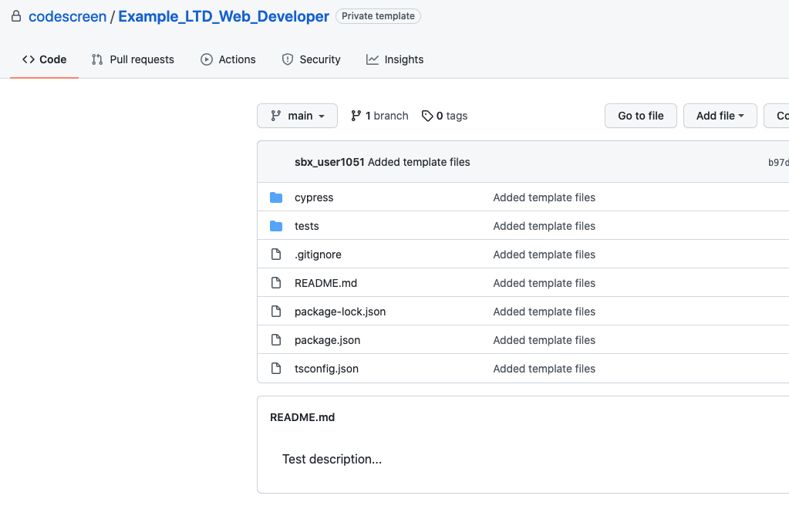

# Creating Custom Web Assessments
To start, [log in](https://app.codescreen.com/account/login) to CodeScreen, click <strong>Add new assessment</strong>, and select <strong>Custom assessment</strong>.

You can then add the description of your assessment, select the <strong>Frontend</strong> category and then choose `Web` from the drop-down list of available frontend frameworks.

The Web option is suitable for when you want to create a custom frontend assessment that tests a candidate's `HTML`, `CSS` and `JavaScipt/TypeScript` skills outside of a framework such as `React` or `Angular`.

Once you create an assessment, a private GitHub repository will be created in the CodeScreen account, and you will be given access.

This repository will contain a skeleton project, and the `README.md` file will contain the description of the assessment that you added during the setup.

</br>

<figure>
  <figcaption style="font-style: italic;">Example custom Web assessment GitHub repository:</figcaption>
  </br>
  
</figure>

</br></br>

You can then update this repository with details of your assessment and start sending the assessment to candidates.

### Automated test-suite setup
If you would like to add tests that are automatically run by CodeScreen against each candidate's solution to your assessment, you can add these as unit tests or end-to-end tests.

All unit tests files must use the `Jest` test framework, and all end-to-end tests must use the `Cypress` E2E test framework.

The `package.json` file may be updated to add any third-party libraries and any `scripts` commands required for your assessment.

#### Naming Conventions

- Unit test filenames must end with `.test.js`, `.test.ts` or `.test.tsx`. Files with names ending in `.hidden.test.js`, `.hidden.test.ts` or `.hidden.test.tsx` will be hidden from the candidate.
- End-to-end test filenames must end with `.spec.js` or `.spec.ts`. Files with names ending in `.hidden.spec.js` or `.hidden.spec.ts` will be hidden from the candidate.
- To hide files used by hidden tests, their names must start with "hidden" (case-insensitive), for example: `hiddenFoo.csv`, `HiddenFoo.js`, etc.

#### GitHub Action

CodeScreen uses GitHub Actions to run automated unit & integration tests. We provide the following GitHub Action file for Web assessments. 

**Note** that this file is added dynamically to the repo of each candidate taking your assessment, so please do not include it in your template repo. This file also cannot be changed.

```yaml
name: Web CI

on: push

jobs:

  unit:
    runs-on: ubuntu-latest
    steps:
    - name: Checkout
      uses: actions/checkout@v3

    - name: Install dependencies
      run: npm install

    - name: Run Jest tests
      run: npm test -- --passWithNoTests
      env:
        CI: false

  e2e:
    runs-on: ubuntu-latest
    steps:
    - name: Checkout
      uses: actions/checkout@v3

    - name: Install dependencies
      run: npm install

    - name: Check Cypress tests exist
      id: check_cypress_tests
      uses: andstor/file-existence-action@v1
      with:
        files: "cypress/e2e/"

    - name: Install and run Cypress tests
      uses: cypress-io/github-action@v4
      if: steps.check_cypress_tests.outputs.files_exists == 'true'
      env:
        GITHUB_TOKEN: ${{ secrets.GITHUB_TOKEN }}
      with:
        build: npm run build --if-present
        start: npm start
        wait-on: 'http://localhost:3000'
```