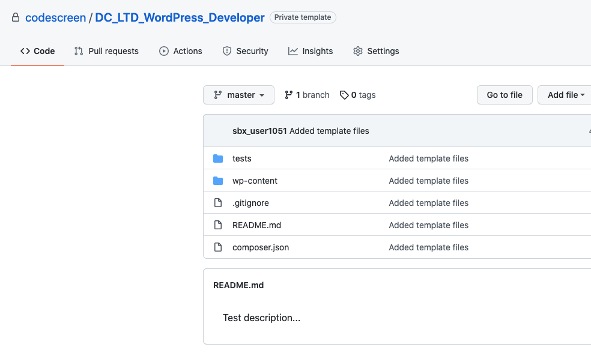

# Creating Custom WordPress Assessments
CodeScreen allows you to add your own assessment and send it to candidates.</br></br>
To begin, log on to [CodeScreen](https://app.codescreen.com/account/login), click <strong>Add new assessment</strong>, and select <strong>Custom assessment</strong>.</br>

You can then add the description of your assessment, choose <strong>WordPress</strong> from the drop-down list of available full-stack languages, and set the time limit for the assessment.</br>

Once you create an assessment, a private GitHub repository will be created in the CodeScreen account, and you will be given access.
This repository will contain a skeleton <strong>WordPress</strong> project, and the README will contain the description of the assessment that you added during the setup.</br></br>

<figure>
  <figcaption style="font-style: italic;">Example custom WordPress assessment GitHub repository:</figcaption>
  </br>
  
</figure>

</br></br>

### Automated test-suite setup

If you would like to add tests that are automatically run by CodeScreen against each candidate's solution to your assessment, you can add these as test classes in the `tests/` directory.

All unit test class filenames must end with `Test.php` and the test classes with filenames that end with `HiddenTest.php` will not be visible to the candidate.

If you want to add files that your hidden tests use and hence are also not visible to the candidate, the names of
these files must begin with `hidden` (case-insensitive), e.g., `hiddenFoo.json`, `hiddenFoo.csv`, `HiddenFoo.php`, etc.

`PHP` version 7.4 must be used and all dependencies that your coding assessment requires need to be added to the `composer.json`
file.

All unit tests must use be located in the `tests/` directory and use the [`PHPUnit`](https://phpunit.de)(version 8.1.2) testing framework.

#### GitHub Action

CodeScreen uses GitHub Actions to run automated unit tests. We provide the following GitHub Action file for WordPress assessments. **Note** that this file is added dynamically to the repo of each candidate taking your assessment, so please do not include it in your template repo. This file also cannot be changed.

```yaml
name: WordPress CI

on: [push]

jobs:
  build:

    runs-on: ubuntu-latest

    steps:
    - uses: actions/checkout@v3
    - uses: nanasess/setup-php@master
      with:
        php-version: '7.4'
    - name: Update composer
      run: composer update
    - name: Install dependencies
      run: composer install
    - name: Run tests
      run: vendor/bin/phpunit tests/
```

### Code validation

We also validate each candidate's solution against the WordPress [Coding Standards](https://make.wordpress.org/core/handbook/best-practices/coding-standards/), and flag any issues we find in the static analysis issues section of our [result screen](https://code-screen.github.io/docs/#/results).
