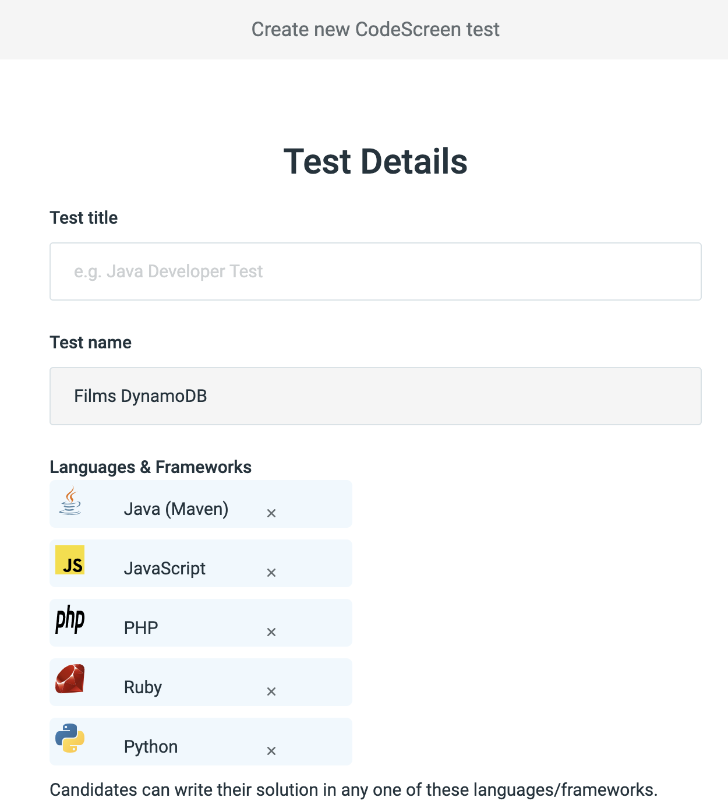
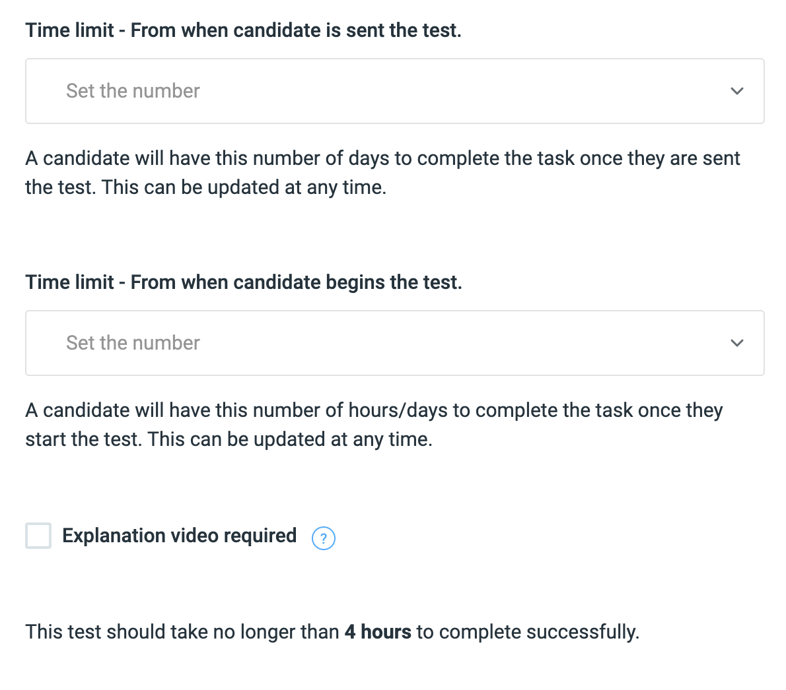

# Creating a Library Test

Once you choose a library test, you then need to give it a name (e.g. Python Developer) and select which choice of language/framework the candidate has to write their soliution to the test in.

<figure>
  <figcaption style="font-style: italic;"></figcaption>
   
  
</figure>

 

You can also set the time limits for the test and select whether a video recording is required from the candidate to explain their
solution.

<figure>
  <figcaption style="font-style: italic;"></figcaption>
   
  
</figure>

Please read <a href="https://code-screen.github.io/Candidate-Video-Docs" target="_blank">here</a> for more details on video recordings.

The time limits are broken into the following:

* `Sent` - The maximum number of days the candidate has to complete the test once they it is sent to them.

* `Begins` - The maximum number of hours/days the candidate has to complete the test once they they start the test.

You will also notice that we display a recommended maximum `Begins` time. Please **note** that all our library tests are designed
to be successfully   solved within 60-90 minutes. We do, however, suggest a time greater than this to avoid making candidates 
feel unnecessarily stressed,   which allows them to perform better on the test.

Once you have filled out all the above, then click the `Publish` button, and you can start [sending](sendingTests.md) your new test to candidates!
