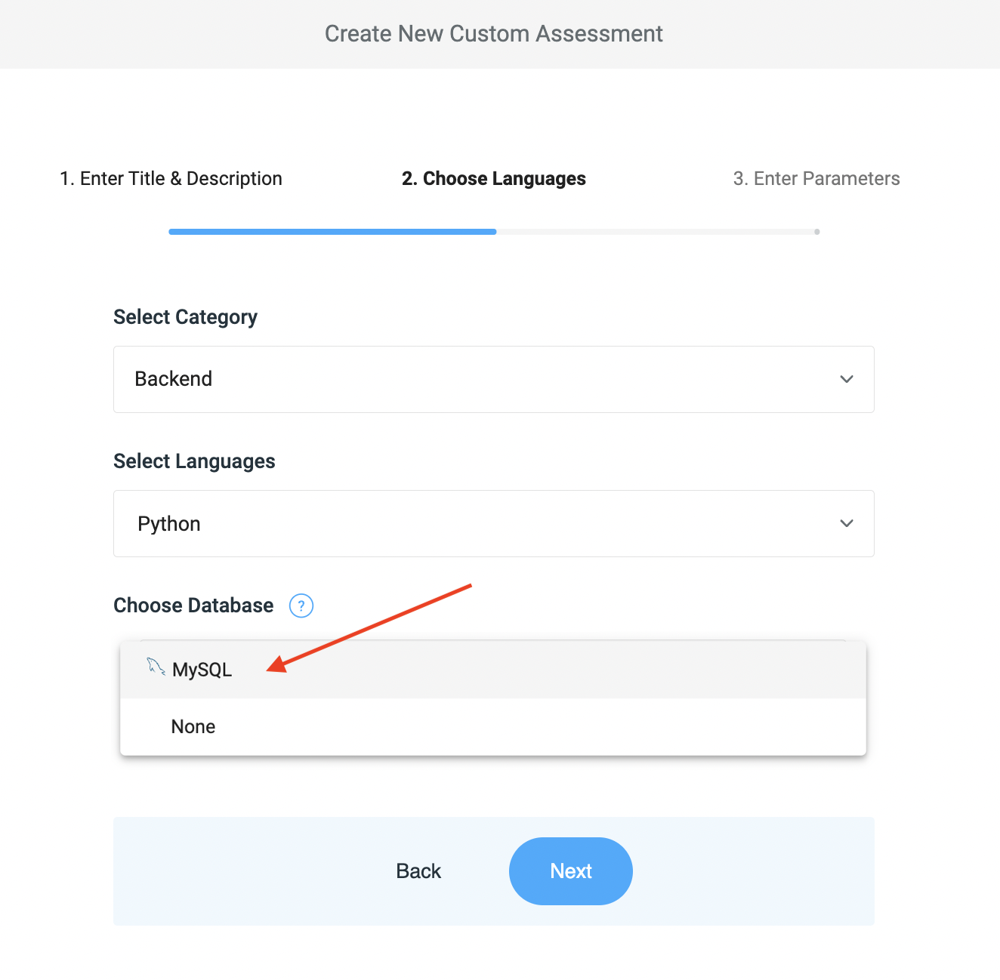
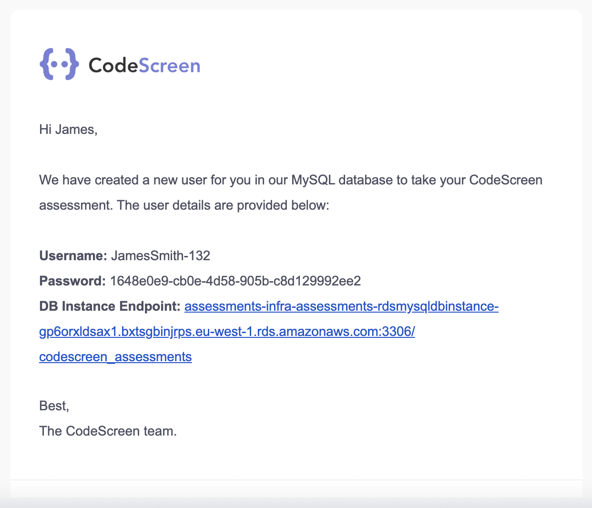

# Custom Assessment MySQL Databases

To create a new custom assessment with the MySQL database option enabled, please follow these steps:

1. [Log in](https://app.codescreen.com/account/login) to CodeScreen, click <strong>Add new assessment</strong>, and click the <strong>Custom</strong> button.

2. Enter the title & description and click the <strong>Next</strong> button.

3. In the <strong>Choose Languages</strong> section, once you click either the `Backend` or `Full-Stack` categories, and then choose your language(s). You will then see an option to select a database. Please choose `MySQL` from the dropdown list and click the <strong>Next</strong> button.

<figure>
  <figcaption style="font-style: italic;"></figcaption>
  </br>
  
</figure>

4. Complete the <strong>Enter Parameters</strong> section to create your assessment.

### Setup
Once your assessment is created, a private GitHub template repository will be created in the CodeScreen account, and you will be given access.

This repository will contain a `dbSetup.sql` file. This is the file in which to add any SQL statements that you want executed as a pre-processing step for each candidate once they start your assessment. 

The only statements that are permitted are `CREATE TABLE` and `INSERT INTO`, e.g.:

```sql
-- Example create table statement
CREATE TABLE {tableNamePrefix}_Store1 (
    ID INT AUTO_INCREMENT PRIMARY KEY,
    Name VARCHAR(255) NOT NULL,
    City VARCHAR(255) NOT NULL
);

-- Example insert data statement
INSERT INTO {tableNamePrefix}_Store1 (Name, City) VALUES
    ('John Doe', 'New York'),
    ('Jane Smith', 'Los Angeles'),
    ('Bob Johnson', 'Boston'),
    ('Alice Brown', 'Denver');
```

<br>

**Note** that this setup file will not be present in the repo that is generated for the candidate.

### Variables
To ensure we create unique tables for each candidate, the variable `{tableNamePrefix}` needs to be used in all places in the setup script where a table name is referenced.

We will then dynamically replace this with the candidate’s repo name before executing the setup file for each candidate.

We also replace all occurences of the {tableNamePrefix} variable in the `README.md` file of the candidate's repo with their repo name, so you can include the table names in your instructions you provide in your README.md file. 

### Users

In order for the candidate to interact with the tables created for them, we will create a user for each candidate in our MySQL DB instance once they start your assessment, and we will email them the details:

<figure>
  <figcaption style="font-style: italic;"></figcaption>
  </br>
  
</figure>

<br>

Once the candidate has submitted their solution and we have processed the result & report, we will then delete the user that was created for that candidate.

### Limits
The maximum combined size of all tables for each candidate is 2GB.
