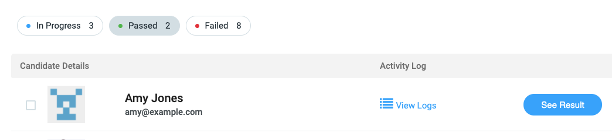
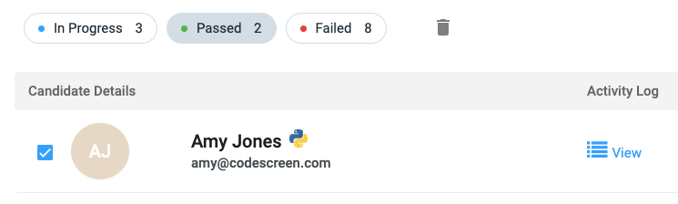
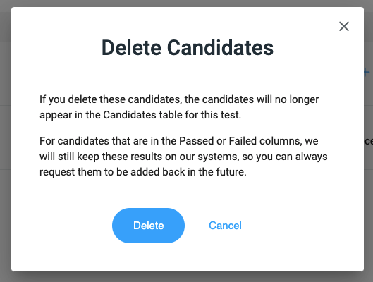

# Deleting Candidates

To delete candidates for a particular test, click the checkbox beside each candidate you want to delete. 

<figure>
  <figcaption style="font-style: italic;"></figcaption>
   
  
</figure>

Once you select one or more candidates, a `trash` icon will appear to the right of the `Failed` filter.

<figure>
  <figcaption style="font-style: italic;"></figcaption>
   
  
</figure>

 

Once you click the trash icon, you will then see the following pop-up:

<figure>
  <figcaption style="font-style: italic;"></figcaption>
   
  
</figure>

 

As stated in the pop-up, for candidates that have either Passed or Failed the test, we will keep the candidates' results on our systems, so you can retrieve them at any time by messaging us on our live chat or via <a href="mailto:hello@codescreen.dev">email</a>. You can also request us to delete the results permanently,
again by messaging us on our live chat or via email.

For candidates that are still In Progress, these will be deleted permanently, so please be sure before clicking the `Delete` button.

Once you click the blue `Delete` button, the candidates will no longer appear in the Candidate list table for that test.
