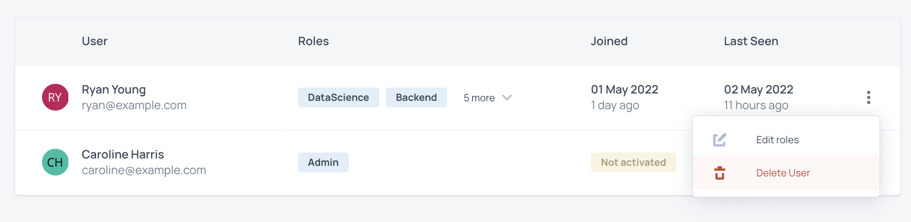
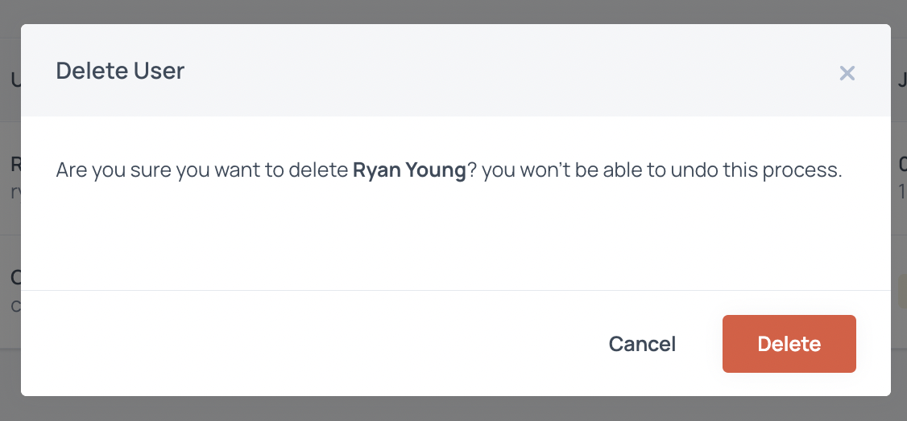

# Deleting Users

To remove a user from your CodeScreen account, first click the `Your Account` entry in the drop down list that pops after you click on your name at the top right of the toolbar, and then choose `Users` from the sections on the left.

Now, click on the 3 bullet point icon to the right of the user's row and then click `Delete user`:

<figure>
  <figcaption style="font-style: italic;"></figcaption>
   
  
</figure>

 

You will then see a pop up to confirm that you want to remove the user:

<figure>
  <figcaption style="font-style: italic;"></figcaption>
   
  
</figure>

