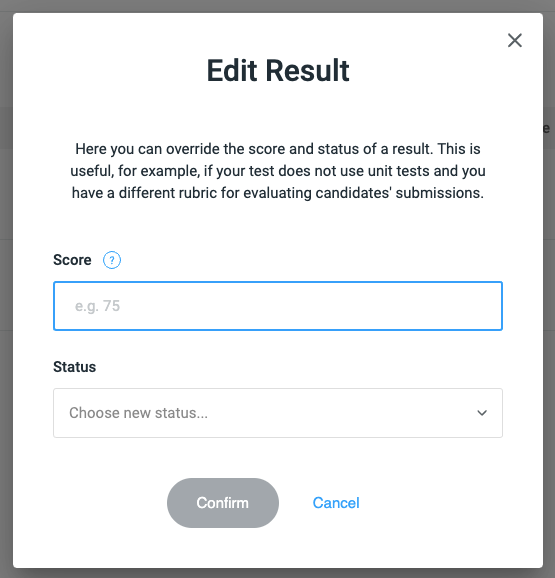

# Editing Results

You can override the score and status of a candidate's result. This is useful, for example, if your test does not use 
unit tests and you have a different rubric for evaluating candidates' submissions.

To do this, click the edit pencil icon beside the candidate's score in the candidate list screen:

<figure>
  <figcaption style="font-style: italic;"></figcaption>
   
  
</figure>

 

You will then see the following pop-up:

<figure>
  <figcaption style="font-style: italic;"></figcaption>
   
  
</figure>

 

Once you choose the new score and status (optional, you can leave the status as is), click the blue `Confirm` button, and that's it!
