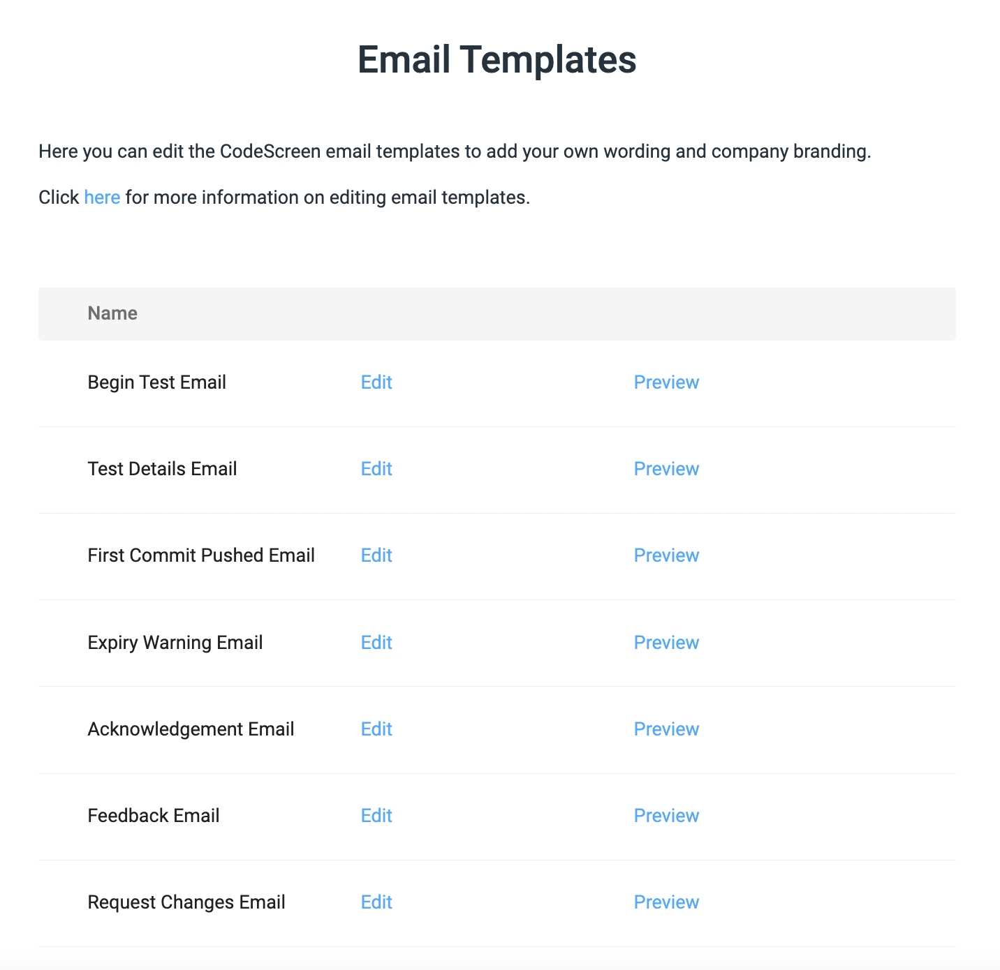

# Editing Email Templates

Candidates receive multiple emails from CodeScreen during their journey through a CodeScreen assessment, from when they are initially sent an assessment to when they submit their solution.

We provide the option to edit these email templates to include your company's logo and wording, which gives the candidate
more of a consistent experience across your interview process.

To edit the email templates, click into the
<a href="https://app.codescreen.com/#/client-templates" target="_blank">Emails</a> section on the top toolbar on CodeScreen, which will take you to the following screen:

<figure>
  <figcaption style="font-style: italic;"></figcaption>
   
  
</figure>

**Note** that you will not have access to the Emails section on CodeScreen unless you are an admin user. If you are not
an admin, please contact one of the admin users in your organization, and they will be able to make you an admin.

Each email type has a default template associated with it, and you can view these by clicking `Show default` beside each type.

To edit an email template, click `Edit`. You can then edit the default `HTML` to include your own branding and wording.
Editing HTML can be easily performed by you or by one of your developer colleagues if you are a non-technical user. If this is not an option, then please message on our live chat and we can do this for you.

Each email template has a set of `substitution variables` that we use to dynamically insert information into the email HTML. 
Examples of these include the candidate's first name, the assessment time limit, etc.

Below is a table which shows at which point during the candidate assessment journey lifecycle each email is sent, and the
substitution variables that are used for each:

<table>
<thead>
<tr>
<td style="white-space: nowrap;"><strong>Email name</strong></td><td><strong>Sent point</strong></td><td><strong> Variables used</strong></td></tr>
</thead><tbody>
<tr>
<td>Begin Assessment</td><td>When a candidate is initially sent the assessment.</td><td>{firstName}, {assessmentTitle}, {companyName}, {candidateLinkUrl},
{dateTimeToBeginassessmentDisplayValue}, {timeToCompleteassessmentBeginsDisplayValue}.</td></tr>
<tr style="background-color: white;">
<td>Assessment Details</td><td>When a candidate begins the assessment.</td><td>{assessmentTitle}, {companyName}, {candidateLinkUrl}, {repoUrl}.</td></tr>
<tr>
<td>First Commit</td><td>When a candidate pushes their first commit(s) to their GitHub repo.</td><td>{assessmentTitle}, {companyName}, {candidateLinkUrl}.</td></tr>
<tr style="background-color: white;">
<td>Expiry Warning</td><td>Sent when there is 30 minutes left before the assessment expires.</td><td>{firstName}, {assessmentTitle}, {companyName}, {candidateLinkUrl}.</td></tr>
<tr>
<td>Acknowledgement</td><td>Sent after the candidates submits their solution for the assessment.</td><td>{assessmentTitle}, {companyName}.</td></tr>
<tr style="background-color: white;">
<td>Feedback</td><td>Sent to notify the candidate that you have given them feedback on their solution.</td><td>{assessmentTitle}, {companyName}, {repoUrl}, {comments}.</td></tr>
<tr>
<td>Request Changes</td><td>Sent to notify the candidate that you have requested changes on their solution.</td><td>{assessmentTitle}, {companyName}, {candidateLinkUrl},{comments}.</td></tr>
</tbody></table>

 

An explanation on what each variable is referring to is provided below:

* `{firstName}` - The candidate's first name.

* `{assessmentTitle}` - The name of your assessment that the candidate has been sent.
* `{companyName}` - The name of your company you set when you signed up to CodeScreen. This can be edited <a href="https://app.codescreen.com/#/client-profile-edit/details" target="_blank">here</a>.
* `{candidateLinkUrl}` - The link to the candidate's assessment page on CodeScreen.
* `{repoUrl}` - The link to the candidate's private repo on GitHub.
* `{dateTimeToBeginassessmentDisplayValue}` - The date time the candidate has until to begin the assessment, e.g. "11th November at 18:30 (UTC)". This is always displayed in the UTC timezone.
* `{timeToCompleteassessmentBeginsDisplayValue}` - The number of hours/days the candidate has to complete the assessment from when they   begin the assessment, e.g. "3 hours", "1 day", etc.
* `{comments}` - The list of comments that have been left on the candidate's GitHub repo when feedback is given/changes are requested.
