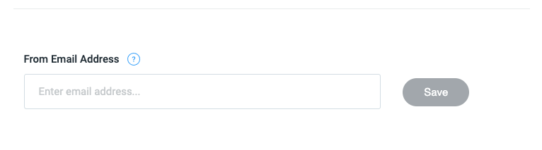

# Editing the From Email Address

You can also edit the email address from which the emails to candidates are sent. The default email address is
<a href="mailto:hello@codescreen.com">hello@codescreen.com</a>.

If you want to change this to one of the internal email addresses you use for hiring, enter it into the
`From Email Address` field at the bottom of the <a href="https://app.codescreen.com/#/client-templates" target="_blank">Emails</a> section,
and click the `Save` button:

<figure>
  <figcaption style="font-style: italic;"></figcaption>
   
  
</figure>

Once you do this, the email address you entered will receive a verification request email from <a href="https://aws.amazon.com/ses/" target="_blank">Amazon SES</a>,
our email provider. You just need to click the link in that email, and then all emails sent to candidates will be sent from this email address.

### Enabling DKIM

To improve deliverability rates when using a custom email address, you can also configure `DomainKeys Identified Mail (DKIM)`, which provides proof that the emails you send to candidates originate from your domain and are authentic. DKIM signatures are stored in your domain's DNS system. Once you save a custom email address, you will also receive an email from CodeScreen containing the records you need to add to your DNS settings to enable DKIM.
