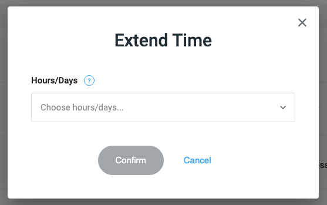

# Extending Time

If you would like to extend the time a candidate has to complete their assessment, you can click the blue + icon to the right
of the time left value for that candidate.

<figure>
  <figcaption style="font-style: italic;"></figcaption>
   
  
</figure>

 

You will then see the following pop-up:

<figure>
  <figcaption style="font-style: italic;"></figcaption>
   
  
</figure>

 

If the candidate has not started the assessment, the number of hours/days you choose here will be added to the 
`existing deadline` the candidate has to start the assessment from when they were sent the assessment. The `existing deadline`
here refers to the `Deadline` value you had set for this assessment when you sent the assessment to this candidate.

If the candidate has started the assessment, the number of hours/days you choose here will be added to the
`existing time limit` the candidate has to submit their solution from when they started the assessment. The `existing time limit`
here refers to the `Time limit` value you had set for this assessment when you sent the assessment to this candidate.

Once you choose the number of hours/days, click the blue `Confirm` button, and that's it!
