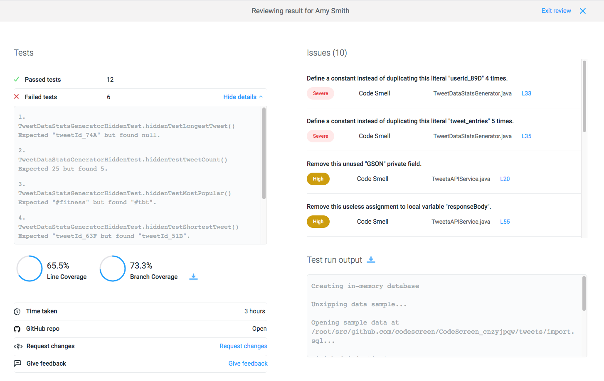

# Test Status

The ```
GET https://app.codescreen.dev/api/testStatus/{testInstanceId}
``` endpoint allows you to retrieve the status of a given CodeScreen test.


### Request

This GET request takes one path parameter, which is the `testInstanceId` that is initially provided as the response to the <a href="#sendTest">Send Test endpoint</a>. 

<br/>An example request is shown below:

```
curl -X POST https://app.codescreen.dev/api/testStatus/1b68dc27-6155-41c2-89e3-4e00bd62d227 \
  -H 'Authorization: apiToken dbf4a385-02ab-7d10-bf0c-5hh991055317'

```

### Response

If the request has succeeded, the response will be a `200 OK` containing JSON with the following properties:

The body of this POST request will contain a JSON payload with the following fields: </br>

<table>
<thead>
<tr>
<td style="white-space: nowrap;">Property Name</td><td>Type</td><td>Required</td><td>Description</td></tr>
</thead><tbody>
<tr>
<td>status</td><td>String</td><td>Yes</td><td>Describes the current state of the test instance. If the test has been completed and results are available, this value will be `"Complete"`. If the test has been started but not yet completed, this value will be `"In_Progress"`. Otherwise it will be `"Not_Started"`.</td></tr>
<tr>
<td>result_url</td><td>String</td><td>No</td><td>The url of the result page for this CodeScreen test. Only present if the candidate has completed the test.</td></tr>
<tr>
<td>score</td><td>Integer</td><td>No</td><td>The candidate's score in the test, out of 100. Only present if candidate has completed the test and the number of unit tests for this test is greater than 0.</td></tr>
<td>metadata</td><td>Object</td><td>Yes</td><td>A non-nested object containing keys and values that will be displayed with this test result. This is used for custom values that you woul like to be displayed as part of the result. If you would like custom data returned as part of this response, please email us at <a href="mailto:hello@codescreen.dev">hello@codescreen.dev</a>.</td></tr>
</tbody></table>

</br>An example response is shown below:

```
{
    "status": "Complete",
    "result_url": "https://app.codescreen.dev/#/codescreenresultccb3b988-d07a-45b4-b60b-76cc52be32cg"
    "score": 75
    "metadata": {
        "sonarqube_security_vulnerabilities_count" : 2
    }
}

```

<br/>The result_url links to the result page on the CodeScreen platform:


