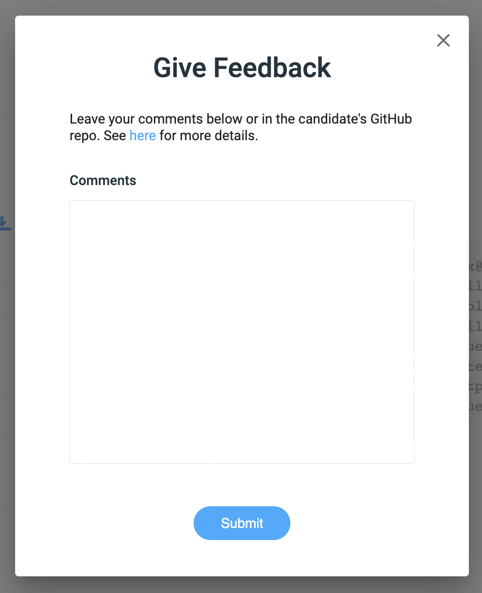
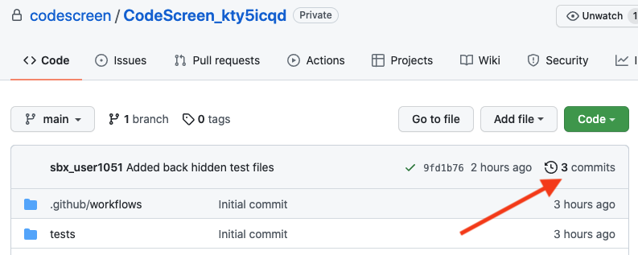
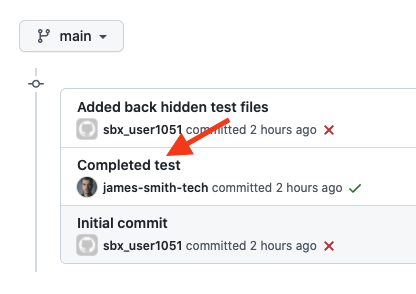
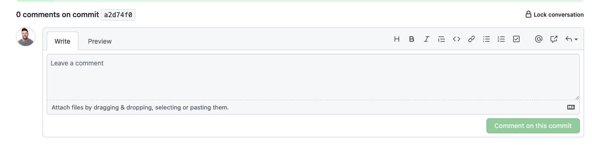
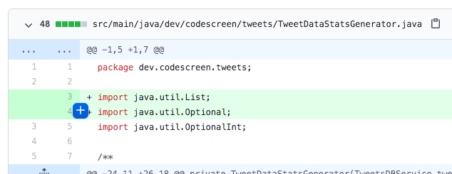
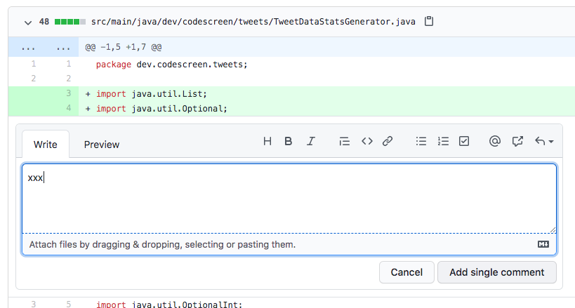

# Giving Feedback

Once a candidate completes a CodeScreen assessment, you can give them feedback on their solution.

To do this, first click into the candidate's report, and then click `Give Feedback`. The following pop-up will appear:

<figure>
  <figcaption style="font-style: italic;"></figcaption>
   
  
</figure>

 

You can either then leave comments directly in text box shown above & click the Submit button, or you can leave comments inside the candidate's GitHub repo (see section below for more details) and then click the Submit button.

That's it! The candidate will then receive an email containing your comments and is granted read-only access to their GitHub repo.

**Note** that all hidden unit test files are removed from the candidate's repo before we grant them back access.

- - -

### Adding Comments to GitHub repo

**1.** Navigate to the candidate's **GitHub** repository, and click on the commits section.

<figure>
  <figcaption style="font-style: italic;"></figcaption>
   
  
</figure>

 

**2.** Now click on one of the candidate's commits.

<figure>
  <figcaption style="font-style: italic;"></figcaption>
   
  
</figure>

 

**3.** You can either leave your comments on the commit or on a line of code in a particular file of that commit:

 

**3.1** To leave a comment on a commit, scroll down to the bottom of the commit page and you will see the `Leave a comment` box:

<figure>
  <figcaption style="font-style: italic;"></figcaption>
   
  
</figure>

Enter your comment and then click the green `Comment on this commit` button. You can add as many comments as you like.

 

**3.2** To leave a comment on a line of code in a particular file, find the line(s) of code in the files shown in the commit and click on the **+** on the left-hand side.

<figure>
  <figcaption style="font-style: italic;"></figcaption>
   
  
</figure>

 

Enter your comment and then click the `Add single comment` button. You can add as many comments (on any number of files) as you like.

<figure>
  <figcaption style="font-style: italic;"></figcaption>
   
  
</figure>

 

Please **note** that the candidate won't be able to see the hidden assessment case files after they get access back to the repo. So please **do not** leave comments on the `"Added back hidden test files"` commit, as the candidate will not be able to see these comments.
