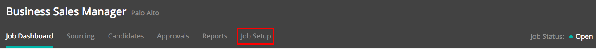
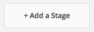
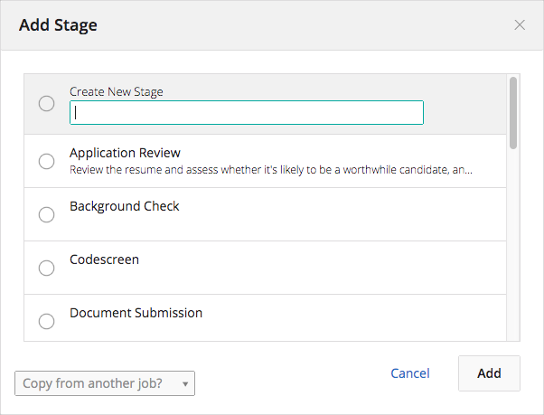
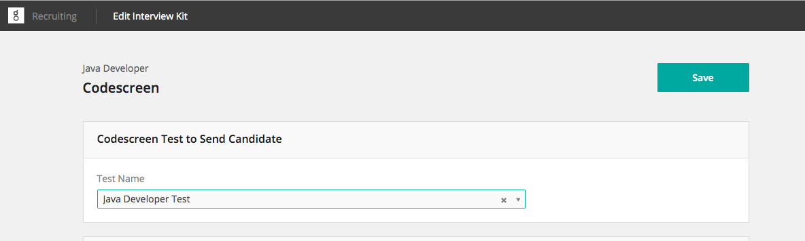
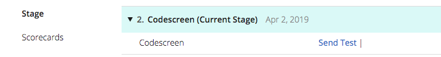
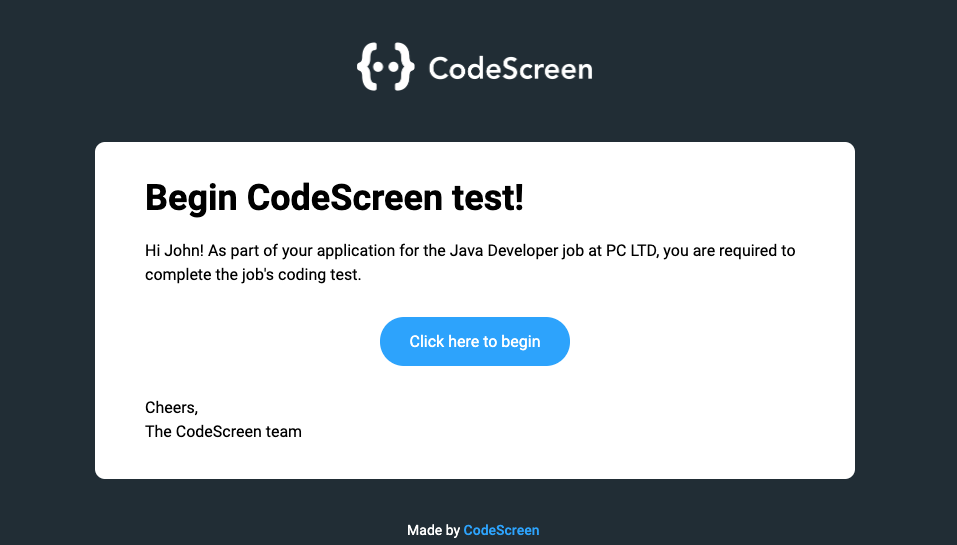
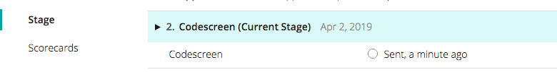
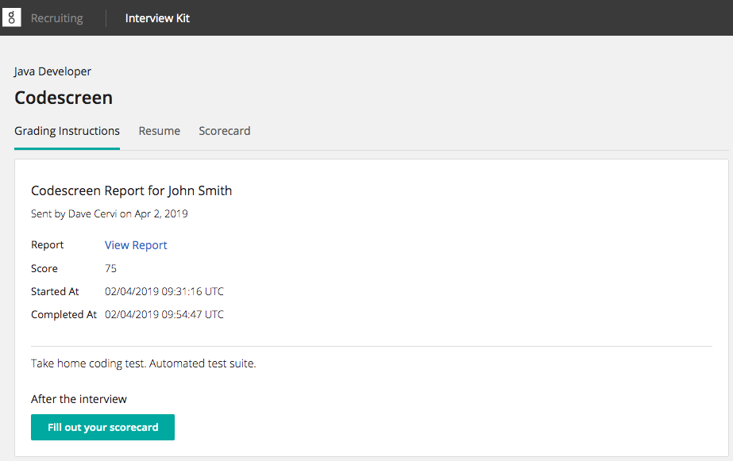
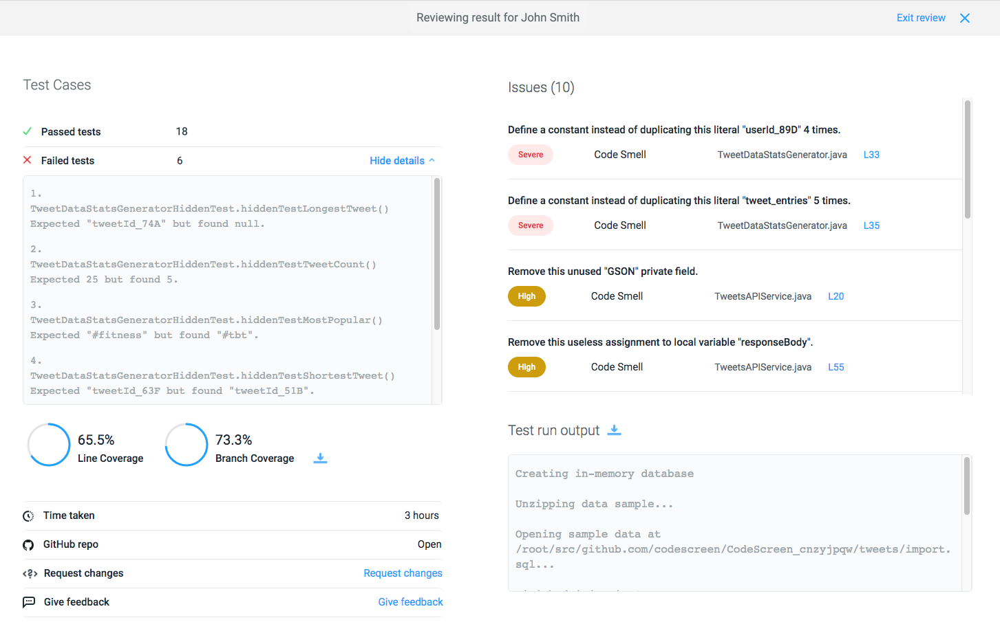

# Integrating Greenhouse with CodeScreen

<figure>
  <figcaption style="font-style: italic;"></figcaption>
   
  
</figure>

The `CodeScreen` integration with `Greenhouse` allows you to do the following:

* Select which CodeScreen test is required for each role you have on Greenhouse.
* Invite candidates to take CodeScreen tests directly from the Greenhouse platform as candidates enter the assessment stage.
* Status updates from invitation to completion.
* Have candidate CodeScreen test reports automatically attach to their Greenhouse candidate profile and their scores displayed.

The integration is quick and straightforward. It works as follows:

### 1. Enable the Greenhouse/CodeScreen Integration
To start, head over to the <a href="https://app.codescreen.com/#/client-integrations" target="_blank">Integrations</a> section on 
the CodeScreen platform to view your Greenhouse `API key`. Once you have your API key, fill out the form at <a href="https://www.greenhouse.io/asksupport" target="_blank">www.greenhouse.io/asksupport</a> or <a href="https://support.greenhouse.io/hc/en-us/requests/new" target="_blank">click here</a> to open a ticket. 

Please do not include your API key in this initial support request.

The Greenhouse Support Team will respond with a `SendSafely` link for you to enter your API key. A notification will be sent to the Greenhouse Support Team after you have entered your API key and they will email you to confirm that your API key has been set up in your account and your integration is enabled.

**Note** that you will not have access to the Integrations section on CodeScreen unless you are an admin user. If you are not
an admin, please contact one of the admin users in your organization, and they will be able to make you an admin.

### 2. Add CodeScreen Stage to Job’s Interview Plan
Once the Greenhouse <> CodeScreen integration is enabled for your organization, you will be able to add the 
CodeScreen assessment as an Interview stage.

To do this for an existing job, navigate to a job (All Jobs>Job Name) and click `Job Setup` from the Job navigation bar.

<figure>
  <figcaption style="font-style: italic;"></figcaption>
   
  
</figure>

From the Job Setup page, navigate to `Interview Plan` on the left-hand panel. Scroll down the page and click `+ Add a Stage`.

<figure>
  <figcaption style="font-style: italic;"></figcaption>
   
  
</figure>

From the Add Stage dialog box, select the `Codescreen` stage. When finished, click `Add` to apply the stage to the 
job’s interview plan.

<figure>
  <figcaption style="font-style: italic;"></figcaption>
   
  
</figure>

### 3. Configure CodeScreen Stage
Once the stage has been added to the job’s interview plan, click `Edit Take Home Test`.
Use the provided drop-down menu to choose which test you want to add to this job’s interview plan.

There will be one entry in this drop-down list for each test that you currently have on CodeScreen.

<figure>
  <figcaption style="font-style: italic;"></figcaption>
   
  
</figure>

Select the appropriate test and assign at least one Greenhouse user to grade/review submitted assessments.  
When finished, click `Save`.

### 4. Send and Review the Test
When candidates are moved into the CodeScreen interview stage, Greenhouse will display a `Send Test` link.

<figure>
  <figcaption style="font-style: italic;"></figcaption>
   
  
</figure>

When you click Send Test, CodeScreen sends an email containing the instructions for the test. 

You are able to edit the email templates that are used to include your own wording and your company’s branding.
You can read more details about this [here](templates.md). 

The default email template looks like the following:

<figure>
  <figcaption style="font-style: italic;"></figcaption>
   
  
</figure>

The status of the assessment will be viewable in Greenhouse:

<figure>
  <figcaption style="font-style: italic;"></figcaption>
   
  
</figure>

Once the candidate has submitted their test, you will be notified via email by Greenhouse and you will be able to view the `Interview Kit`
for that candidate.

<figure>
  <figcaption style="font-style: italic;"></figcaption>
   
  
</figure>

Inside the Interview Kit section, there is a `Score` field which represents the candidate's score on the test, which is based on how many
unit test cases the candidate's solution passed. 

You can also view more details about the test result on CodeScreen by clicking `View Report`, which will bring you to a 
page on CodeScreen similar to the following:

<figure>
  <figcaption style="font-style: italic;"></figcaption>
   
  
</figure>

And that’s it!

A video demo showing the integration in action is available to view 
<a href="https://www.loom.com/share/ce9ea6dfa9384c5a968dfb3b5225bbb8" target="_blank">here</a>.
