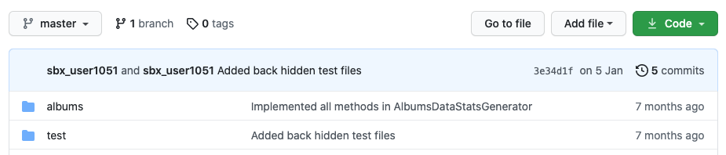
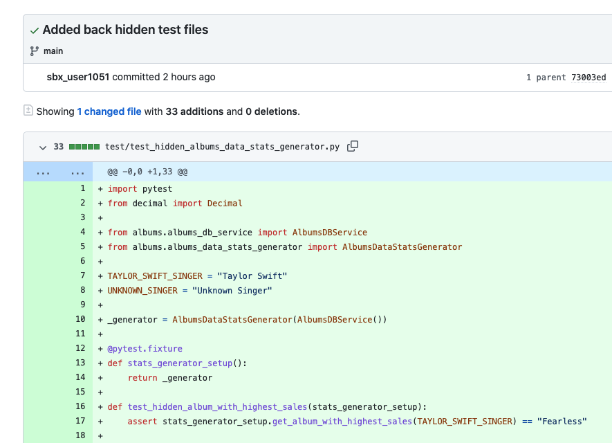

# Hidden Test Cases

Hidden tests cases are unit test cases that are not visible to the candidate, but are added to the candidate's repo after they submit   their
solution (which is when their access to the repo is revoked).

<figure>
  <figcaption style="font-style: italic;"></figcaption>
   
  
</figure>

<figure>
  <figcaption style="font-style: italic;"></figcaption>
   
  
</figure>

 

These hidden tests are run against the candidate’s solution and count towards the final score. These allow you to test each candidate 
solution against   edge test cases, etc.

Hidden tests are included in all our off-the-shelf [library test assessments](choosing-library-test.md) and are available for you to add to your 
[custom test assessments](custom-test-concepts.md).

