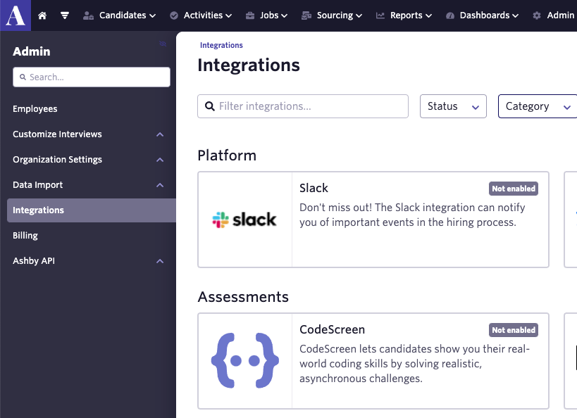
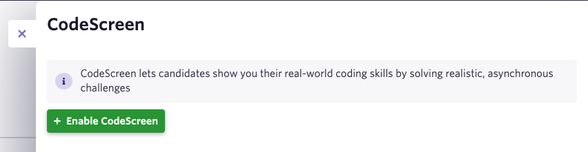
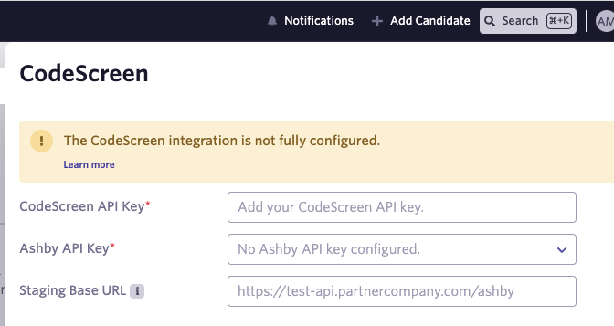
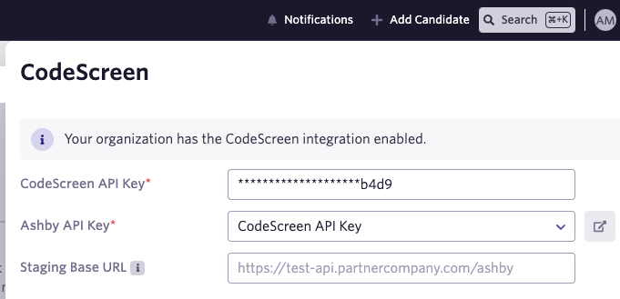
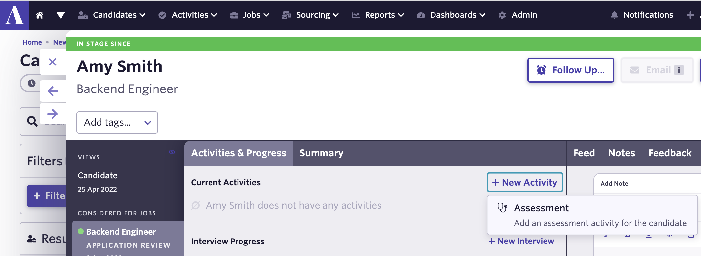
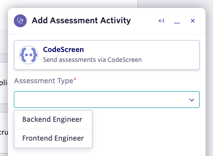
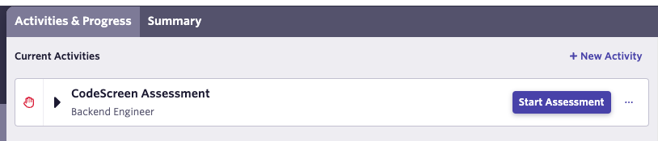
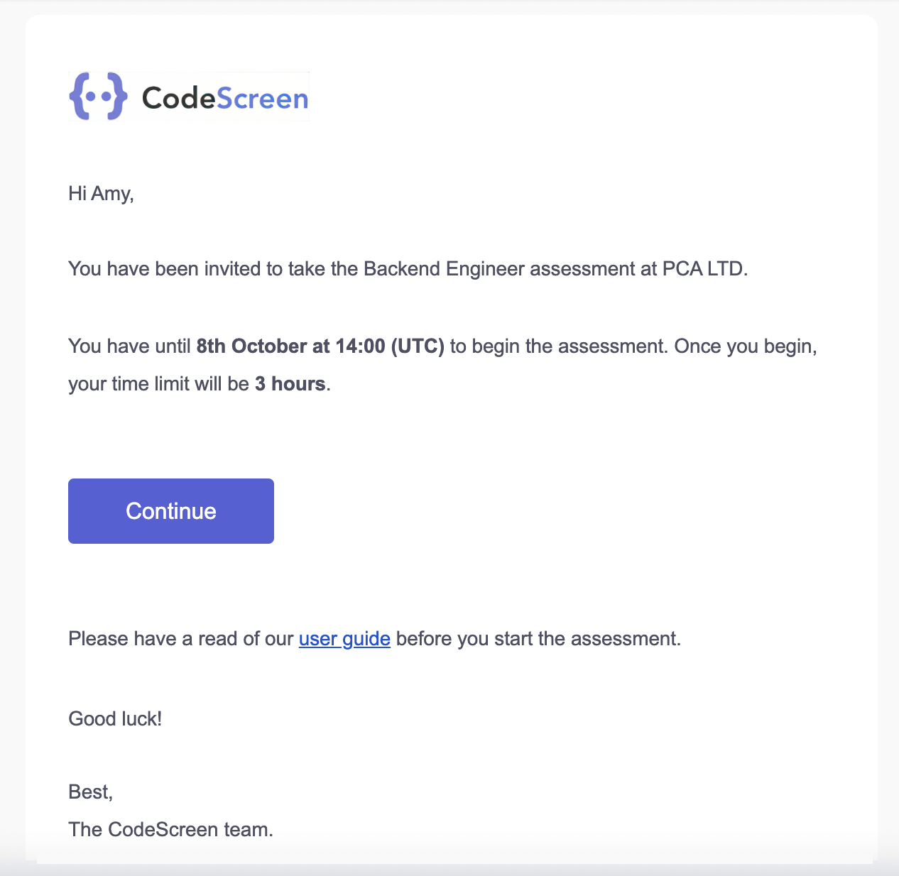
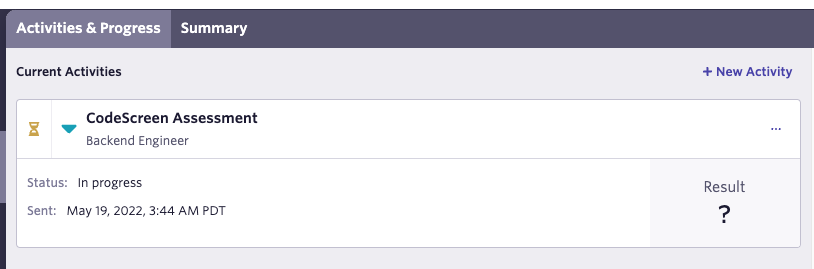
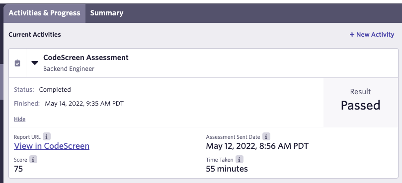

# Integrating Ashby with CodeScreen

<figure>
  <figcaption style="font-style: italic;"></figcaption>
   
  
</figure>

The `CodeScreen` integration with `Ashby` allows you to do the following:

* Select which CodeScreen test is required for each job you have on Ashby.
* Invite candidates to take CodeScreen tests directly from the Ashby platform as candidates enter the assessment/coding test stage.
* Status updates from invitation to completion.
* Have candidate CodeScreen test reports automatically attach to their Ashby candidate profile and their scores displayed.

The integration is quick and straightforward. It works as follows:

### 1. Enable the Ashby/CodeScreen Integration
To start, head over to the `Admin` section on Ashby, click into `Integrations` and click the CodeScreen entry from the Assessments list:

<figure>
  <figcaption style="font-style: italic;"></figcaption>
   
  
</figure>

 

Now click the green `Enable CodeScreen` button.

<figure>
  <figcaption style="font-style: italic;"></figcaption>
   
  
</figure>

 

You then need to enter your `CodeScreen API key` and your `Ashby API key`. The `Staging Base URL` must be left blank.

<figure>
  <figcaption style="font-style: italic;"></figcaption>
   
  
</figure>

 

To retrieve your `CodeScreen API key`, head over to the <a href="https://app.codescreen.com/integrations" target="_blank">Integrations</a> section on CodeScreen to view your Ashby `API key`. 

**Note** that you will not have access to the Integrations section on CodeScreen unless you are an admin user. If you are not
an admin, please contact one of the admin users in your organization, and they will be able to make you an admin.

Once you enter `CodeScreen API key` and `Ashby API key`, the integration will be enabled:

<figure>
  <figcaption style="font-style: italic;"></figcaption>
   
  
</figure>

 

**Important**

In order for CodeScreen to update results inside Ashby, we also need to securely store your `Ashby API key` on our system. To do this, please contact us via <a href="mailto:hello@codescreen.com">email</a>/live chat, and we will explain this process to you. This process will only take 5 minutes to complete.

### 2. Send Test To Candidate
Once the Ashby <> CodeScreen integration is enabled for your organization, you will be able to send a CodeScreen test to a candidate from Ashby.

To do this, click into a candidate and then click `New Activity` -> `Assessment`:

<figure>
  <figcaption style="font-style: italic;"></figcaption>
   
  
</figure>

 

You can then choose which CodeScreen test you want to send to the candidate. There is a one-to-one mapping here between the tests you have created on CodeScreen and the tests
available to send from Ashby.

<figure>
  <figcaption style="font-style: italic;"></figcaption>
   
  
</figure>

 

Once you click `Add Activity`, you can then click the `Start Assessment` purple button to send the test to the candidate:

<figure>
  <figcaption style="font-style: italic;"></figcaption>
   
  
</figure>

 

The candidate will receive an email containing the instructions for the test.

You can edit the email templates that are used to include your own wording and your company’s branding. You can read more
details about this [here](editing-email-templates.md). 

The default email template looks like the following:

<figure>
  <figcaption style="font-style: italic;"></figcaption>
   
  
</figure>

 

The status of the test for the candidate will then be viewable in Ashby:

<figure>
  <figcaption style="font-style: italic;"></figcaption>
   
  
</figure>

 

### 3. Review Test results

Once the candidate has submitted their test, you will be notified via email by CodeScreen and you will be able to view the
result for that candidate inside Ashby.

<figure>
  <figcaption style="font-style: italic;"></figcaption>
   
  
</figure>

 

You can also view more details about the test result on CodeScreen by clicking the `View in CodeScreen` link, which will bring you to a page on CodeScreen similar to the following:

<figure>
  <figcaption style="font-style: italic;"></figcaption>
   
  
</figure>

 

And that’s it, you're all set!
