# Integrating Lever with CodeScreen

<figure>
  <figcaption style="font-style: italic;"></figcaption>
   
  
</figure>

The `CodeScreen` integration with `Lever` allows you to do the following:

* Select which CodeScreen assessment is required for each role you have on Lever.
* Invite candidates to take CodeScreen assessments directly from the Lever platform as candidates enter the assessment stage.
* Status updates from invitation to completion.
* Have candidate CodeScreen assessment reports automatically attach to their Lever candidate profile and their scores displayed.

The integration is quick and straightforward. It works as follows:

 

### 1. Authorize CodeScreen App in Lever
To start, click the following <a href="https://app.codescreen.com/lever-connect" target="_blank">URL</a>.

You will then be prompted to authorize the CodeScreen application from inside your Lever account:

<figure>
  <figcaption style="font-style: italic;"></figcaption>
   
  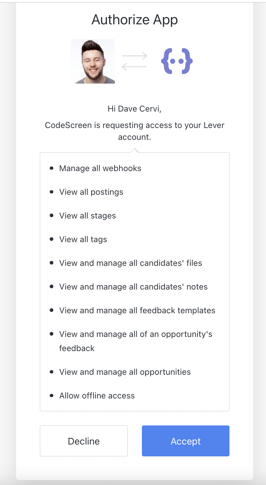
</figure>

 

Now, click the blue Accept button. You will then see the following confirmation message:

<figure>
  <figcaption style="font-style: italic;"></figcaption>
   
  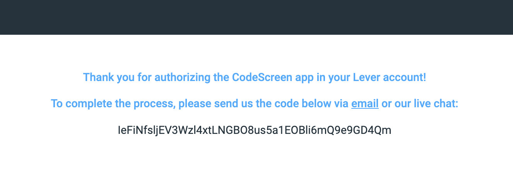
</figure>

 

### 2. Add Webhook Signature to CodeScreen

Head to the <a href="https://hire.lever.co/settings/integrations?tab=webhooks" target="_blank">Integrations - Webhook</a> section in your Lever account.

Then, turn on the `Candidate Stage Change` webook, and add the following <a href="https://app.codescreen.com/api/lever/candidate_stage_changed">URL</a> to the URL field (shown with a red arrow in the image below):

<figure>
  <figcaption style="font-style: italic;"></figcaption>
   
  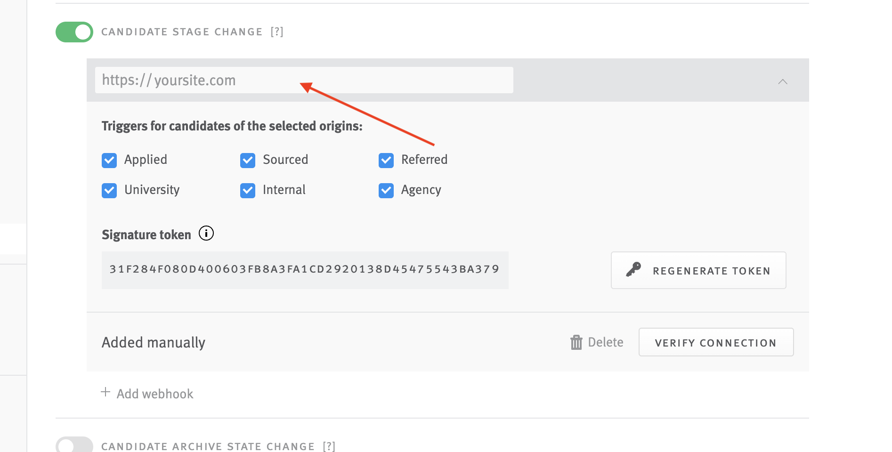
</figure>

 

Now, copy the value of the `Signature token` field, and then paste it into the Lever Webhook Signature field in the <a href="https://app.codescreen.com/integrations" target="_blank">Integrations</a> section in CodeScreen and click the `Save changes` button at the bottom of the page.

Finally, click the `Verify Connection` button in Lever to complete the process.

**Note** that you will not have access to the Integrations section on CodeScreen unless you are an admin user. If you are not an admin, please contact one of the admin users in your organization, and they will be able to make you an admin.

 

### 3. Add CodeScreen Stage to Job’s Interview Plan
First, navigate to `Settings > Pipeline and archive reasons > Pipeline stages`, and then click on the `Customize Pipeline Stages` button:

<figure>
  <figcaption style="font-style: italic;"></figcaption>
   
  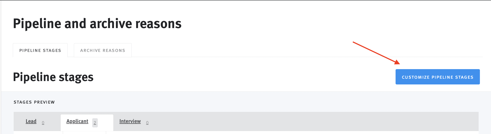
</figure>

 

Now, click the `Add Stage` link on the right:

<figure>
  <figcaption style="font-style: italic;"></figcaption>
   
  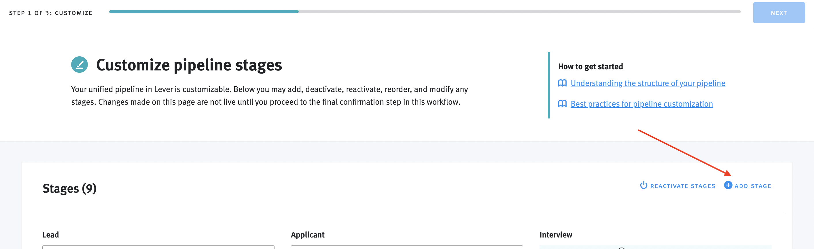
</figure>

 

Enter the stage name and then click the blue `Add Stage` button.

**Note** that the name of the stage must begin with `CodeScreen`, e.g. `CodeScreen Assessment`.

Finally, navigate back to the job that you want to add a CodeScreen assessment to, and then click the `Add tag` link in the section on the right:

<figure>
  <figcaption style="font-style: italic;"></figcaption>
   
  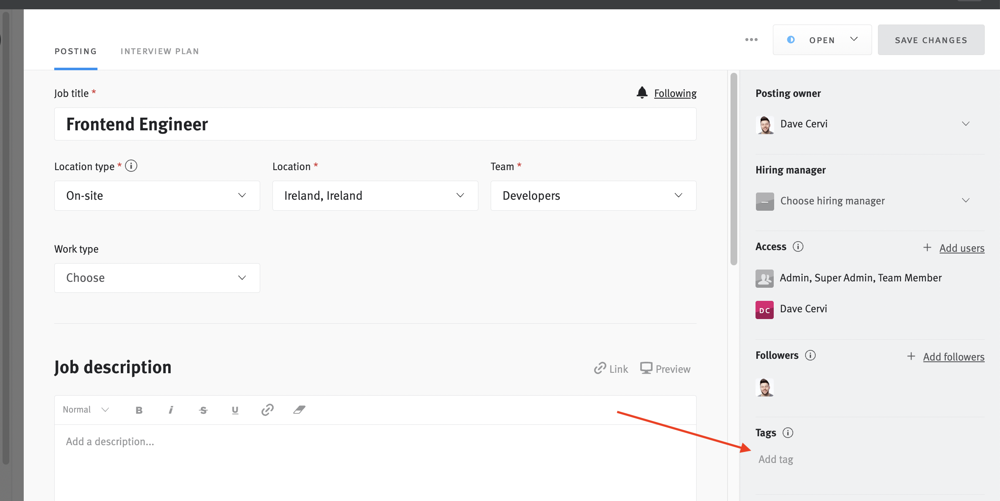
</figure>

 

The name of the tag must be of the form `CodeScreen {assessmentName}`, where `{assessmentName}` refers to the name of the assessment in CodeScreen that you want to send to candidates applying to this job. For example, if the name of the assessment in CodeScreen is `Frontend Developer`, then the name of the tag should be `CodeScreen Frontend Developer`.

 

### 4. Send Assessment

To send a CodeScreen assessment to a candidate from your Lever, click the checkbox on left of the row for a candidate
and then click stage button:

<figure>
  <figcaption style="font-style: italic;"></figcaption>
   
  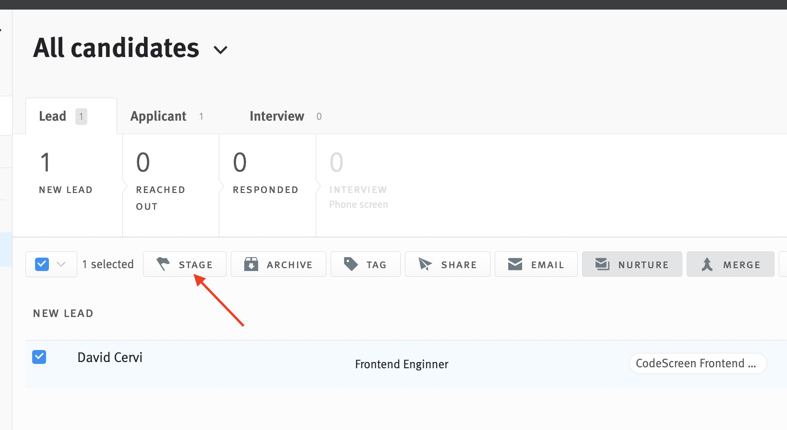
</figure>

 

Now click on the name of your CodeScreen stage:

<figure>
  <figcaption style="font-style: italic;"></figcaption>
   
  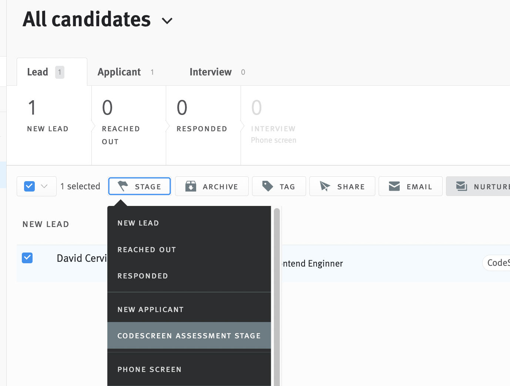
</figure>

 

This will then automatically trigger the assessment to be sent to candidate, and the candidate will receive an email containing the instructions for the assessment.

You are able to edit the email templates that are used to include your own wording and your company’s branding.
You can read more details about this [here](editing-email-templates.md). 

The default email template looks like the following:

 

<figure>
  <figcaption style="font-style: italic;"></figcaption>
   
  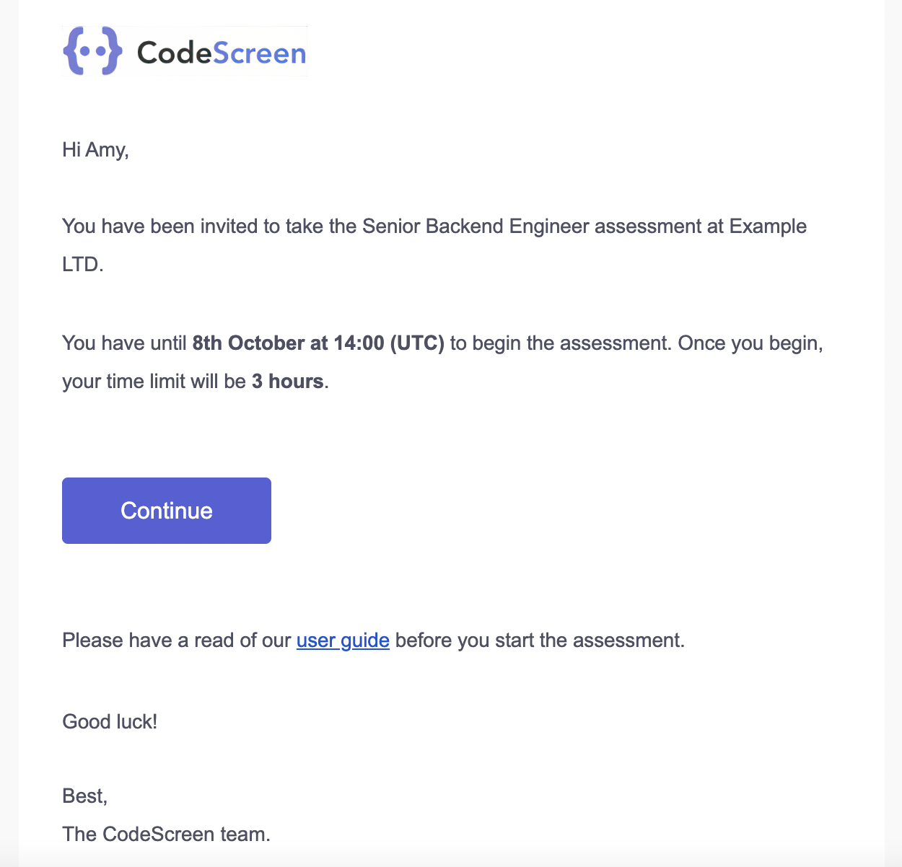
</figure>

 

### 5. Track Candidate Progress

Once a candidate is sent a CodeScreen assessment, a new tag will be added to their profile in Lever:

<figure>
  <figcaption style="font-style: italic;"></figcaption>
   
  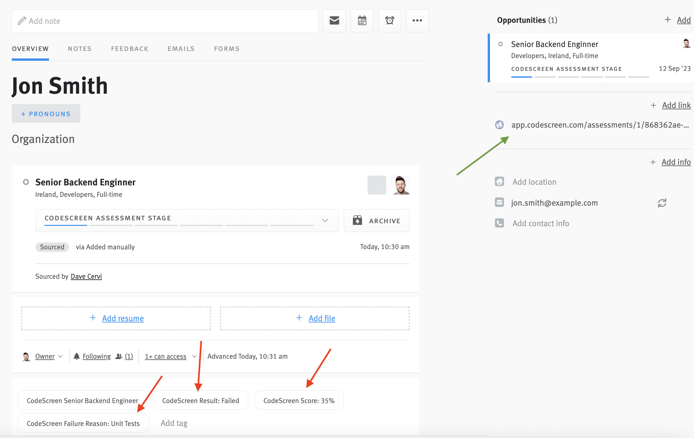
</figure>

 

A new tag will also be added once the candidate begins the assessment:

<figure>
  <figcaption style="font-style: italic;"></figcaption>
   
  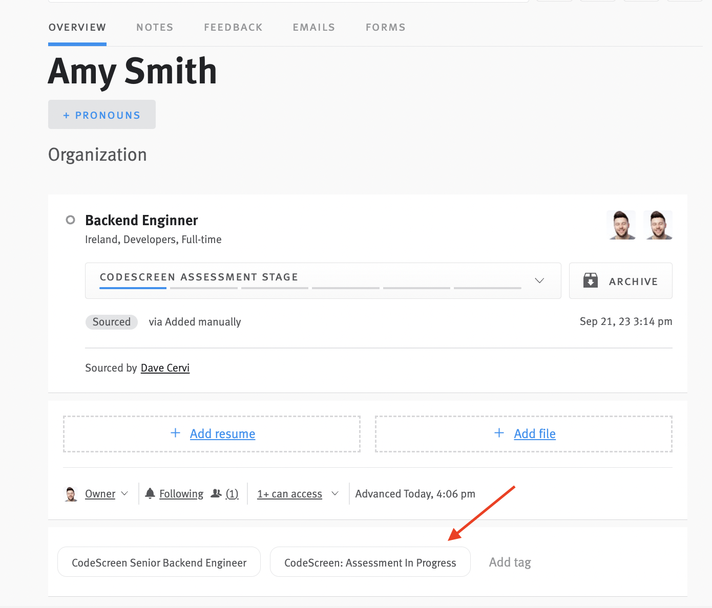
</figure>

 

### 6. Review Result

Once the candidate has submitted their solution to the assessment, you will be notified via email by CodeScreen, and their result will be displayed inside Lever as a Feedback entry:

<figure>
  <figcaption style="font-style: italic;"></figcaption>
   
  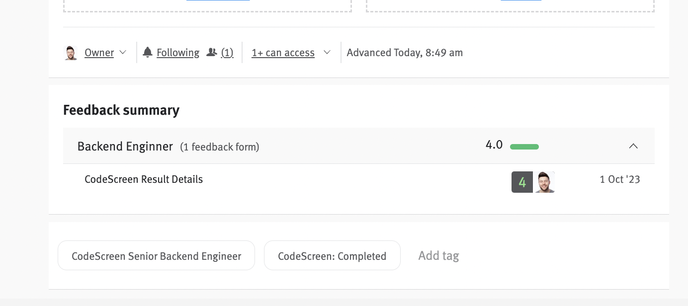
</figure>

 

The rating is displayed as a number between 1 - 4, which is based on the CodeScreen <a target="_blank" href="https://docs.codescreen.com/#/viewing-candidates?id=passed-and-failed">score</a>.

Once you click into the feedback details, the CodeScreen score, result (`Passed`, `Failed` or `Expired`), and the <a target="_blank" href="https://docs.codescreen.com/#/viewing-candidates?id=passed-and-failed">failure reason</a> (only present if the candidate did not pass) are displayed.

<figure>
  <figcaption style="font-style: italic;"></figcaption>
   
  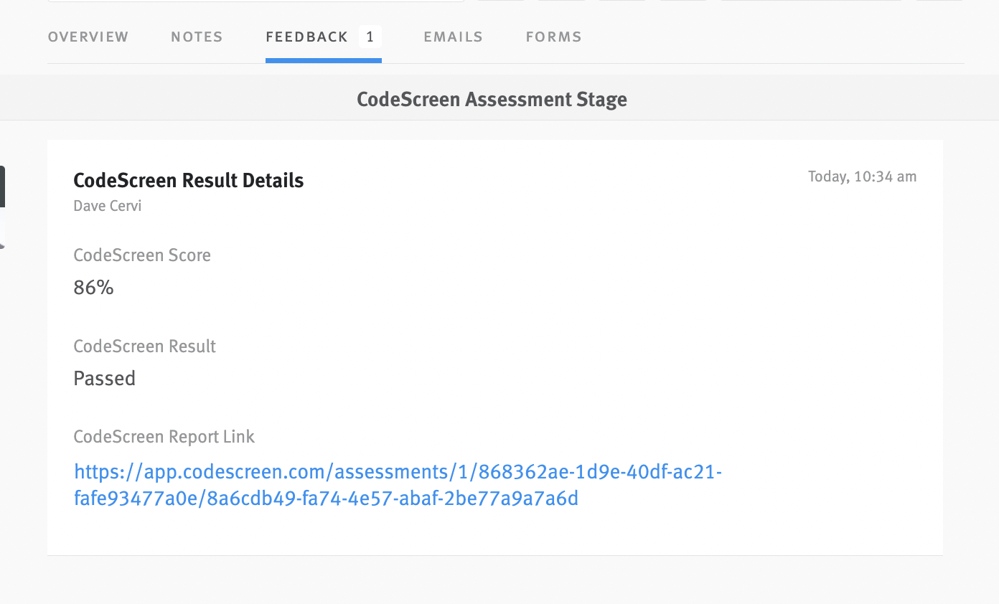
</figure>

 

You can also view the full report on CodeScreen by clicking the report link, which will bring you to a page on CodeScreen similar to the following:

<figure>
  <figcaption style="font-style: italic;"></figcaption>
   
  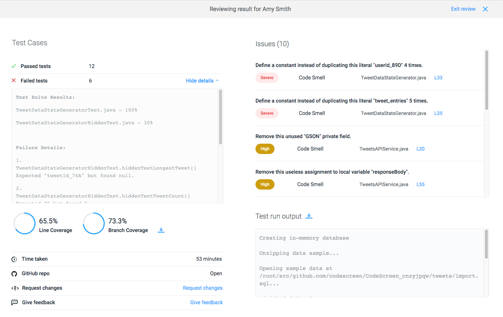
</figure>

 

And that’s it!

A video demo showing the integration in action is available to view 
<a href="https://www.loom.com/share/73f6344c67764952ac03e8c48b689788" target="_blank">here</a>.
