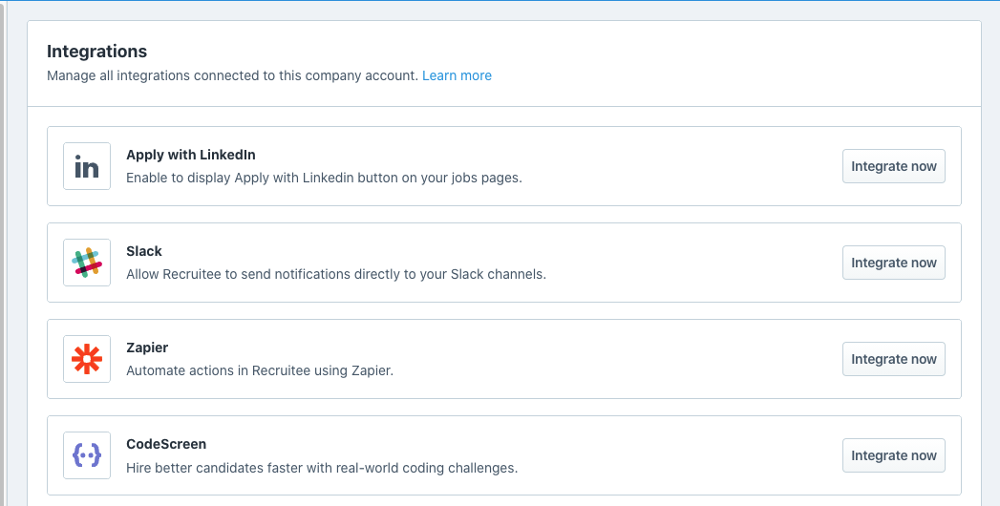
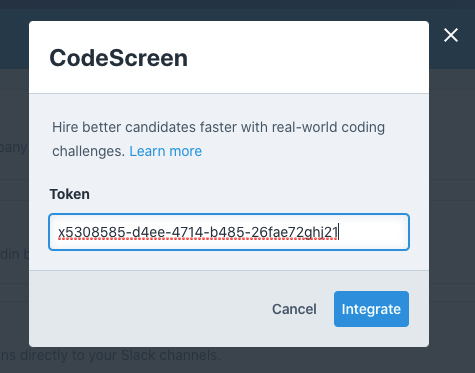
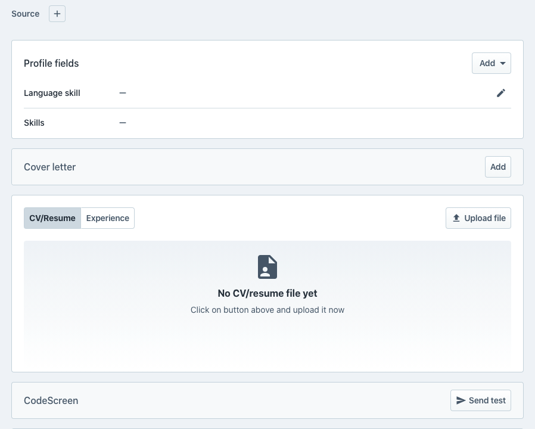
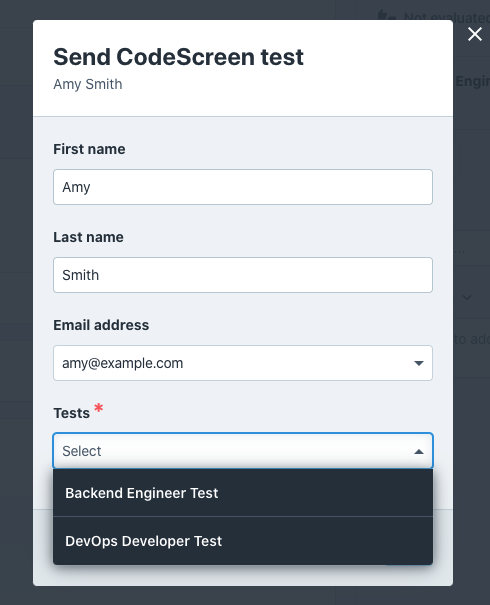
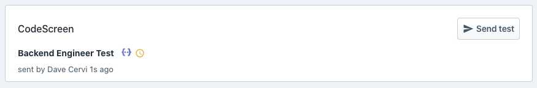
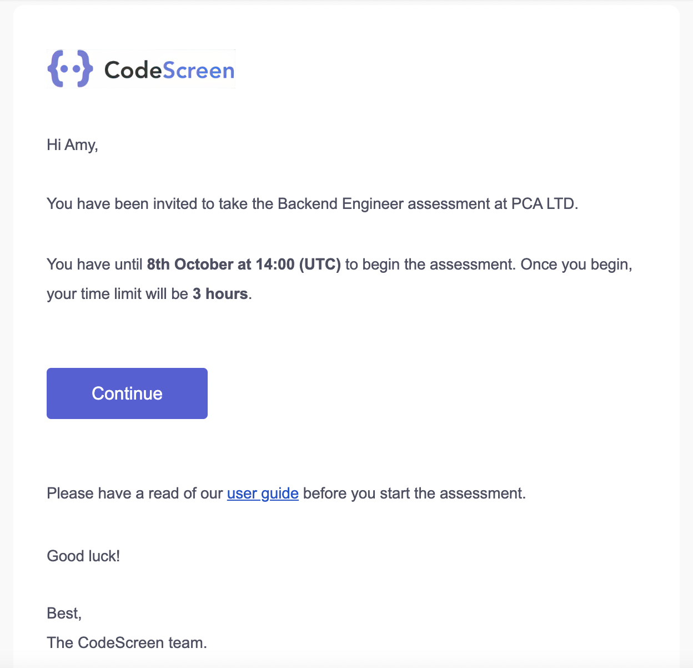
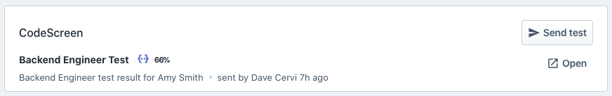

# Integrating Recruitee with CodeScreen

<figure>
  <figcaption style="font-style: italic;"></figcaption>
   
  
</figure>

The `CodeScreen` integration with `Recruitee` allows you to do the following:

* Invite candidates to take CodeScreen tests directly from the Recruitee platform.
* Have candidate CodeScreen test reports automatically attach to their Recruitee candidate profile and their scores displayed.

The integration is quick and straightforward. It works as follows:

### 1. Enable the Recruitee/CodeScreen Integration
To start, head over to the <a href="https://app.codescreen.com/integrations" target="_blank">Integrations</a> section on 
the CodeScreen platform to view your Recruitee `API token`. Once you have your API token, go to the `Settings` section on Recruitee and then click `Apps and plugins` on the left  sidebar. Find CodeScreen in the `Integrations` list, click the `Integrate now` button, enter your API token, and click `Integrate`.

<figure>
  <figcaption style="font-style: italic;"></figcaption>
   
  
</figure>

<figure>
  <figcaption style="font-style: italic;"></figcaption>
   
  
</figure>

 

**Note** that you will not have access to the Integrations section on CodeScreen unless you are an admin user. If you are not
an admin, please contact one of the admin users in your organization, and they will be able to make you an admin.

### 2. Send CodeScreen test to candidate
Once the Recruitee <> CodeScreen integration is enabled for your organization, you will be able to send CodeScreen tests to candidates from inside Recruitee.

To do this, click on a candidate, scroll down to the bottom of their profile page, and click the `Send test` button on the right of the CodeScreen box.

<figure>
  <figcaption style="font-style: italic;"></figcaption>
   
  
</figure>

 

Now, choose which test you want to send to the candidate from your list of available tests.

There will be one entry in this list for each test that you currently have on CodeScreen.

<figure>
  <figcaption style="font-style: italic;"></figcaption>
   
  
</figure>

 

Once you select the test, click the `Send` button. You will then see a confirmation message similar to the following:

<figure>
  <figcaption style="font-style: italic;"></figcaption>
   
  
</figure>

 

CodeScreen then sends the candidate an email containing the instructions for the test. 

You are able to edit the email templates that are used to include your own wording and your company’s branding. You can read more details about this [here](editing-email-templates.md). 

The default email template looks like the following:

<figure>
  <figcaption style="font-style: italic;"></figcaption>
   
  
</figure>

 

### 3. Review the test result.
Once the candidate has submitted their test, you will be notified via email by CodeScreen, and the result will be available on Recruitee.

<figure>
  <figcaption style="font-style: italic;"></figcaption>
   
  
</figure>

 

The percentage value represents the percentage of unit test cases that the candidate's solution passed.

To view the full result report, click `Open`, where you’ll be taken to a page on CodeScreen that similar to the following:

<figure>
  <figcaption style="font-style: italic;"></figcaption>
   
  
</figure>

And that’s it!

If you are not currently using Recruitee and want to learn more about their platform, click <a href="https://recruitee.grsm.io/41woqjbhnyls" target="_blank">here</a>.