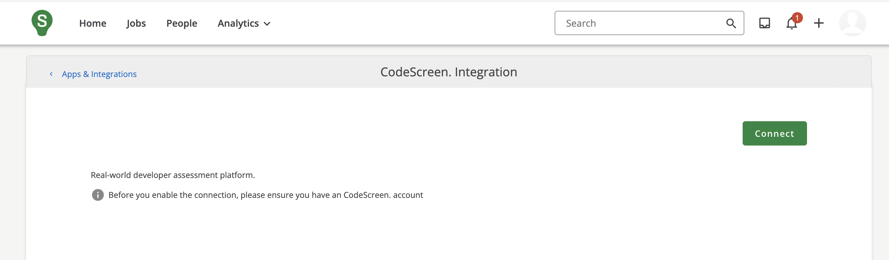
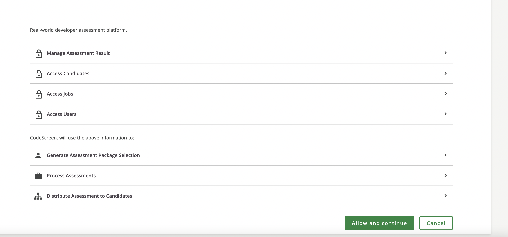
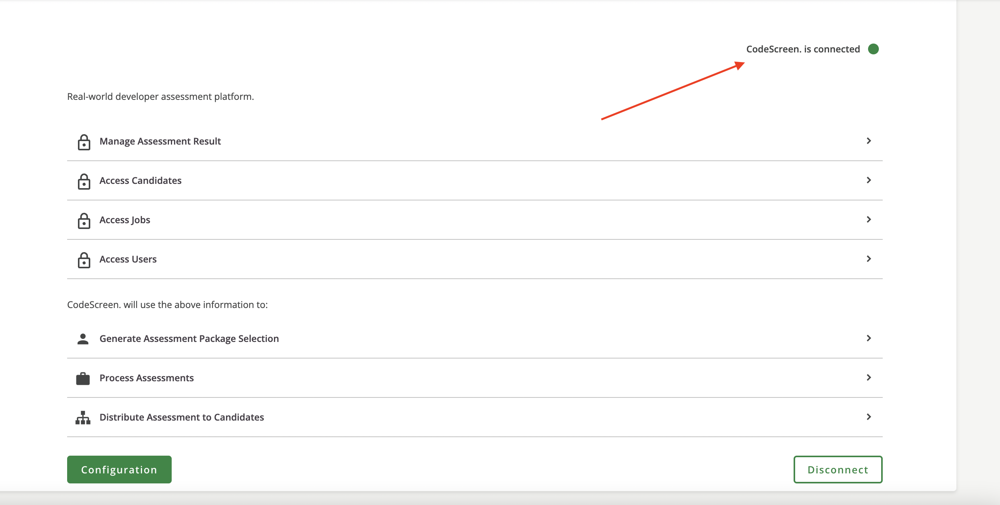
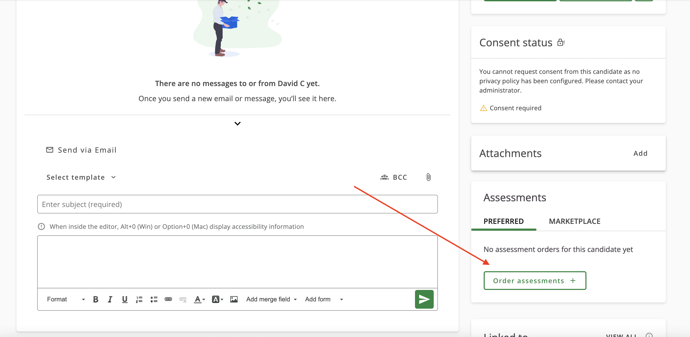
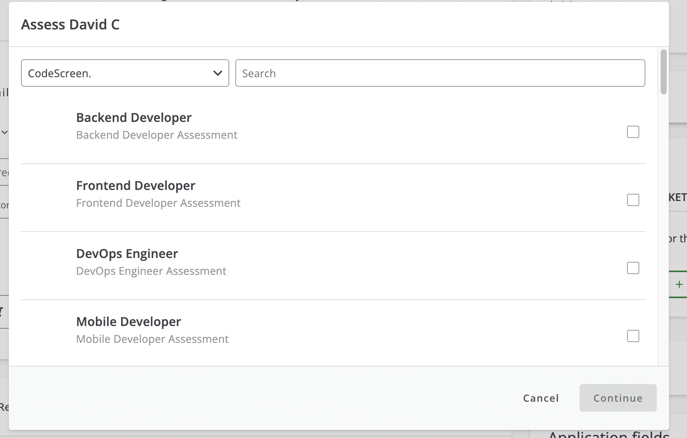
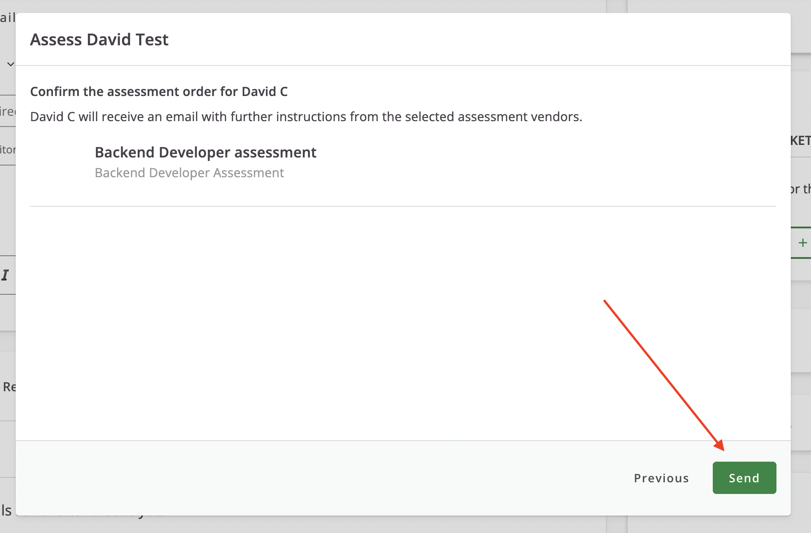
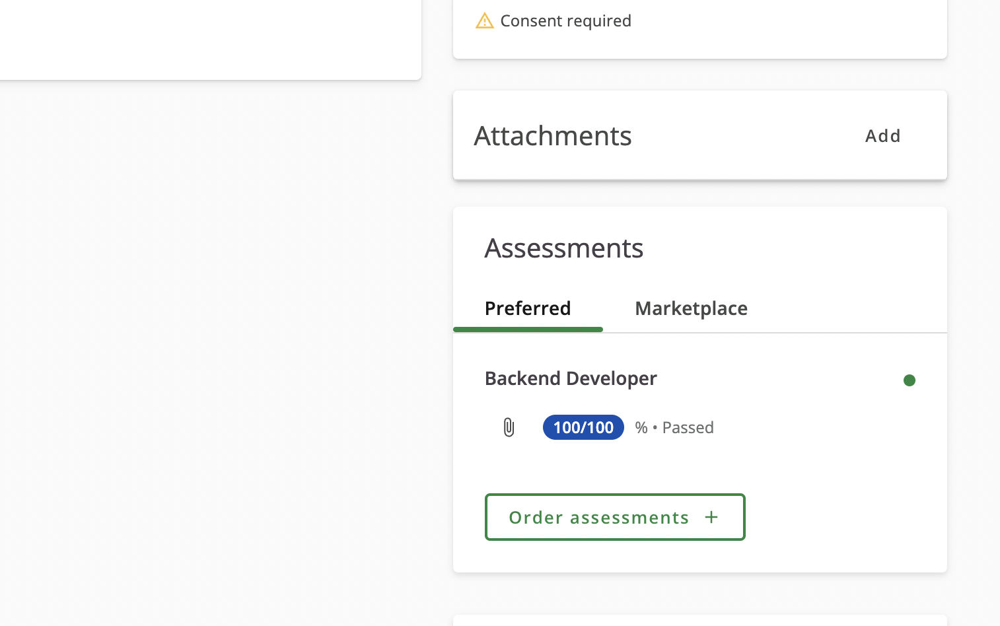

# Integrating SmartRecruiters with CodeScreen

<figure>
  <figcaption style="font-style: italic;"></figcaption>
   
  
</figure>

The `CodeScreen` integration with `SmartRecruiters` allows you to do the following:

* Select which CodeScreen assessment is required for each role you have on SmartRecruiters.
* Invite candidates to take CodeScreen assessments directly from the SmartRecruiters platform as candidates enter the assessment stage.
* Status updates from invitation to completion.
* Have candidate CodeScreen assessment reports automatically attach to their SmartRecruiters candidate profile and their scores displayed.

The integration is quick and straightforward. It works as follows:

### 1. Enable the SmartRecruiters/CodeScreen Integration
To do this, head over to the `Apps & Integration` section in your SmartRecruiters account, choose CodeScreen from the list, and then click the green `Connect` button. **Note** please make sure you are logged into your CodeScreen account in a seperate browser tab before completing this step).

<figure>
  <figcaption style="font-style: italic;"></figcaption>
   
  
</figure>

 

You will then see the following screen which shows the permissions CodeScreen requires in your SmartRecruiters account. Please click the green `Allow and continue` button to proceed.

<figure>
  <figcaption style="font-style: italic;"></figcaption>
   
  
</figure>

 

And that's it, the connection step is now complete!

<figure>
  <figcaption style="font-style: italic;"></figcaption>
   
  
</figure>

 

### 2. Send CodeScreen assessment to a candidate
Once the SmartRecruiters <> CodeScreen integration is enabled for your organization, you will be able to start sending CodeScreen assessments to candidates via the SmartRecruiters platform.

To do this for an existing candidate, navigate to the candidate, and click the `Order assessments` button in the `Assessments` section in the bottom right of the screen.

<figure>
  <figcaption style="font-style: italic;"></figcaption>
   
  
</figure>

 

You will then see the list of CodeScreen assessments you can send to this candidate. There will be one entry in this list for each assessment that you currently have set up on CodeScreen:

<figure>
  <figcaption style="font-style: italic;"></figcaption>
   
  
</figure>

 

Tick the box of the assessment you want to send, click the `Continue` button, and then click the green `Send` button to send the assessment to the candidate.

<figure>
  <figcaption style="font-style: italic;"></figcaption>
   
  
</figure>

 

When you click Send, CodeScreen sends an email to the candidate containing the instructions for the assessment.

You are able to edit the email templates that are used to include your own wording and your company’s branding. You can read more details about this [here](editing-email-templates.md). 

The default email template looks like the following:

<figure>
  <figcaption style="font-style: italic;"></figcaption>
   
  
</figure>

 

### 3. Review the assessment
Once the candidate has submitted their assessment, you will be notified via email by SmartRecruiters, and the result will be viewable on the SmartRecruiters’s page for that candidate:

<figure>
  <figcaption style="font-style: italic;"></figcaption>
   
  
</figure>

 

You can then click the attachment icon, and you will be redirected to the report page on the CodeScreen platform, which will look like something similar to the following:

<figure>
  <figcaption style="font-style: italic;"></figcaption>
   
  
</figure>

And that’s it!
