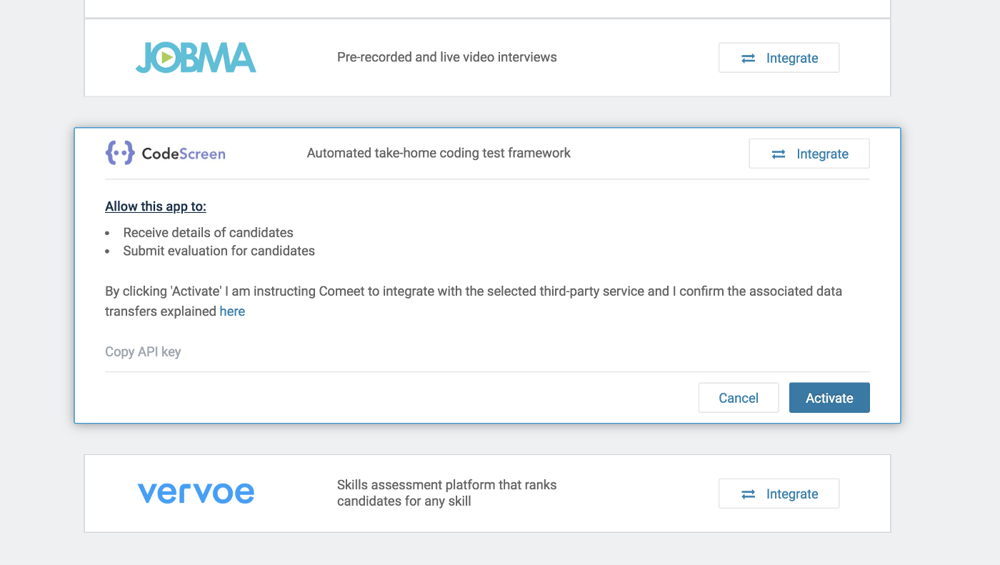
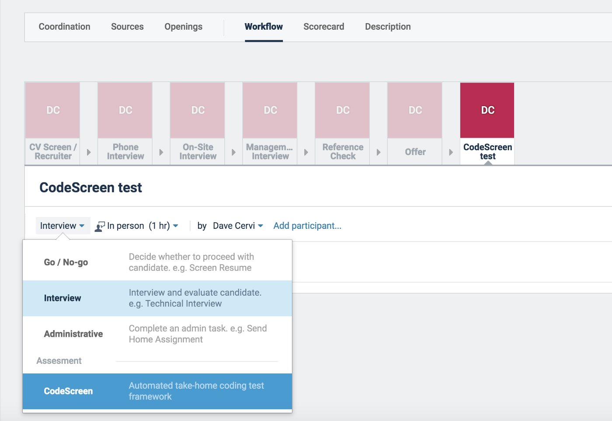
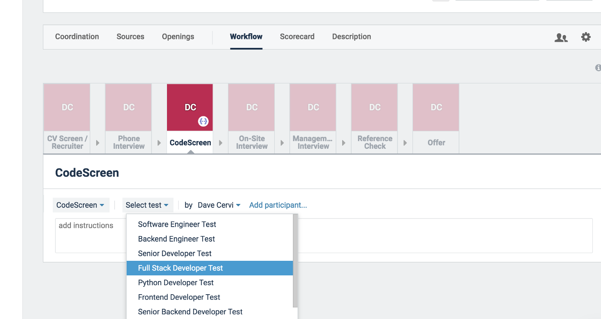
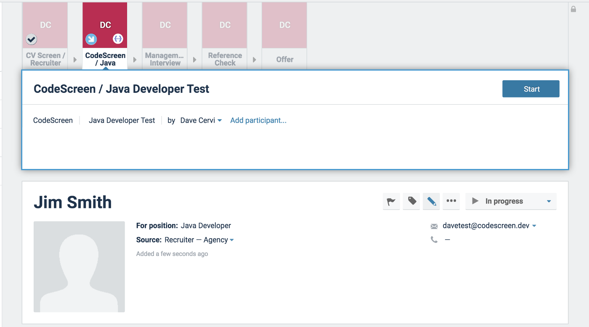
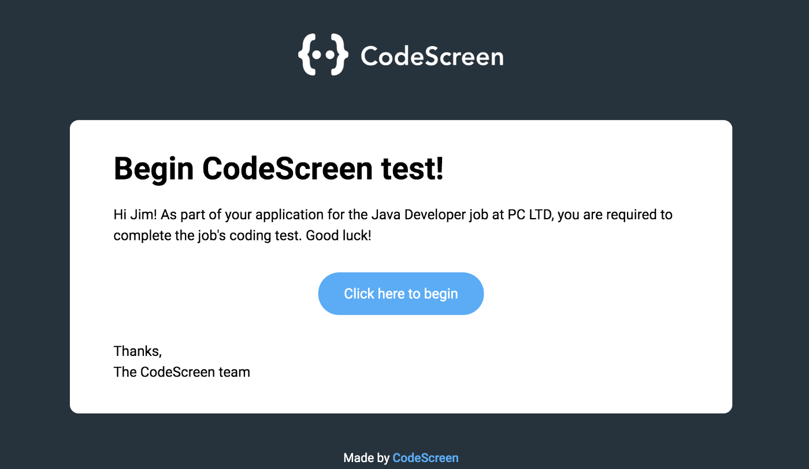
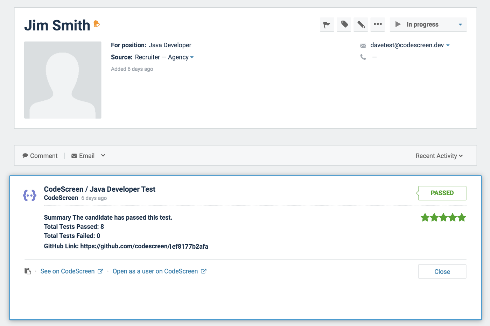

# Integrating Spark Hire with CodeScreen

<figure>
  <figcaption style="font-style: italic;"></figcaption>
   
  
</figure>

The `CodeScreen` integration with `Spark Hire` allows you to do the following:

* Select which CodeScreen assessment is required for each role you have on Spark Hire.
* Invite candidates to take CodeScreen assessments directly from the Spark Hire platform as candidates enter the assessment stage.
* Status updates from invitation to completion.
* Have candidate CodeScreen assessment reports automatically attach to their Spark Hire candidate profile and their scores displayed.

The integration is quick and straightforward. It works as follows:

### 1. Enable the Spark Hire/CodeScreen Integration
To start, head over to the `Integrations` section on Spark Hire, find CodeScreen, click `Integrate`, and copy the `API key`.
Once you have the API key, go to the <a href="https://app.codescreen.com/integrations" target="_blank">Integrations</a> section on the CodeScreen platform and copy your Spark Hire API key into the Spark Hire API Key box and click `Save changes`.

To complete the integration, click the `Activate` button in the CodeScreen integration section on Spark Hire.

<figure>
  <figcaption style="font-style: italic;"></figcaption>
   
  
</figure>

 

**Note** that you will not have access to the Integrations section on CodeScreen unless you are an admin user. If you are not
an admin, please contact one of the admin users in your organization, and they will be able to make you an admin.

### 2. Add CodeScreen Step to Job
Once the Spark Hire <> CodeScreen integration is enabled for your organization, you will be able to add the CodeScreen assessment as an Interview step for any of your jobs you have set up on Spark Hire.

To do this for an existing job, navigate to the job, and click the `Workflow` tab.

<figure>
  <figcaption style="font-style: italic;"></figcaption>
   
  
</figure>

 

You will then see the list of available CodeScreen assessments you can choose from. 
There will be one entry in this list for each assessment that you currently have on CodeScreen.

<figure>
  <figcaption style="font-style: italic;"></figcaption>
   
  
</figure>

 

### 3. Send and Review the assessment
Once a candidate is moved into the stage that you added the CodeScreen assessment to, you can send them the assessment by clicking the `Start` button.

<figure>
  <figcaption style="font-style: italic;"></figcaption>
   
  
</figure>

 

When you click Start, CodeScreen sends an email to the candidate containing the instructions for the assessment.

You are able to edit the email templates that are used to include your own wording and your company’s branding. You can read more details about this [here](editing-email-templates.md). 

The default email template looks like the following:

<figure>
  <figcaption style="font-style: italic;"></figcaption>
   
  
</figure>

 

Once the candidate has submitted their assessment, you will be notified via email by Spark Hire, and the result will be viewable on Spark Hire.

<figure>
  <figcaption style="font-style: italic;"></figcaption>
   
  
</figure>

 

You can then click the `Open as a user on CodeScreen` which will bring you to a page on CodeScreen similar to the following:

<figure>
  <figcaption style="font-style: italic;"></figcaption>
   
  
</figure>

 

And that’s it, you're all set!
