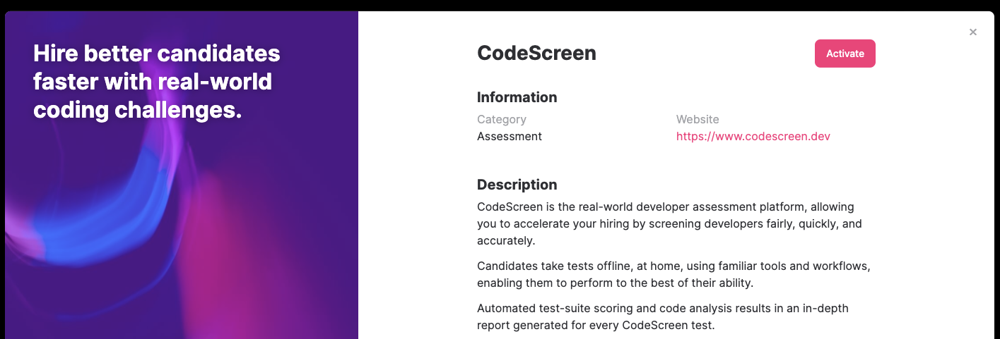
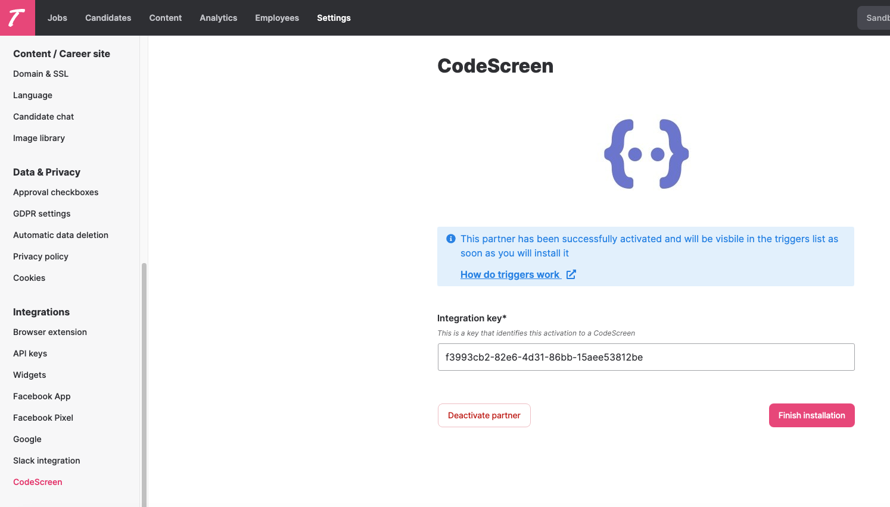
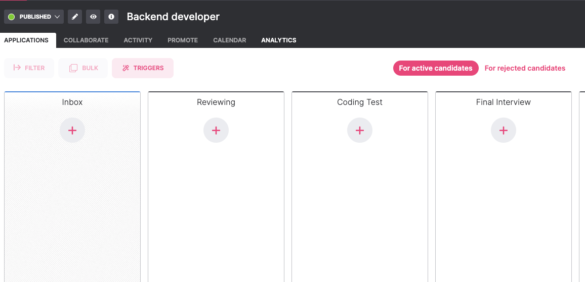
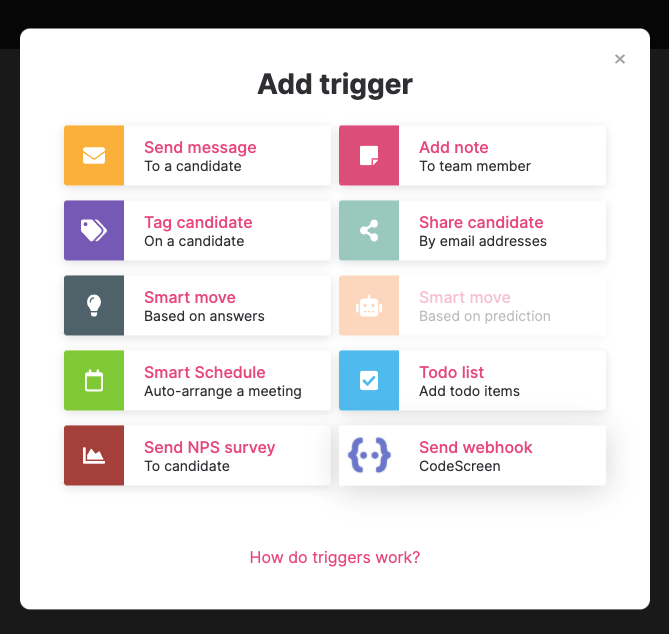
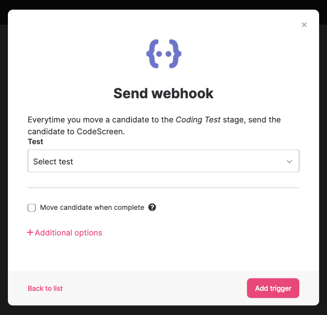
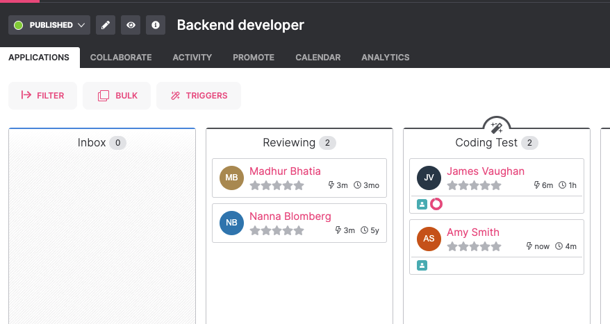
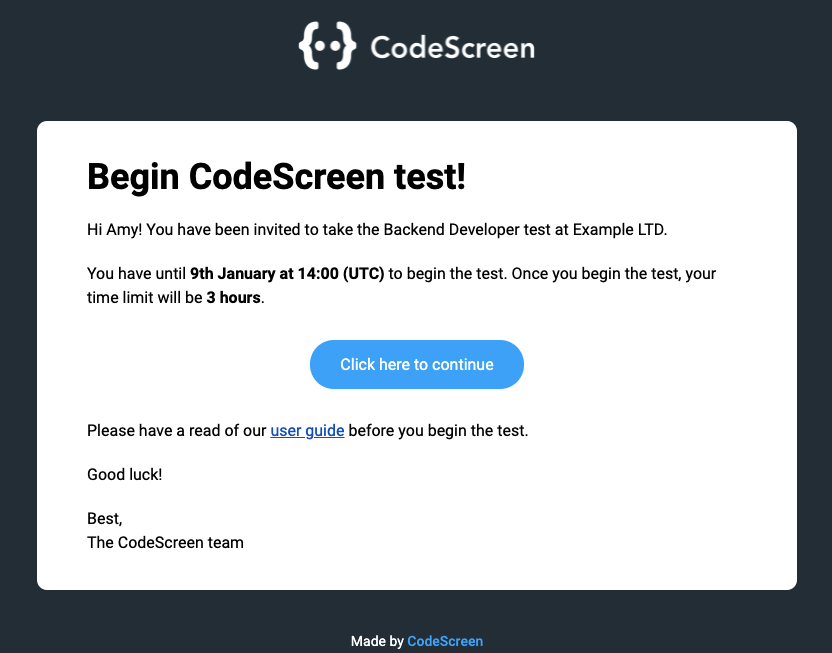
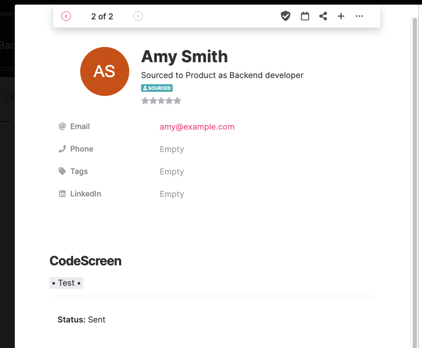
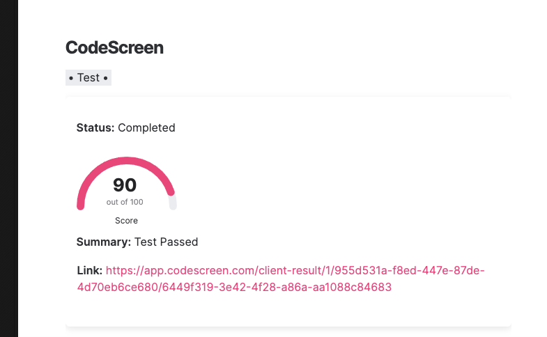

# Integrating Teamtailor with CodeScreen

<figure>
  <figcaption style="font-style: italic;"></figcaption>
   
  
</figure>

The `CodeScreen` integration with `Teamtailor` allows you to do the following:

* Select which CodeScreen test is required for each job you have on Teamtailor.
* Invite candidates to take CodeScreen tests directly from the Teamtailor platform as candidates enter the assessment/coding test stage.
* Status updates from invitation to completion.
* Have candidate CodeScreen test reports automatically attach to their Teamtailor candidate profile and their scores displayed.

The integration is quick and straightforward. It works as follows:

### 1. Enable the Teamtailor/CodeScreen Integration
To start, head over to the `Marketplace` section on Teamtailor, click the CodeScreen entry from the Assessments list and click
the `Activate` button in the popup:

<figure>
  <figcaption style="font-style: italic;"></figcaption>
   
  
</figure>

 

Now head over to the `Settings` section on Teamtailor, find CodeScreen from the `Integrations` list on the right of the page and
click the `Finish installation` button.

<figure>
  <figcaption style="font-style: italic;"></figcaption>
   
  
</figure>

 

Once this is done, copy the Integration key, go to the <a href="https://app.codescreen.com/integrations" target="_blank">Integrations</a> section on the CodeScreen platform and copy your Integration key into the Teamtailor API Key box and click `Save changes`.

**Note** that you will not have access to the Integrations section on CodeScreen unless you are an admin user. If you are not
an admin, please contact one of the admin users in your organization, and they will be able to make you an admin.

### 2. Add CodeScreen Trigger to a Job’s Interview Stage
Once the Teamtailor <> CodeScreen integration is enabled for your organization, you will be able to add the 
CodeScreen assessment Trigger to an Interview Stage for any of the Jobs you have created on Teamtailor.

To do this for an existing job, navigate to a job and click into the `Triggers` section.

<figure>
  <figcaption style="font-style: italic;"></figcaption>
   
  
</figure>

 

Click the `+` button for the stage in which you want a CodeScreen test to be sent and then select the
`Send webhook CodeScreen` option from the pop-up.

<figure>
  <figcaption style="font-style: italic;"></figcaption>
   
  
</figure>

 

You will then be able to choose which CodeScreen test you want to be automatically sent to each candidate once they enter
this stage of the job. There is a one-to-one mapping here between the tests you have created on CodeScreen and the tests
available to send from Teamtailor.

<figure>
  <figcaption style="font-style: italic;"></figcaption>
   
  
</figure>

 

Select your test and click the `Add trigger` button to complete the process.

### 3. Send and Review the Test
When candidates are moved into the interview stage that you added the CodeScreen Webhook trigger to, a CodeScreen test
will be automatically sent to the candidate.

<figure>
  <figcaption style="font-style: italic;"></figcaption>
   
  
</figure>

 

The candidate will receive an email containing the instructions for the test.

You can edit the email templates that are used to include your own wording and your company’s branding. You can read more
details about this [here](editing-email-templates.md). 

The default email template looks like the following:

<figure>
  <figcaption style="font-style: italic;"></figcaption>
   
  
</figure>

 

The status of the test for each candidate will be viewable in Teamtailor in the profile section for that candidate.

<figure>
  <figcaption style="font-style: italic;"></figcaption>
   
  
</figure>

 

Once the candidate has submitted their test, you will be notified via email by CodeScreen and you will be able to view the
result for that candidate inside Teamtailor.

<figure>
  <figcaption style="font-style: italic;"></figcaption>
   
  
</figure>

 

The result contains a `Score` field which represents the candidate's score on the test, which is based on how many
unit test cases the candidate's solution passed. You can also view more details about the test result on CodeScreen by 
clicking the result link, which will bring you to a page on CodeScreen similar to the following:

<figure>
  <figcaption style="font-style: italic;"></figcaption>
   
  
</figure>

And that’s it, you're all set!

A video demo showing the integration in action is available to view 
<a href="https://www.loom.com/share/c5e35d10f26347aba5baba597acc7228" target="_blank">here</a>.
