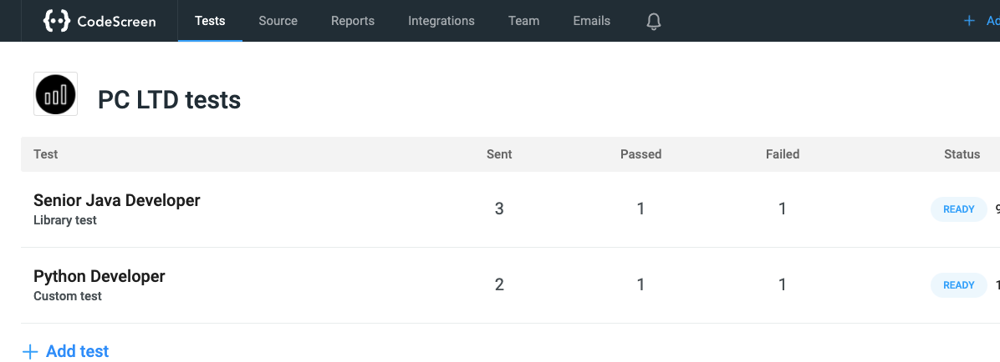

# List Tests

The ```
GET https://app.codescreen.com/api/listTests
``` endpoint will retrieve the list of tests that you have created on CodeScreen.


### Request

```
curl -X GET https://app.codescreen.com/api/listTests -H 'Authorization: apiKey c5793bc0-4176-4dec-b59c-ff47337f01c4' 

```
<br/>For example, if you have the following tests on CodeScreen:



### Response

If the request has succeeded, the response will be a `200 OK` containing JSON with the following properties:

```
[
    {
        "testId": "af401f8e-24d9-4889-ad8b-39cc8366b0ac",
        "testName": "Senior Java Developer Test"
    },
    {
        "testId": "8bc9bb2e-112b-42d6-86d5-c3bfecf7e994",
        "testName": "Python Developer Test"
    }
]

```