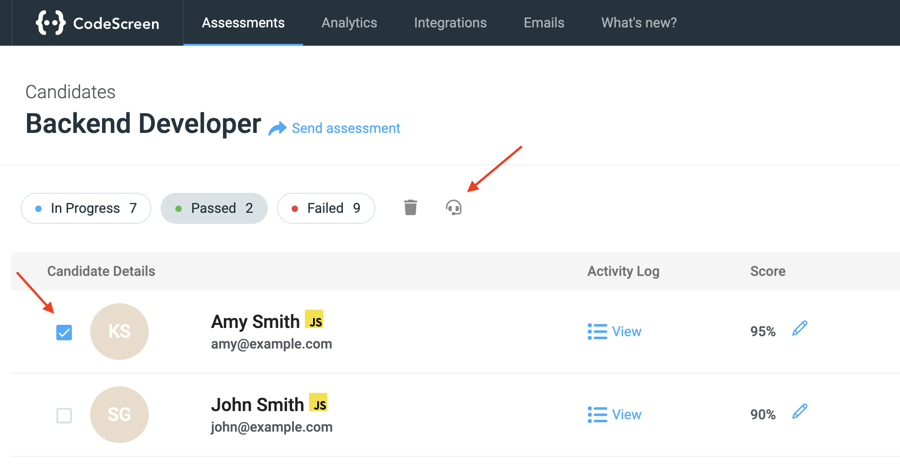
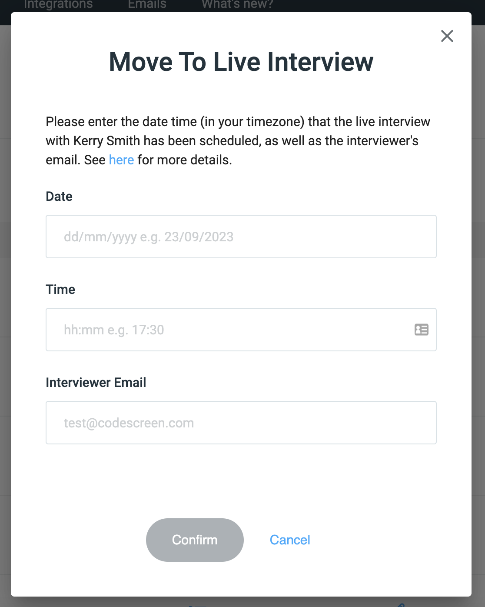
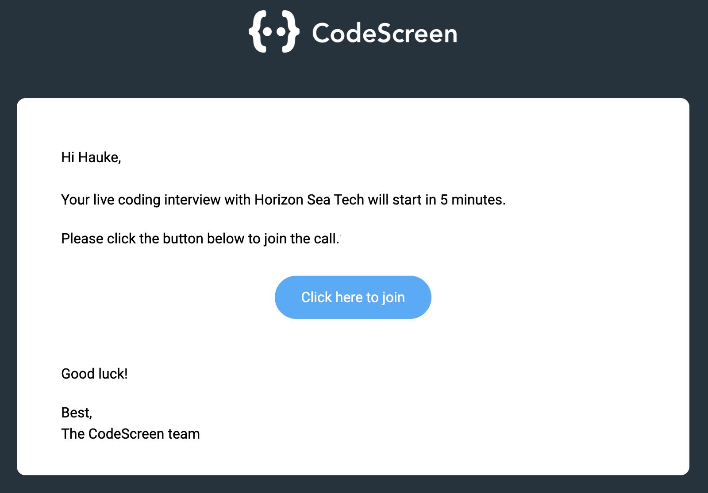
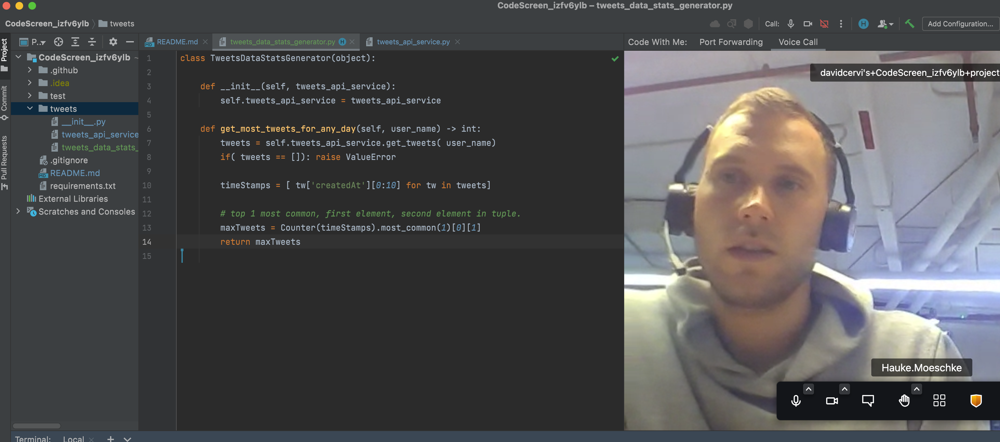

# Live Coding With Context

CodeScreen provides the option to set up live coding interviews with candidates that have completed your CodeScreen assessment to discuss their solution in further detail
and ask them any follow-up questions. Our live coding environment uses IntelliJ (one of the world’s most popular IDEs).

---

To get started, click the tick box beside the candidate that you want to move to a Live Interview, and then click the grey headset icon that appears above:

<figure>
  <figcaption style="font-style: italic;"></figcaption>
   
  
</figure>

 

You will then see the following pop-up:

<figure>
  <figcaption style="font-style: italic;"></figcaption>
   
  
</figure>

 

You then enter the `Date` & `Time` that the live interview has been scheduled for.

**Note** the assumption here is that the live interview has already been scheduled with this candidate outside of CodeScreen using your ATS or another scheduling tool.

You also must enter the email address of the interviewer that will conduct this interview with the candidate.

You can then click the `Confirm` button to complete the process.

---

### What Happens During the Live Interview?

5 minutes before the interview is set to start, both the candidate & interviewer will receive an email from CodeScreen containing a link to access the live coding environment:

<figure>
  <figcaption style="font-style: italic;"></figcaption>
   
  
</figure>

 

The live coding environment will have the candidate's original GitHub solution repo for the assessment already opened.

<figure>
  <figcaption style="font-style: italic;"></figcaption>
   
  
</figure>

 

The interviewer can then ask the candidate questions regarding their initial solution, pair program together on modifications/improvements, etc. 

Both the interviewer & candidate will be able to make changes to the code in real-time, with the changes immediately updated on the other participant's screen.
