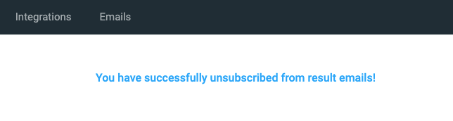

# Notification Preferences

By default, once a candidate passes/fails one of your assessments, or when a assessment expires, you will be notified by email.

<figure>
  <figcaption style="font-style: italic;">Email Notification:</figcaption>
   
  
</figure>

 

If you want to stop receiving these notifications, click the `Unsubscribe` link at the bottom of each result
notification email. You will then be brought to a screen that confirms that you have unsubscribed and will no longer
receive these types of emails.

 

<figure>
  <figcaption style="font-style: italic;">Unsubscribe:</figcaption>
   
  
</figure>

 

**Note** that the changes you make here only affect your user; the notification preferences for the other users in your
account will not be affected.
