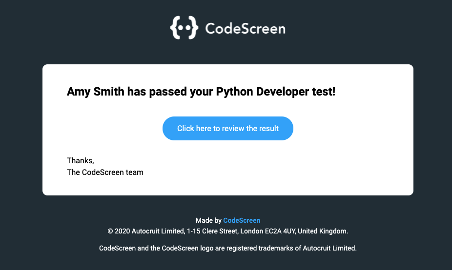
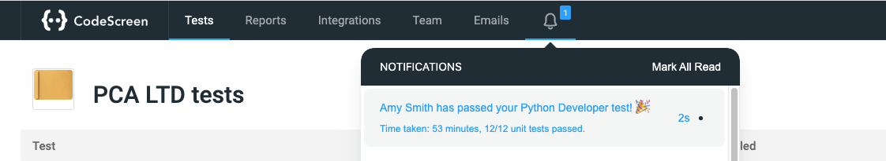
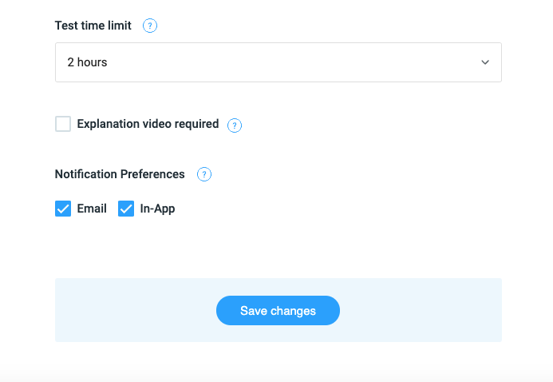

# Notification Preferences

By default, once a candidate passes/fails one of your tests, or when a test expires, you will be notified by email and inside the
notification inbox inside the CodeScreen application.

<figure>
  <figcaption style="font-style: italic;">Email Notification:</figcaption>
   
  
</figure>

 

<figure>
  <figcaption style="font-style: italic;">In-App Notification:</figcaption>
   
  
</figure>

 

You can stop receiving these notifications for a test by clicking into the test from the home screen, then click the
`Review test` link in the top right of the screen, and then scroll down to the `Notification Preferences` section:

 

<figure>
  <figcaption style="font-style: italic;">Notification Preferences:</figcaption>
   
  
</figure>

 

You can then untick the `Email` box if you want to stop receiving email notifications for this test and untick the 
`In-App` box if you want to stop receiving in-app notifications for this test. Finally, click the `Save changes` button to
save your new notification preferences.

**Note** that the changes you make here only affect your user; the notification preferences for the other users in your
account will not be affected.
