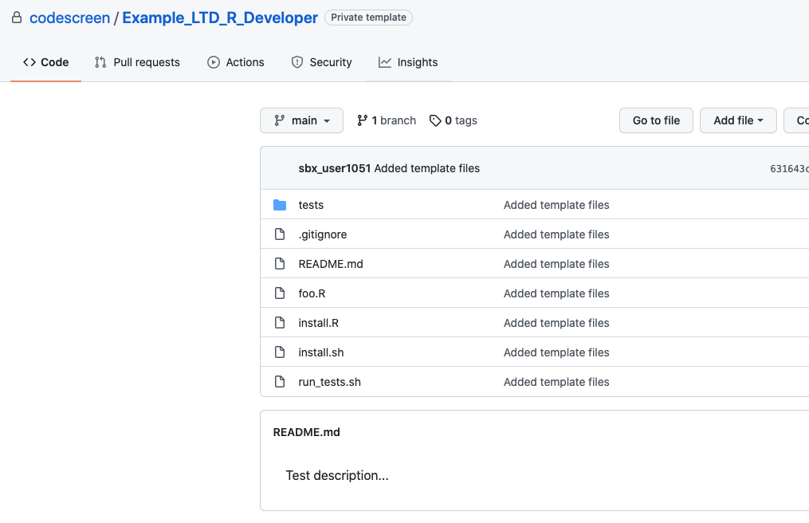

# Creating Custom R Assessments
CodeScreen allows you to add your own assessment and send it to candidates.  
To begin, log on to [CodeScreen](https://app.codescreen.dev/#/login), click <strong>Add new test</strong>, and select <strong>Custom test</strong>. 

You can then add the description of your test, choose <strong>R</strong> from the drop-down list of available backend languages, and set the time limit for the test. 

Once you click <strong>Publish</strong>, a private GitHub repository will be created in the CodeScreen account, and you will be given access.
This repository will contain a skeleton <strong>R</strong> project, and the README will contain the description of the test that you added during the setup.  

<figure>
  <figcaption style="font-style: italic;">Example custom R assessment GitHub repository:</figcaption>
   
  
</figure>

 

### Automated test-suite setup

If you would like to add tests that are automatically run by CodeScreen against each candidate's solution to your assessment, you can add these as test files in the `tests/` directory.

All unit tests files must be added in the `tests/` directory and use the [testthat](https://testthat.r-lib.org/) package.

All unit test filenames must begin with `test_` and unit test files with filenames that begin with `test_hidden` will not be visible to the candidate.

If you want to add files that your hidden unit tests use and hence are also not visible to the candidate, the names of these files must begin with `hidden`, e.g., `hiddenFoo.json`, `hiddenFoo.csv`, `hidden_foo.R`, etc.

All dependencies required for your coding test must be added to the `install.sh` file.

The `install.R` and `run_tests.sh` files should not be modified.

Your coding test also must use/be compatible with `R` version `4.0.3`.

### Examples

An **example** `R` assessment that uses automated test suite scoring can be seen here: 
https://github.com/Code-Screen/R-CodeScreen-Increment-Func
