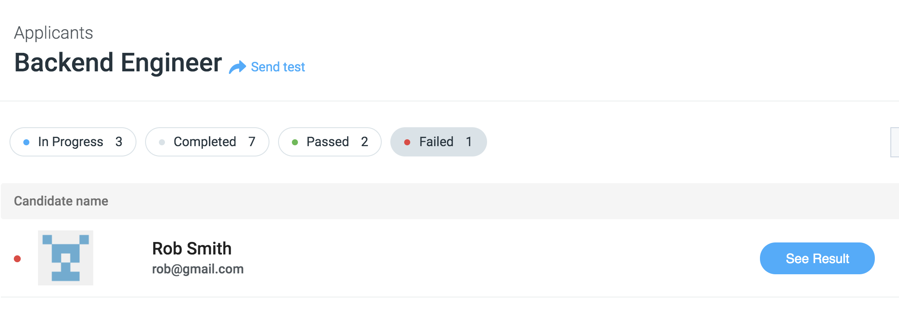
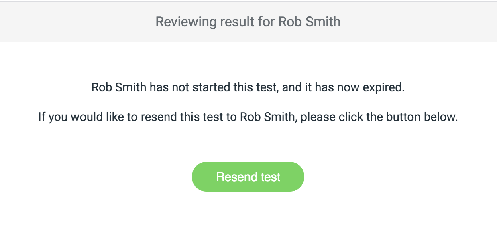
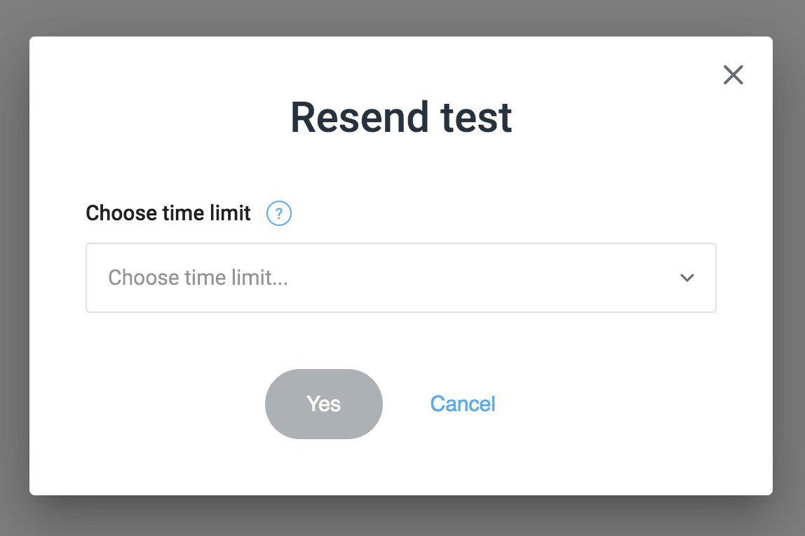
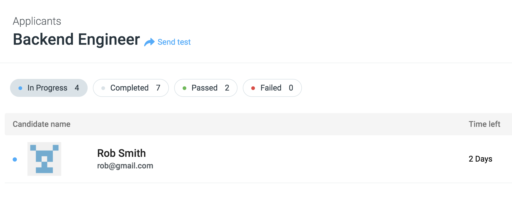

# Re-Sending tests

Once a candidate is sent a test, and their time runs out before they start/push any changes to their `GitHub` repository,
the test will expire, and they will automatically be marked as a `Failure`.

If you would like to then re-send the test to the candidate, please follow these instructions:

**1.**  Find the row for the candidate in the Failed section for the given test, and click the `See Result` button.

<figure>
  <figcaption style="font-style: italic;"></figcaption>
   
  
</figure>

**2.** You will then see the screen below.

<figure>
  <figcaption style="font-style: italic;"></figcaption>
   
  
</figure>

Please click the green `Resend test` button.

**3.** You will then see the following pop-up:

<figure>
  <figcaption style="font-style: italic;"></figcaption>
   
  
</figure>

Here you can enter the time the candidate has to complete the test from when it is re-sent. Once you set the time, 
then click the `Yes` button. The test is then re-sent, the candidate is notified via email, and the candidate is placed back into
the `In Progress` column.

<figure>
  <figcaption style="font-style: italic;"></figcaption>
   
  
</figure>

That's it; you're all done!
