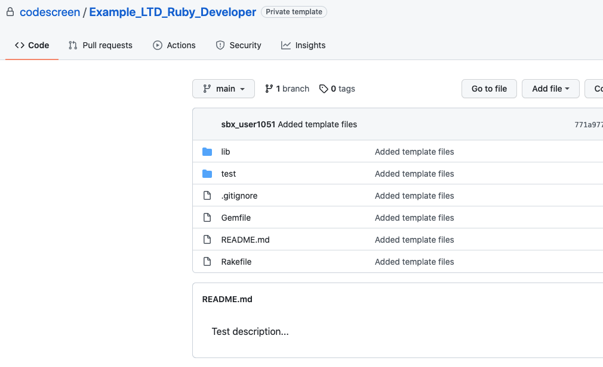

# Creating Custom Ruby Assessments
CodeScreen allows you to add your own assessment and send it to candidates.  
To begin, log on to [CodeScreen](https://app.codescreen.dev/#/login), click <strong>Add new test</strong>, and select <strong>Custom test</strong>. 

You can then add the description of your test, choose <strong>Ruby</strong> from the drop-down list of available backend languages, and set the time limit for the test. 

Once you click <strong>Publish</strong>, a private GitHub repository will be created in the CodeScreen account, and you will be given access.
This repository will contain a skeleton <strong>Ruby</strong> project, and the README will contain the description of the test that you added during the setup.  

<figure>
  <figcaption style="font-style: italic;">Example custom Ruby assessment GitHub repository:</figcaption>
   
  
</figure>

  

### Automated test-suite setup

If would like to add tests that are automatically run by CodeScreen against each candidate's solution to your assessment, you can add these as test files in the `tests/` directory.

All unit tests files must be added in the `tests/` directory and use the [`Test::Unit`](https://test-unit.github.io/) testing framework.

All unit test file names must begin with `test_` and unit test files with file names that begin with `test_hidden` will not be visible to the candidate.

All dependencies required for your coding test must be added to the `Gemfile`.

The coding test must be compatible with `Ruby` version 2.5.3 and the `bundle` version required is 2.0.1.

The current content of the `Rakefile` must not be modified. You may add to the `Rakefile` as required for your coding test.

The maximum memory allowed for a solution to your coding test is 4G.

### Examples

An **example** `Ruby` assessment that uses automated test suite scoring can be seen here: 
https://github.com/Code-Screen/Ruby-CodeScreen-Fibonacci
